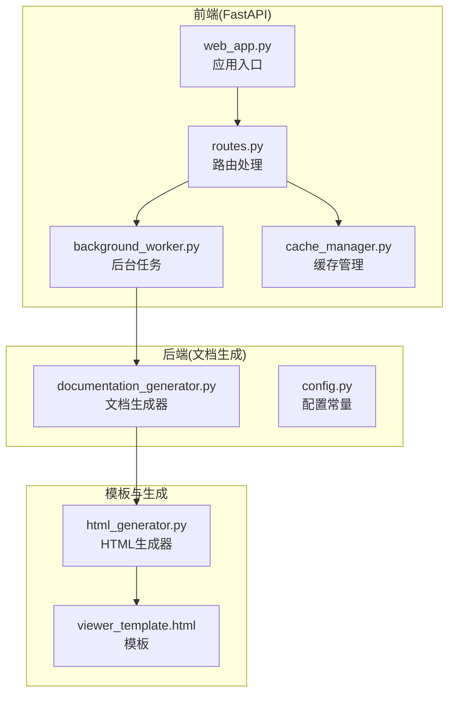
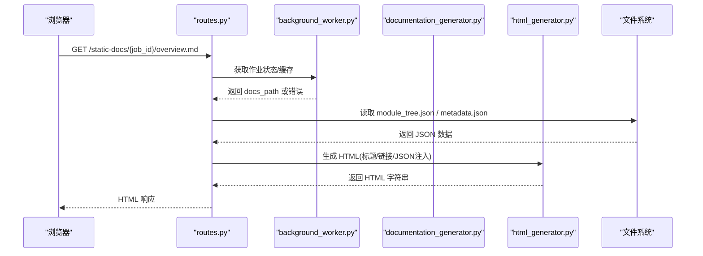
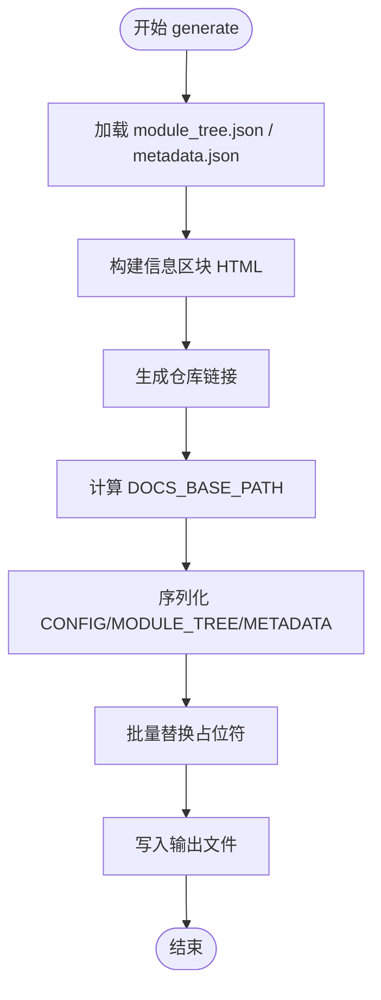
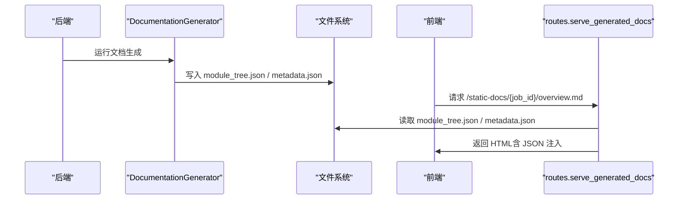
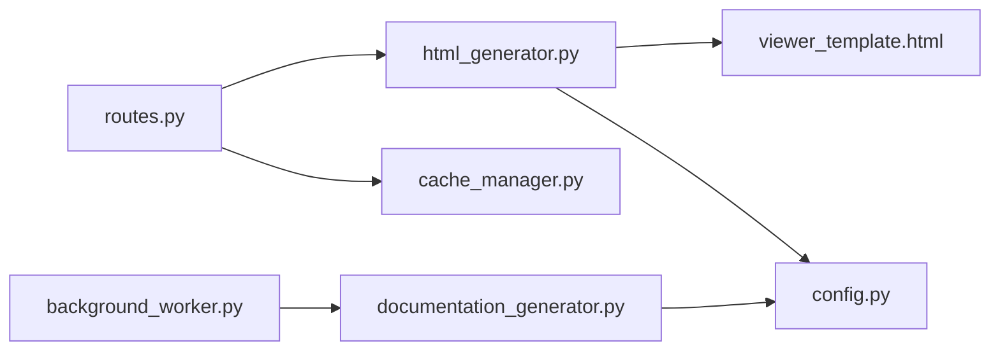

# HTML结构与模板占位符

<cite>
**本文档引用的文件**
- [viewer_template.html](file://codewiki/templates/github_pages/viewer_template.html)
- [html_generator.py](file://codewiki/cli/html_generator.py)
- [documentation_generator.py](file://codewiki/src/be/documentation_generator.py)
- [web_app.py](file://codewiki/src/fe/web_app.py)
- [routes.py](file://codewiki/src/fe/routes.py)
- [background_worker.py](file://codewiki/src/fe/background_worker.py)
- [cache_manager.py](file://codewiki/src/fe/cache_manager.py)
- [config.py](file://codewiki/src/config.py)
</cite>

## 目录
1. [简介](#简介)
2. [项目结构](#项目结构)
3. [核心组件](#核心组件)
4. [架构总览](#架构总览)
5. [详细组件分析](#详细组件分析)
6. [依赖关系分析](#依赖关系分析)
7. [性能考虑](#性能考虑)
8. [故障排除指南](#故障排除指南)
9. [结论](#结论)

## 简介
本文件深入解析 CodeWiki 的 HTML 模板 viewer_template.html 的结构设计与动态占位符机制，重点说明：
- 文档结构如何划分为 head 资源加载区与 body 内容展示区
- 模板变量如 {{TITLE}}、{{REPO_LINK}}、{{SHOW_INFO}} 等的替换逻辑及注入方式
- 动态内容挂载点 div#navigation 与 div#content 的作用
- script 标签内 CONFIG、MODULE_TREE、METADATA 等 JSON 对象的序列化注入过程
- DOCS_BASE_PATH 如何支持文档路径自定义
- loading 与 error 状态的 UI 结构设计
- 结合 CodeWiki 后端生成流程，说明 HTML 模板与生成器（html_generator.py）的协同工作机制

## 项目结构
该功能涉及前后端协作：前端通过 FastAPI 提供静态文档服务，后端负责生成文档与元数据，前端再用模板渲染为可浏览的 HTML 页面。

图表来源
- [web_app.py](file://codewiki/src/fe/web_app.py#L24-L92)
- [routes.py](file://codewiki/src/fe/routes.py#L179-L269)
- [background_worker.py](file://codewiki/src/fe/background_worker.py#L182-L287)
- [documentation_generator.py](file://codewiki/src/be/documentation_generator.py#L320-L382)
- [html_generator.py](file://codewiki/cli/html_generator.py#L83-L172)
- [viewer_template.html](file://codewiki/templates/github_pages/viewer_template.html#L1-L644)

章节来源
- [web_app.py](file://codewiki/src/fe/web_app.py#L24-L92)
- [routes.py](file://codewiki/src/fe/routes.py#L179-L269)
- [background_worker.py](file://codewiki/src/fe/background_worker.py#L182-L287)
- [documentation_generator.py](file://codewiki/src/be/documentation_generator.py#L320-L382)
- [html_generator.py](file://codewiki/cli/html_generator.py#L83-L172)
- [viewer_template.html](file://codewiki/templates/github_pages/viewer_template.html#L1-L644)

## 核心组件
- HTML 模板 viewer_template.html：定义页面结构、样式、脚本与动态占位符
- HTMLGenerator：负责读取模板、加载模块树与元数据、替换占位符并输出最终 HTML
- DocumentationGenerator：后端生成文档与元数据（module_tree.json、metadata.json）
- FastAPI 路由与后台任务：提供文档服务与缓存管理
- 配置常量：定义文档目录、文件名等

章节来源
- [viewer_template.html](file://codewiki/templates/github_pages/viewer_template.html#L1-L644)
- [html_generator.py](file://codewiki/cli/html_generator.py#L13-L172)
- [documentation_generator.py](file://codewiki/src/be/documentation_generator.py#L50-L84)
- [routes.py](file://codewiki/src/fe/routes.py#L179-L269)
- [background_worker.py](file://codewiki/src/fe/background_worker.py#L182-L287)
- [config.py](file://codewiki/src/config.py#L8-L18)

## 架构总览
前端通过 /static-docs/{job_id}/ 路由访问生成的文档，后端从缓存或临时目录读取 module_tree.json 与 metadata.json，并将这些数据以 JSON 形式注入到模板中，最终输出可交互的 HTML 页面。

图表来源
- [routes.py](file://codewiki/src/fe/routes.py#L179-L269)
- [background_worker.py](file://codewiki/src/fe/background_worker.py#L182-L287)
- [documentation_generator.py](file://codewiki/src/be/documentation_generator.py#L320-L382)
- [html_generator.py](file://codewiki/cli/html_generator.py#L83-L172)

## 详细组件分析

### HTML 模板结构设计
- head 区域：包含基础 meta、title、外部库（marked、mermaid）、内联样式
- body 区域：左侧导航栏（sidebar），右侧内容区（content），底部脚本块
- 动态占位符：{{TITLE}}、{{REPO_LINK}}、{{SHOW_INFO}}、{{INFO_CONTENT}}、{{CONFIG_JSON}}、{{MODULE_TREE_JSON}}、{{METADATA_JSON}}、{{DOCS_BASE_PATH}}

章节来源
- [viewer_template.html](file://codewiki/templates/github_pages/viewer_template.html#L3-L368)
- [viewer_template.html](file://codewiki/templates/github_pages/viewer_template.html#L369-L644)

### 占位符替换逻辑与注入方式
HTMLGenerator 在 generate 方法中：
- 自动加载 docs_dir 下的 module_tree.json 与 metadata.json（若存在）
- 构建信息区块 HTML（_build_info_content），并根据是否存在信息决定显示开关
- 生成仓库链接（{{REPO_LINK}}）
- 计算 DOCS_BASE_PATH（用于相对路径）
- 将 CONFIG、MODULE_TREE、METADATA 序列化为 JSON 字符串并注入模板
- 替换所有占位符，写入输出文件

图表来源
- [html_generator.py](file://codewiki/cli/html_generator.py#L83-L172)
- [html_generator.py](file://codewiki/cli/html_generator.py#L173-L218)

章节来源
- [html_generator.py](file://codewiki/cli/html_generator.py#L83-L172)
- [html_generator.py](file://codewiki/cli/html_generator.py#L173-L218)

### 动态内容挂载点
- div#navigation：用于动态构建侧边导航菜单，基于 MODULE_TREE 渲染层级结构
- div#content：用于展示解析后的 Markdown 内容，初始隐藏，加载完成后显示
- div#loading：加载状态提示，加载完成或出错时切换显示

章节来源
- [viewer_template.html](file://codewiki/templates/github_pages/viewer_template.html#L386-L397)
- [viewer_template.html](file://codewiki/templates/github_pages/viewer_template.html#L502-L536)

### JSON 注入与客户端初始化
模板脚本块中：
- CONFIG、MODULE_TREE、METADATA 以 JSON 形式注入
- DOCS_BASE_PATH 支持自定义文档根路径
- marked 初始化选项（breaks、gfm、headerIds 等）
- mermaid 初始化主题与参数
- DOMContentLoaded 时构建导航并默认加载 overview.md

章节来源
- [viewer_template.html](file://codewiki/templates/github_pages/viewer_template.html#L399-L438)
- [viewer_template.html](file://codewiki/templates/github_pages/viewer_template.html#L407-L428)

### DOCS_BASE_PATH 路径自定义
- 生成器根据 output_path 与 docs_dir 的相对关系计算 DOCS_BASE_PATH
- 客户端 loadDocument 使用该路径拼接请求地址，支持 GitHub Pages 等部署场景

章节来源
- [html_generator.py](file://codewiki/cli/html_generator.py#L136-L146)
- [viewer_template.html](file://codewiki/templates/github_pages/viewer_template.html#L510-L511)

### loading 与 error 状态 UI
- 加载状态：显示旋转指示器与提示文本，内容区域隐藏
- 错误状态：渲染错误面板，包含标题与消息，内容区域显示错误内容

章节来源
- [viewer_template.html](file://codewiki/templates/github_pages/viewer_template.html#L390-L397)
- [viewer_template.html](file://codewiki/templates/github_pages/viewer_template.html#L627-L639)

### 后端生成流程与模板协同
- DocumentationGenerator 生成 module_tree.json 与 metadata.json
- routes.serve_generated_docs 读取 JSON 并调用 HTMLGenerator 生成最终 HTML
- web_app 提供 /static-docs 路由，供用户直接访问生成的文档

图表来源
- [documentation_generator.py](file://codewiki/src/be/documentation_generator.py#L320-L382)
- [routes.py](file://codewiki/src/fe/routes.py#L222-L269)
- [web_app.py](file://codewiki/src/fe/web_app.py#L69-L76)

章节来源
- [documentation_generator.py](file://codewiki/src/be/documentation_generator.py#L320-L382)
- [routes.py](file://codewiki/src/fe/routes.py#L222-L269)
- [web_app.py](file://codewiki/src/fe/web_app.py#L69-L76)

## 依赖关系分析
- HTMLGenerator 依赖模板文件 viewer_template.html 与 docs_dir 中的 module_tree.json、metadata.json
- routes.serve_generated_docs 依赖缓存与后台作业状态，读取 JSON 并生成 HTML
- background_worker 负责克隆仓库、运行 DocumentationGenerator、缓存结果
- config.py 提供文档目录与文件名常量，影响生成路径

图表来源
- [html_generator.py](file://codewiki/cli/html_generator.py#L13-L33)
- [viewer_template.html](file://codewiki/templates/github_pages/viewer_template.html#L1-L644)
- [routes.py](file://codewiki/src/fe/routes.py#L179-L269)
- [background_worker.py](file://codewiki/src/fe/background_worker.py#L182-L287)
- [documentation_generator.py](file://codewiki/src/be/documentation_generator.py#L320-L382)
- [config.py](file://codewiki/src/config.py#L8-L18)

章节来源
- [html_generator.py](file://codewiki/cli/html_generator.py#L13-L33)
- [routes.py](file://codewiki/src/fe/routes.py#L179-L269)
- [background_worker.py](file://codewiki/src/fe/background_worker.py#L182-L287)
- [documentation_generator.py](file://codewiki/src/be/documentation_generator.py#L320-L382)
- [config.py](file://codewiki/src/config.py#L8-L18)

## 性能考虑
- 模板一次性注入 JSON，避免多次网络请求
- DOCS_BASE_PATH 优化静态资源加载路径，减少跨域与重定向
- marked 与 mermaid 初始化参数合理设置，提升渲染性能
- 缓存策略减少重复生成与网络传输

## 故障排除指南
- 模板未找到：检查模板路径是否正确
- module_tree.json/metadata.json 缺失：确认后端生成流程是否成功
- DOCS_BASE_PATH 导致资源加载失败：验证 output_path 与 docs_dir 的相对位置
- 加载错误：查看控制台错误信息，确认 showError 是否被触发

章节来源
- [html_generator.py](file://codewiki/cli/html_generator.py#L121-L124)
- [routes.py](file://codewiki/src/fe/routes.py#L222-L269)
- [viewer_template.html](file://codewiki/templates/github_pages/viewer_template.html#L532-L536)

## 结论
CodeWiki 的 HTML 模板与生成器通过清晰的占位符设计与 JSON 注入机制，实现了可配置、可扩展的文档展示页面。前端路由与后端生成器协同工作，确保了从数据生成到页面渲染的完整链路稳定可靠。开发者可通过调整模板与生成器参数，灵活适配不同部署环境与展示需求。