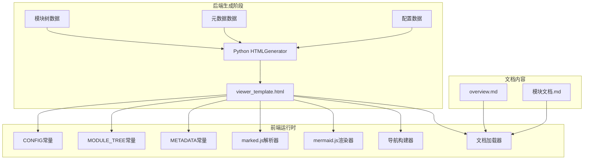
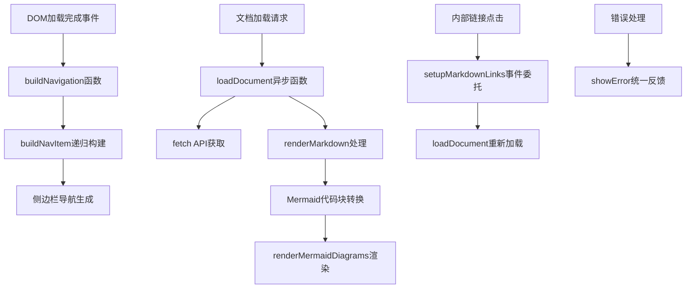
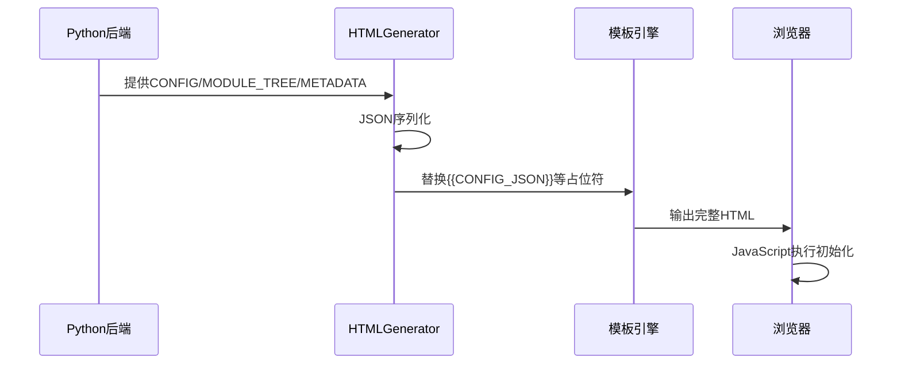
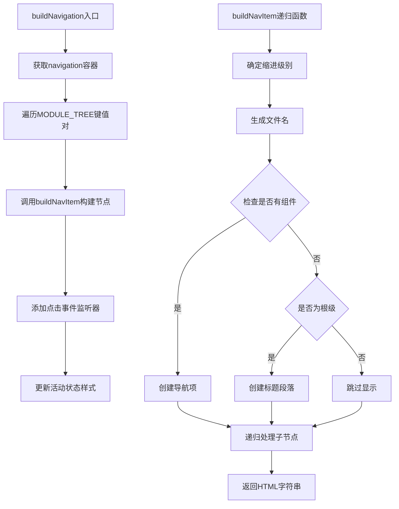
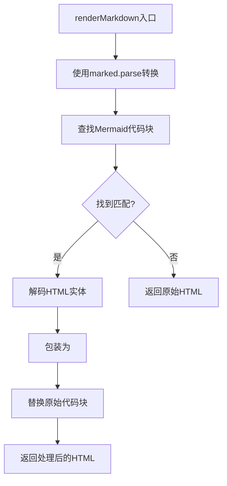
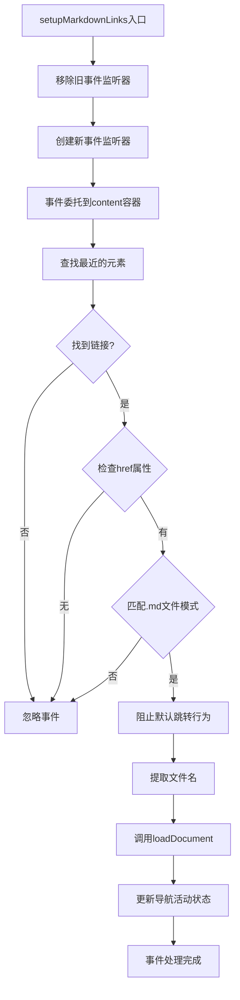
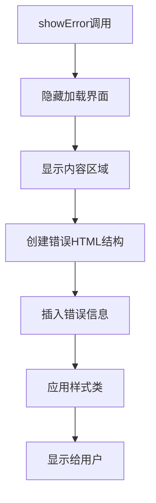
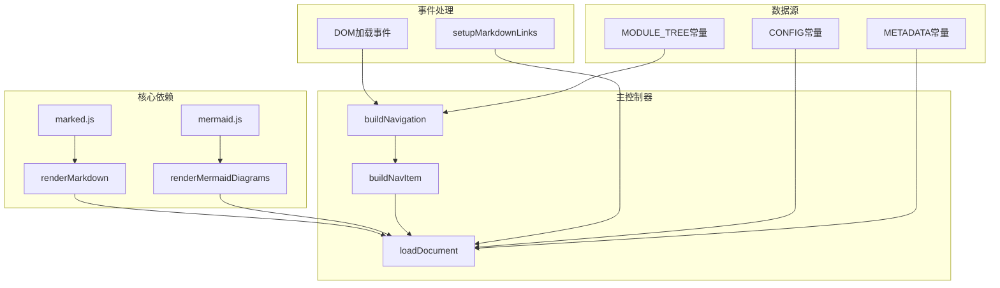

# JavaScript交互逻辑

<cite>
**本文档引用的文件**
- [viewer_template.html](file://codewiki/templates/github_pages/viewer_template.html)
- [html_generator.py](file://codewiki/cli/html_generator.py)
- [doc_generator.py](file://codewiki/cli/adapters/doc_generator.py)
- [module_tree.json](file://output/docs/FSoft-AI4Code--CodeWiki-docs/module_tree.json)
- [metadata.json](file://output/docs/FSoft-AI4Code--CodeWiki-docs/metadata.json)
- [overview.md](file://output/docs/FSoft-AI4Code--CodeWiki-docs/overview.md)
</cite>

## 目录
1. [简介](#简介)
2. [项目结构概览](#项目结构概览)
3. [核心组件分析](#核心组件分析)
4. [架构总览](#架构总览)
5. [详细组件分析](#详细组件分析)
6. [依赖关系分析](#依赖关系分析)
7. [性能考虑](#性能考虑)
8. [故障排除指南](#故障排除指南)
9. [结论](#结论)

## 简介

本文档深入解析CodeWiki项目中`viewer_template.html`的JavaScript交互逻辑。该模板是GitHub Pages文档查看器的核心，负责在客户端渲染Markdown文档、构建多级侧边栏导航、处理用户交互以及动态加载内容。文档详细说明了CONFIG、MODULE_TREE、METADATA等占位符的注入机制，剖析了关键JavaScript函数的实现原理，并提供了完整的调用流程示例和性能优化建议。

## 项目结构概览

CodeWiki项目采用前后端分离的设计模式，前端模板通过Python后端生成静态HTML文件：



**图表来源**
- [viewer_template.html](file://codewiki/templates/github_pages/viewer_template.html#L399-L640)
- [html_generator.py](file://codewiki/cli/html_generator.py#L120-L171)

**章节来源**
- [viewer_template.html](file://codewiki/templates/github_pages/viewer_template.html#L1-L644)
- [html_generator.py](file://codewiki/cli/html_generator.py#L1-L285)

## 核心组件分析

### 配置注入机制

前端JavaScript通过占位符注入三种核心配置数据：

1. **CONFIG常量**：包含运行时配置参数
2. **MODULE_TREE常量**：定义文档导航结构
3. **METADATA常量**：包含生成信息和统计数据

这些配置通过Python的HTMLGenerator在模板渲染时注入到HTML中。

**章节来源**
- [viewer_template.html](file://codewiki/templates/github_pages/viewer_template.html#L400-L404)
- [html_generator.py](file://codewiki/cli/html_generator.py#L147-L166)

### Marked.js集成

系统集成了marked.js进行Markdown解析，配置包括：
- 自动换行支持 (`breaks: true`)
- GitHub风格标记 (`gfm: true`)
- 自动生成标题ID (`headerIds: true`)
- 禁用邮箱混淆 (`mangle: false`)

**章节来源**
- [viewer_template.html](file://codewiki/templates/github_pages/viewer_template.html#L406-L412)

### Mermaid.js集成

Mermaid图表渲染器配置：
- 禁用自动启动 (`startOnLoad: false`)
- 主题定制化
- 流程图和序列图优化设置

**章节来源**
- [viewer_template.html](file://codewiki/templates/github_pages/viewer_template.html#L414-L428)

## 架构总览

前端JavaScript架构采用模块化设计，主要包含以下核心模块：



**图表来源**
- [viewer_template.html](file://codewiki/templates/github_pages/viewer_template.html#L430-L536)

## 详细组件分析

### 配置注入与初始化

#### 占位符注入流程

HTMLGenerator负责将Python数据结构转换为JavaScript可用的JSON格式：



**图表来源**
- [html_generator.py](file://codewiki/cli/html_generator.py#L147-L166)
- [viewer_template.html](file://codewiki/templates/github_pages/viewer_template.html#L400-L404)

#### 配置数据结构

基于示例数据，配置结构如下：

**MODULE_TREE示例结构**：
```json
{
  "模块名称": {
    "path": "源码路径",
    "components": ["组件列表"],
    "children": {
      "子模块": {
        "path": "子模块路径",
        "components": [],
        "children": {}
      }
    }
  }
}
```

**METADATA示例结构**：
```json
{
  "generation_info": {
    "timestamp": "ISO时间戳",
    "main_model": "模型名称",
    "generator_version": "版本号"
  },
  "statistics": {
    "total_components": 总组件数,
    "max_depth": 最大深度
  }
}
```

**章节来源**
- [module_tree.json](file://output/docs/FSoft-AI4Code--CodeWiki-docs/module_tree.json#L1-L83)
- [metadata.json](file://output/docs/FSoft-AI4Code--CodeWiki-docs/metadata.json#L1-L24)

### 导航构建系统

#### buildNavigation函数实现

该函数负责将MODULE_TREE转换为可视化的侧边栏导航：



**图表来源**
- [viewer_template.html](file://codewiki/templates/github_pages/viewer_template.html#L440-L492)

#### 导航项格式化

`formatNavTitle`函数负责将下划线分隔的模块名转换为人类可读的标题格式。

**章节来源**
- [viewer_template.html](file://codewiki/templates/github_pages/viewer_template.html#L440-L500)

### 文档加载系统

#### loadDocument函数详解

该函数实现了完整的文档加载和渲染流程：

```mermaid
sequenceDiagram
participant User as 用户
participant Nav as 导航系统
participant Loader as loadDocument
participant Fetch as fetch API
participant Parser as renderMarkdown
participant Mermaid as renderMermaidDiagrams
participant Links as setupMarkdownLinks
User->>Nav : 点击导航项
Nav->>Loader : loadDocument(文件名)
Loader->>Loader : 显示加载界面
Loader->>Fetch : 获取Markdown内容
Fetch-->>Loader : 返回文本内容
Loader->>Parser : 解析Markdown
Parser-->>Loader : 返回HTML
Loader->>Loader : 更新内容区域
Loader->>Mermaid : 渲染Mermaid图表
Mermaid-->>Loader : 图表渲染完成
Loader->>Links : 设置内部链接处理器
Loader->>Loader : 滚动到页面顶部
Loader-->>User : 显示文档内容
```

**图表来源**
- [viewer_template.html](file://codewiki/templates/github_pages/viewer_template.html#L502-L536)

#### 错误处理机制

系统实现了多层次的错误处理：

1. **网络错误捕获**：检查HTTP响应状态
2. **解析错误处理**：捕获Markdown解析异常
3. **Mermaid渲染错误**：优雅降级为代码块显示
4. **统一错误反馈**：通过showError函数显示用户友好的错误信息

**章节来源**
- [viewer_template.html](file://codewiki/templates/github_pages/viewer_template.html#L502-L536)
- [viewer_template.html](file://codewiki/templates/github_pages/viewer_template.html#L627-L639)

### Markdown渲染系统

#### renderMarkdown函数实现

该函数结合marked.js和自定义Mermaid处理逻辑：



**图表来源**
- [viewer_template.html](file://codewiki/templates/github_pages/viewer_template.html#L588-L607)

#### Mermaid图表渲染

`renderMermaidDiagrams`函数负责将代码块转换为可交互的图表：

**章节来源**
- [viewer_template.html](file://codewiki/templates/github_pages/viewer_template.html#L588-L625)

### 内部链接处理

#### setupMarkdownLinks事件委托

该函数实现了智能的内部链接拦截机制：



**图表来源**
- [viewer_template.html](file://codewiki/templates/github_pages/viewer_template.html#L538-L586)

**章节来源**
- [viewer_template.html](file://codewiki/templates/github_pages/viewer_template.html#L538-L586)

### 错误处理与用户反馈

#### showError函数实现

统一的错误处理机制确保用户获得清晰的反馈：



**图表来源**
- [viewer_template.html](file://codewiki/templates/github_pages/viewer_template.html#L627-L639)

**章节来源**
- [viewer_template.html](file://codewiki/templates/github_pages/viewer_template.html#L627-L639)

## 依赖关系分析

前端JavaScript组件之间的依赖关系：



**图表来源**
- [viewer_template.html](file://codewiki/templates/github_pages/viewer_template.html#L7-L8)
- [viewer_template.html](file://codewiki/templates/github_pages/viewer_template.html#L400-L428)

**章节来源**
- [viewer_template.html](file://codewiki/templates/github_pages/viewer_template.html#L1-L644)

## 性能考虑

### 优化建议

1. **懒加载策略**
   - 对于大型文档，考虑实现按需加载
   - 使用Intersection Observer优化图片和图表的延迟加载

2. **缓存机制**
   - 实现浏览器缓存策略，避免重复下载相同文档
   - 缓存已渲染的HTML内容

3. **异步处理优化**
   - 将Mermaid渲染改为批量处理，避免阻塞UI线程
   - 实现请求去重，防止重复加载同一文档

4. **内存管理**
   - 及时清理事件监听器，防止内存泄漏
   - 优化DOM操作，减少重排重绘

5. **网络优化**
   - 实现请求超时和重试机制
   - 支持HTTP缓存头处理

### 当前实现的优势

- **事件委托**：减少事件监听器数量，提高性能
- **渐进式渲染**：先显示骨架屏，再渲染内容
- **错误隔离**：单个文档错误不影响整体系统稳定性
- **模块化设计**：便于维护和扩展

## 故障排除指南

### 常见问题及解决方案

1. **导航不显示**
   - 检查MODULE_TREE数据格式是否正确
   - 确认JSON序列化过程中没有特殊字符问题

2. **文档无法加载**
   - 验证fetch请求的URL路径
   - 检查服务器CORS配置
   - 确认文档文件存在且可访问

3. **Mermaid图表不显示**
   - 检查代码块语法格式
   - 验证mermaid.js库加载成功
   - 查看控制台错误信息

4. **内部链接失效**
   - 确认链接格式符合.md文件规范
   - 检查事件委托绑定是否正常
   - 验证文件路径映射关系

### 调试技巧

1. **开发者工具**
   - 使用Network面板检查资源加载
   - 使用Console面板查看JavaScript错误
   - 使用Elements面板验证DOM结构

2. **日志记录**
   - 在关键函数中添加console.log语句
   - 使用try-catch捕获异常并记录详细信息

3. **性能监控**
   - 使用Performance面板分析渲染性能
   - 监控内存使用情况，防止内存泄漏

**章节来源**
- [viewer_template.html](file://codewiki/templates/github_pages/viewer_template.html#L532-L535)
- [viewer_template.html](file://codewiki/templates/github_pages/viewer_template.html#L620-L623)

## 结论

CodeWiki的JavaScript交互系统展现了现代前端开发的最佳实践。通过精心设计的模块化架构、完善的错误处理机制和高效的性能优化策略，系统实现了流畅的用户体验和稳定的运行表现。

关键优势包括：
- **数据驱动的导航系统**：基于MODULE_TREE的动态导航生成
- **强大的Markdown渲染能力**：结合marked.js和Mermaid.js的综合解析
- **智能的内部链接处理**：无缝的文档间跳转体验
- **健壮的错误处理机制**：优雅的错误降级和用户反馈

未来可以进一步优化的方向包括实现更高级的缓存策略、支持离线文档访问、增强移动端适配等特性。