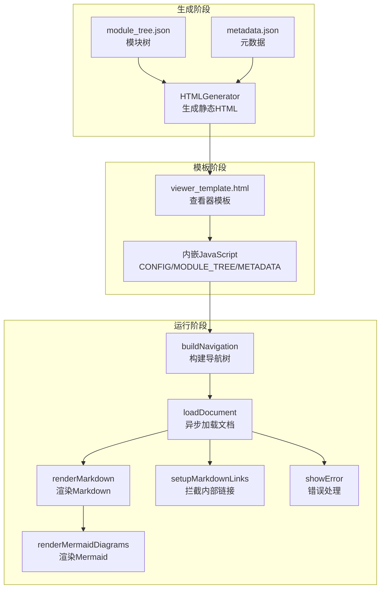
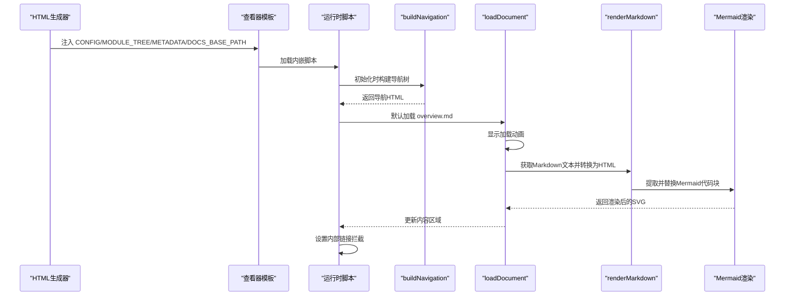
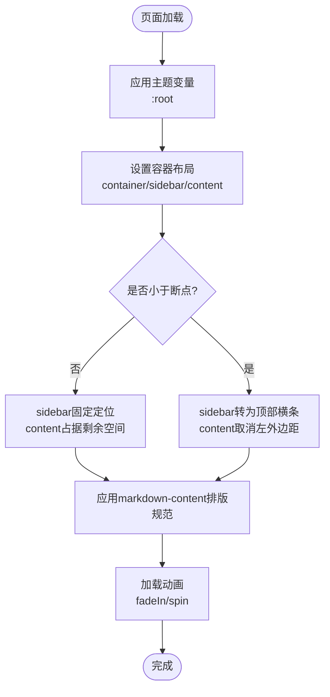
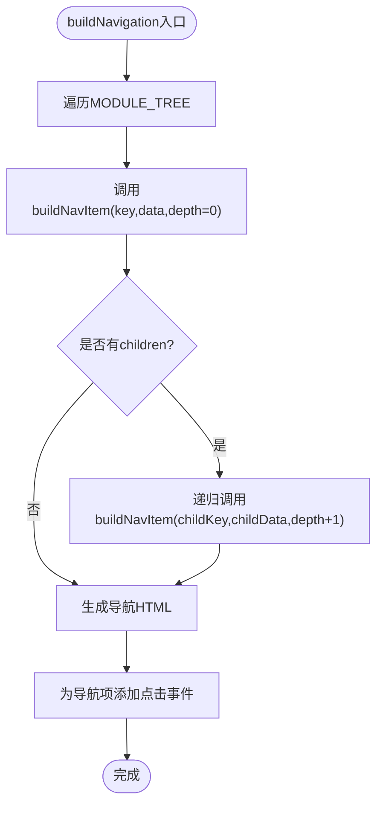
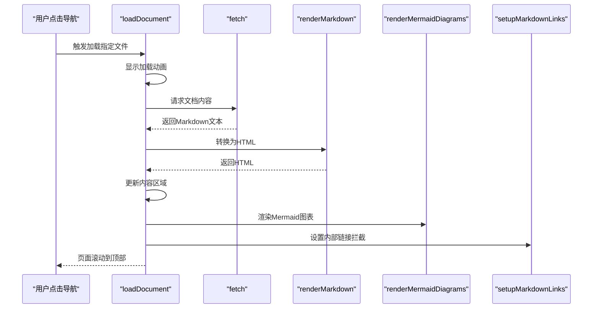
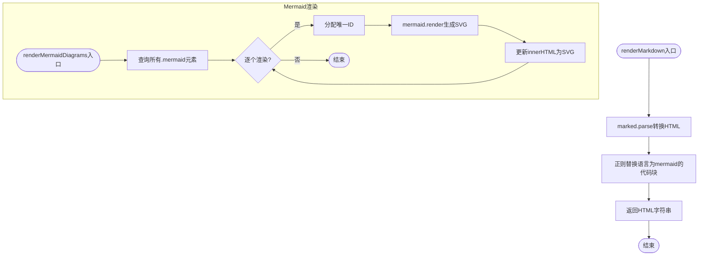
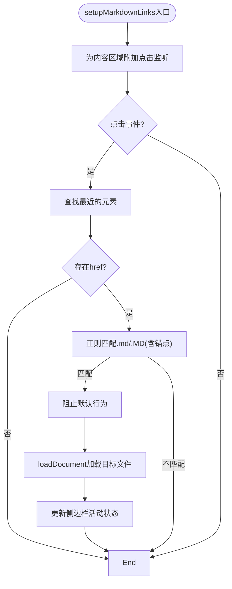
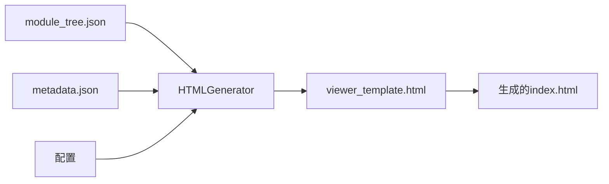
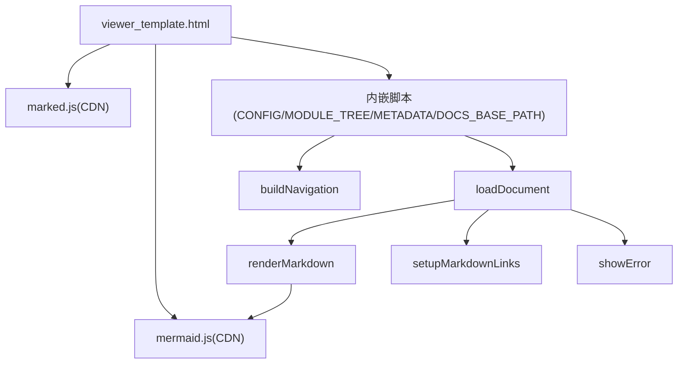

# 查看器模板结构

<cite>
**本文档引用的文件**
- [viewer_template.html](file://codewiki/templates/github_pages/viewer_template.html)
- [html_generator.py](file://codewiki/cli/html_generator.py)
- [template_utils.py](file://codewiki/src/fe/template_utils.py)
- [templates.py](file://codewiki/src/fe/templates.py)
- [module_tree.json](file://output/docs/FSoft-AI4Code--CodeWiki-docs/module_tree.json)
- [metadata.json](file://output/docs/FSoft-AI4Code--CodeWiki-docs/metadata.json)
</cite>

## 目录
1. [简介](#简介)
2. [项目结构](#项目结构)
3. [核心组件](#核心组件)
4. [架构总览](#架构总览)
5. [详细组件分析](#详细组件分析)
6. [依赖关系分析](#依赖关系分析)
7. [性能考虑](#性能考虑)
8. [故障排除指南](#故障排除指南)
9. [结论](#结论)

## 简介
本文件全面解析 CodeWiki 项目的查看器模板 viewer_template.html 的前端架构与交互逻辑。重点涵盖：
- CSS 样式设计：响应式布局（container、sidebar、content）、主题变量（CSS 自定义属性）、排版规范（markdown-content 样式）和加载动画（fadeIn、spin）
- JavaScript 动态数据注入：通过 CONFIG、MODULE_TREE、METADATA 等占位符注入动态数据
- 导航构建：buildNavigation 函数如何递归生成侧边栏导航树
- 文档加载：loadDocument 如何异步加载 Markdown 文件并更新内容区域
- 渲染协作：renderMarkdown 与 renderMermaidDiagrams 如何协同工作以支持 Mermaid 图表渲染
- 错误处理：showError 函数的实现细节
- 内部链接拦截：setupMarkdownLinks 的事件委托与正则匹配
- 客户端渲染：通过 marked.js 和 mermaid.js 的 CDN 链接实现客户端 Markdown 解析，并确保与 CodeWiki 生成的文档结构兼容

## 项目结构
查看器模板位于 GitHub Pages 模板目录中，由 CLI 工具在生成静态文档时嵌入动态数据并输出为独立的 index.html。其核心职责是：
- 接收来自后端的模块树、元数据和配置信息
- 构建可交互的侧边栏导航
- 异步加载 Markdown 内容并渲染为 HTML
- 支持 Mermaid 图表的客户端渲染
- 提供错误提示与加载动画

**图表来源**
- [viewer_template.html](file://codewiki/templates/github_pages/viewer_template.html#L371-L438)
- [html_generator.py](file://codewiki/cli/html_generator.py#L127-L171)

**章节来源**
- [viewer_template.html](file://codewiki/templates/github_pages/viewer_template.html#L1-L644)
- [html_generator.py](file://codewiki/cli/html_generator.py#L13-L171)

## 核心组件
- 查看器模板：提供基础 HTML 结构、样式与脚本占位符，负责运行时的交互逻辑
- HTML 生成器：负责将模块树、元数据与配置注入到模板中，生成最终的静态 HTML
- 模板工具：提供导航渲染等辅助能力（用于其他模板场景）
- 运行时脚本：负责构建导航、加载文档、渲染 Markdown 与 Mermaid、拦截内部链接与错误处理

**章节来源**
- [viewer_template.html](file://codewiki/templates/github_pages/viewer_template.html#L371-L438)
- [html_generator.py](file://codewiki/cli/html_generator.py#L127-L171)
- [template_utils.py](file://codewiki/src/fe/template_utils.py#L44-L79)

## 架构总览
查看器模板采用“静态模板 + 动态注入”的模式：
- 模板中预留占位符（标题、仓库链接、信息区、JSON 数据、文档基础路径）
- 生成器在构建阶段将模块树、元数据、配置等 JSON 注入到模板中
- 运行时脚本从注入的 JSON 中读取数据，初始化导航与文档加载流程

**图表来源**
- [viewer_template.html](file://codewiki/templates/github_pages/viewer_template.html#L400-L438)
- [html_generator.py](file://codewiki/cli/html_generator.py#L147-L166)

## 详细组件分析

### CSS 样式设计
查看器模板使用 CSS 自定义属性统一主题色系，并针对不同设备尺寸提供响应式布局。关键样式类别如下：
- 主题变量：通过 :root 定义 primary-color、secondary-color、text-color、border-color、hover-color、code-bg 等变量，便于全局主题切换
- 布局容器：container 使用 Flex 布局，sidebar 固定宽度并固定定位，content 占据剩余空间，形成经典的“侧边栏 + 内容”结构
- 响应式断点：在较小屏幕下，sidebar 转为顶部横条，content 取消左侧边距，保证移动端可读性
- 排版规范：markdown-content 对标题、段落、列表、代码块、表格、引用、图片等元素进行统一排版，确保阅读体验一致
- 加载动画：fadeIn 用于内容出现的淡入过渡，spin 用于加载旋转指示器，提升用户感知

**图表来源**
- [viewer_template.html](file://codewiki/templates/github_pages/viewer_template.html#L9-L367)

**章节来源**
- [viewer_template.html](file://codewiki/templates/github_pages/viewer_template.html#L9-L367)

### JavaScript 动态数据注入
模板通过占位符将后端生成的数据注入到运行时脚本中：
- CONFIG：生成器注入的配置对象
- MODULE_TREE：模块树结构，用于构建导航
- METADATA：文档生成元数据，用于显示生成信息
- DOCS_BASE_PATH：文档基础路径，用于异步加载 Markdown

注入过程由 HTML 生成器完成，将 JSON 字符串直接写入模板占位符，避免二次解析带来的安全风险。

**章节来源**
- [viewer_template.html](file://codewiki/templates/github_pages/viewer_template.html#L400-L404)
- [html_generator.py](file://codewiki/cli/html_generator.py#L147-L166)

### 导航构建：buildNavigation 与 buildNavItem
- buildNavigation：遍历 MODULE_TREE，调用 buildNavItem 递归生成导航项
- buildNavItem：根据层级深度生成不同缩进类名（nav-section/nav-subsection），并为每个模块生成对应的导航项
- 标题格式化：formatNavTitle 将下划线分隔的键名转换为首字母大写的标题形式
- 事件绑定：为所有导航项添加点击事件，触发 loadDocument 并更新活动状态

**图表来源**
- [viewer_template.html](file://codewiki/templates/github_pages/viewer_template.html#L440-L492)

**章节来源**
- [viewer_template.html](file://codewiki/templates/github_pages/viewer_template.html#L440-L492)

### 文档加载：loadDocument
- 显示加载动画并隐藏内容区域
- 计算文档路径（基于 DOCS_BASE_PATH 或相对路径）
- fetch 获取 Markdown 文本，失败时抛出错误
- 调用 renderMarkdown 将 Markdown 转换为 HTML
- 更新内容区域并显示
- 调用 renderMermaidDiagrams 渲染 Mermaid 图表
- 调用 setupMarkdownLinks 设置内部链接拦截
- 滚动到页面顶部

**图表来源**
- [viewer_template.html](file://codewiki/templates/github_pages/viewer_template.html#L502-L536)

**章节来源**
- [viewer_template.html](file://codewiki/templates/github_pages/viewer_template.html#L502-L536)

### Markdown 渲染：renderMarkdown 与 Mermaid 协同
- renderMarkdown：使用 marked.parse 将 Markdown 转换为 HTML，并通过正则替换将语言为 mermaid 的代码块提取为 .mermaid 容器
- renderMermaidDiagrams：遍历所有 .mermaid 元素，为其分配唯一 ID 并调用 mermaid.render 生成 SVG，异常时回退为错误文本

**图表来源**
- [viewer_template.html](file://codewiki/templates/github_pages/viewer_template.html#L588-L625)

**章节来源**
- [viewer_template.html](file://codewiki/templates/github_pages/viewer_template.html#L588-L625)

### 内部链接拦截：setupMarkdownLinks
- 使用事件委托监听内容区域内的链接点击
- 通过正则匹配以 .md 或 .MD 结尾的链接（支持锚点）
- 阻止默认行为，调用 loadDocument 加载目标文档
- 同步更新侧边栏活动状态

**图表来源**
- [viewer_template.html](file://codewiki/templates/github_pages/viewer_template.html#L538-L586)

**章节来源**
- [viewer_template.html](file://codewiki/templates/github_pages/viewer_template.html#L538-L586)

### 错误处理：showError
- 在文档加载或 Mermaid 渲染失败时调用
- 隐藏加载动画，显示错误区域并展示错误消息

**章节来源**
- [viewer_template.html](file://codewiki/templates/github_pages/viewer_template.html#L627-L639)

### 与生成器的集成
HTML 生成器负责将模块树、元数据与配置注入到模板中，并计算文档基础路径，确保运行时脚本能正确加载 Markdown 文件。同时，生成器会构建“生成信息”区域的 HTML 内容，用于在页面顶部展示模型、时间戳、提交号、组件数量等统计信息。

**图表来源**
- [html_generator.py](file://codewiki/cli/html_generator.py#L127-L171)
- [module_tree.json](file://output/docs/FSoft-AI4Code--CodeWiki-docs/module_tree.json#L1-L83)
- [metadata.json](file://output/docs/FSoft-AI4Code--CodeWiki-docs/metadata.json#L1-L24)

**章节来源**
- [html_generator.py](file://codewiki/cli/html_generator.py#L127-L171)
- [module_tree.json](file://output/docs/FSoft-AI4Code--CodeWiki-docs/module_tree.json#L1-L83)
- [metadata.json](file://output/docs/FSoft-AI4Code--CodeWiki-docs/metadata.json#L1-L24)

## 依赖关系分析
- 查看器模板依赖外部 CDN 提供的 marked.js 与 mermaid.js
- 运行时脚本依赖注入的 MODULE_TREE、METADATA、CONFIG 与 DOCS_BASE_PATH
- 导航渲染与文档加载相互解耦，通过事件驱动实现松耦合

**图表来源**
- [viewer_template.html](file://codewiki/templates/github_pages/viewer_template.html#L7-L8)
- [viewer_template.html](file://codewiki/templates/github_pages/viewer_template.html#L400-L438)

**章节来源**
- [viewer_template.html](file://codewiki/templates/github_pages/viewer_template.html#L7-L8)
- [viewer_template.html](file://codewiki/templates/github_pages/viewer_template.html#L400-L438)

## 性能考虑
- 异步加载：使用 fetch 异步获取 Markdown，避免阻塞主线程
- 事件委托：仅在内容区域注册一次点击监听，减少事件处理器数量
- 渐进渲染：先显示内容，再渲染 Mermaid，避免长时间空白
- 缓存策略：建议浏览器缓存静态资源（marked.js、mermaid.js），减少重复下载
- 响应式优化：在小屏设备上减少固定定位开销，提高滚动性能

## 故障排除指南
- 文档无法加载
  - 检查 DOCS_BASE_PATH 是否正确指向文档目录
  - 确认 Markdown 文件名与导航项一致（区分大小写）
  - 查看网络面板确认请求状态码
- Mermaid 图表不显示
  - 检查代码块语言是否为 mermaid
  - 查看控制台错误日志，确认 mermaid.js 版本与语法
- 导航点击无效
  - 确认 buildNavigation 是否成功执行
  - 检查事件监听是否被重复绑定导致冲突
- 错误提示频繁出现
  - 查看 showError 的具体错误信息
  - 检查 CONFIG/MODULE_TREE/METADATA 注入是否完整

**章节来源**
- [viewer_template.html](file://codewiki/templates/github_pages/viewer_template.html#L502-L536)
- [viewer_template.html](file://codewiki/templates/github_pages/viewer_template.html#L627-L639)

## 结论
viewer_template.html 通过简洁的模板结构与强大的运行时脚本，实现了从模块树到可交互文档的无缝转换。其响应式布局、主题变量与排版规范确保了良好的跨设备体验；异步加载与事件委托提升了性能与可维护性；Markdown 与 Mermaid 的协同渲染满足了复杂文档的可视化需求。配合 HTML 生成器的动态注入机制，模板能够与 CodeWiki 的生成流程完美契合，输出高质量的静态文档查看器。