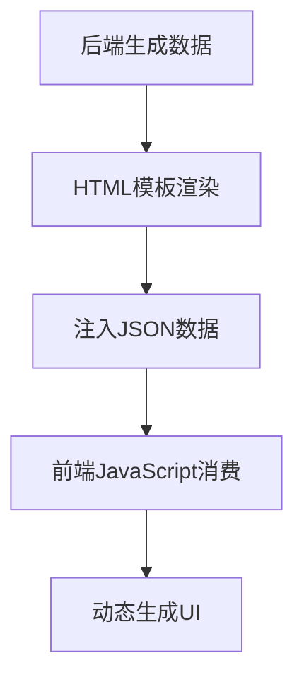
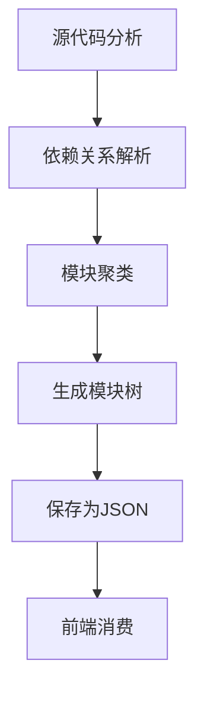
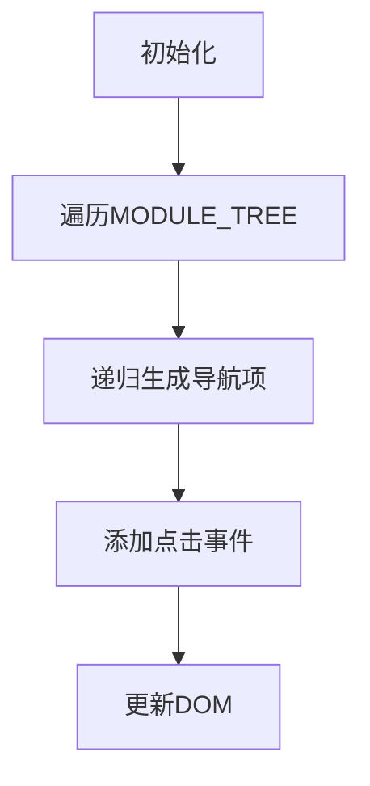
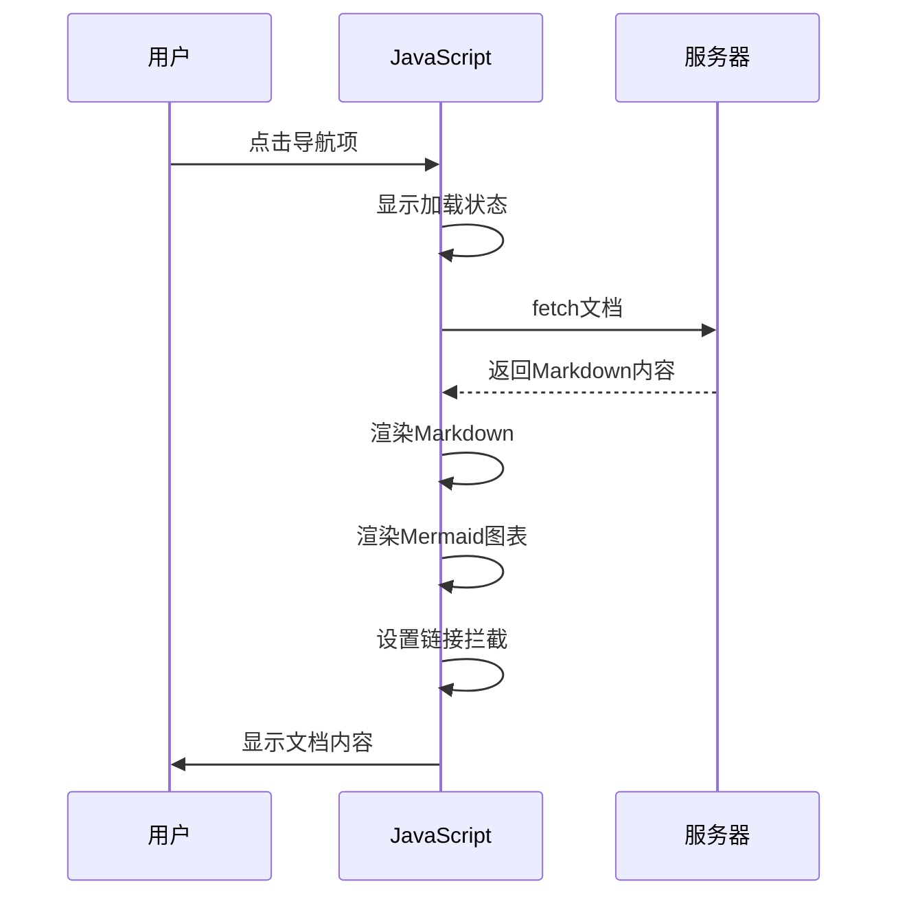

# 前端数据消费

<cite>
**本文档引用的文件**  
- [viewer_template.html](file://codewiki/templates/github_pages/viewer_template.html)
- [html_generator.py](file://codewiki/cli/html_generator.py)
- [template_utils.py](file://codewiki/src/fe/template_utils.py)
- [documentation_generator.py](file://codewiki/src/be/documentation_generator.py)
- [module_tree.json](file://codewiki/src/be/documentation_generator.py#L69)
- [metadata.json](file://codewiki/src/be/documentation_generator.py#L83)
</cite>

## 目录
1. [简介](#简介)
2. [服务端数据注入机制](#服务端数据注入机制)
3. [模块树结构与生成](#模块树结构与生成)
4. [导航构建逻辑](#导航构建逻辑)
5. [文档加载与单页应用导航](#文档加载与单页应用导航)
6. [实际模块树结构示例](#实际模块树结构示例)
7. [结论](#结论)

## 简介
本文档深入分析`viewer_template.html`中JavaScript如何消费服务端注入的JSON数据，重点阐述`CONFIG`、`MODULE_TREE`等常量如何将后端数据转换为前端可操作的对象，以及`buildNavigation`、`loadDocument`等函数如何实现动态导航和文档加载功能。

## 服务端数据注入机制

`viewer_template.html`通过模板占位符将服务端生成的JSON数据直接嵌入到JavaScript代码中。在页面加载时，这些JSON数据被解析为前端可操作的JavaScript对象。



**图示来源**
- [viewer_template.html](file://codewiki/templates/github_pages/viewer_template.html#L401-L404)
- [html_generator.py](file://codewiki/cli/html_generator.py#L148-L152)

### 数据注入实现

在`viewer_template.html`中，以下语句将服务端数据注入到前端：

```javascript
const CONFIG = {{CONFIG_JSON}};
const MODULE_TREE = {{MODULE_TREE_JSON}};
const METADATA = {{METADATA_JSON}};
const DOCS_BASE_PATH = '{{DOCS_BASE_PATH}}';
```

这些占位符由`HTMLGenerator`类在`html_generator.py`中替换为实际的JSON数据：

```python
# 准备嵌入的JSON数据
config_json = json.dumps(config, indent=2)
module_tree_json = json.dumps(module_tree, indent=2)
metadata_json = json.dumps(metadata, indent=2) if metadata else "null"

# 替换模板占位符
replacements = {
    "{{CONFIG_JSON}}": config_json,
    "{{MODULE_TREE_JSON}}": module_tree_json,
    "{{METADATA_JSON}}": metadata_json,
    "{{DOCS_BASE_PATH}}": docs_base_path,
}
```

**本节来源**
- [viewer_template.html](file://codewiki/templates/github_pages/viewer_template.html#L401-L404)
- [html_generator.py](file://codewiki/cli/html_generator.py#L148-L163)

## 模块树结构与生成

`MODULE_TREE`对象是前端导航系统的核心数据结构，它反映了代码库的模块化组织。该结构由后端分析生成，并通过`module_tree.json`文件持久化。

### 模块树生成流程



**图示来源**
- [documentation_generator.py](file://codewiki/src/be/documentation_generator.py#L60-L72)
- [dependency_analyzer](file://codewiki/src/be/dependency_analyzer)

### 模块树数据结构

`MODULE_TREE`是一个嵌套的字典结构，每个节点包含以下属性：

- `path`: 模块的文件系统路径
- `components`: 该模块包含的核心组件列表
- `children`: 子模块的嵌套字典

后端在生成文档时会创建`module_tree.json`文件：

```python
# documentation_generator.py
metadata = {
    "generation_info": {
        "commit_id": self.commit_id
    },
    "statistics": {
        "total_components": len(components),
        "leaf_nodes": num_leaf_nodes,
        "max_depth": self.config.max_depth,
        "token_usage": self.total_token_usage
    },
    "files_generated": [
        "overview.md",
        "module_tree.json",
        "first_module_tree.json"
    ]
}
```

**本节来源**
- [documentation_generator.py](file://codewiki/src/be/documentation_generator.py#L60-L72)
- [module_tree.json](file://codewiki/src/be/documentation_generator.py#L69)

## 导航构建逻辑

`buildNavigation`函数负责将`MODULE_TREE`数据结构转换为可视化的侧边栏导航菜单。

### 导航构建流程



**图示来源**
- [viewer_template.html](file://codewiki/templates/github_pages/viewer_template.html#L440-L464)

### 递归导航项生成

`buildNavItem`函数采用递归方式遍历`MODULE_TREE`，根据节点深度生成不同层级的导航项：

```javascript
function buildNavItem(key, data, depth) {
    const indentClass = depth > 0 ? 'nav-subsection' : 'nav-section';
    const fileName = `${key}.md`;
    
    let html = `<div class="${indentClass}">`;
    
    if (data.components && data.components.length > 0) {
        html += `<div class="nav-item" data-file="${fileName}">
                    ${formatNavTitle(key)}
                </div>`;
    } else if (depth === 0) {
        html += `<h3>${formatNavTitle(key)}</h3>`;
    } else {
        html += `<div class="nav-item" data-file="${fileName}">
                    ${formatNavTitle(key)}
                </div>`;
    }
    
    if (data.children) {
        for (const [childKey, childData] of Object.entries(data.children)) {
            html += buildNavItem(childKey, childData, depth + 1);
        }
    }
    
    html += '</div>';
    return html;
}
```

**本节来源**
- [viewer_template.html](file://codewiki/templates/github_pages/viewer_template.html#L466-L492)

### 导航标题格式化

`formatNavTitle`函数将模块键名转换为用户友好的显示标题：

```javascript
function formatNavTitle(key) {
    return key
        .replace(/_/g, ' ')
        .split(' ')
        .map(word => word.charAt(0).toUpperCase() + word.slice(1))
        .join(' ');
}
```

该函数执行以下转换：
1. 将下划线`_`替换为空格
2. 按空格分割字符串
3. 将每个单词首字母大写
4. 重新连接为完整标题

例如：`user_management` → `User Management`

**本节来源**
- [viewer_template.html](file://codewiki/templates/github_pages/viewer_template.html#L494-L500)

## 文档加载与单页应用导航

前端通过`loadDocument`和`setupMarkdownLinks`函数实现单页应用(SPA)式的文档导航体验。

### 文档加载流程



**图示来源**
- [viewer_template.html](file://codewiki/templates/github_pages/viewer_template.html#L502-L536)

### 文档加载实现

`loadDocument`函数负责加载和渲染Markdown文档：

```javascript
async function loadDocument(filename) {
    const docPath = DOCS_BASE_PATH ? `${DOCS_BASE_PATH}/${filename}` : filename;
    const response = await fetch(docPath);
    const markdown = await response.text();
    const html = await renderMarkdown(markdown);
    
    content.innerHTML = html;
    
    // 渲染Mermaid图表
    await renderMermaidDiagrams();
    
    // 设置Markdown链接拦截
    setupMarkdownLinks();
}
```

**本节来源**
- [viewer_template.html](file://codewiki/templates/github_pages/viewer_template.html#L502-L536)

### 单页应用导航实现

`setupMarkdownLinks`函数通过事件委托拦截所有Markdown链接的点击事件，实现SPA式导航：

```javascript
function setupMarkdownLinks() {
    const content = document.getElementById('content');
    
    // 移除现有监听器避免重复
    const oldListener = content._markdownLinkListener;
    if (oldListener) {
        content.removeEventListener('click', oldListener);
    }
    
    const listener = function(e) {
        const link = e.target.closest('a');
        if (!link) return;
        
        const href = link.getAttribute('href');
        if (!href) return;
        
        // 检查是否为.md文件链接
        const mdMatch = href.match(/([^\/]*\.md(?:#.*)?$)/i);
        if (mdMatch) {
            e.preventDefault();
            e.stopPropagation();
            
            const filename = mdMatch[1].split('#')[0];
            loadDocument(filename);
            
            // 更新侧边栏激活状态
            document.querySelectorAll('.nav-item').forEach(item => {
                if (item.getAttribute('data-file') === filename) {
                    document.querySelectorAll('.nav-item').forEach(i => i.classList.remove('active'));
                    item.classList.add('active');
                }
            });
        }
    };
    
    content._markdownLinkListener = listener;
    content.addEventListener('click', listener);
}
```

**本节来源**
- [viewer_template.html](file://codewiki/templates/github_pages/viewer_template.html#L538-L586)

## 实际模块树结构示例

以下是`BidingCC--BuildingAI-docs`项目的`module_tree.json`实际结构示例：

```json
{
    "packages/@buildingai/ai-sdk": {
        "path": "packages/@buildingai/ai-sdk/src",
        "components": [
            "ProviderConfig",
            "ProviderConfigUtils",
            "ExtendedChatCompletionChunk",
            "DocumentParser"
        ],
        "children": {}
    },
    "packages/api/src/modules/ai": {
        "path": "packages/api/src/modules/ai",
        "components": [
            "AiAgentModule",
            "AiChatModule",
            "AiDatasetsModule",
            "AiMcpModule"
        ],
        "children": {}
    },
    "extensions/buildingai-simple-blog": {
        "path": "extensions/buildingai-simple-blog/src",
        "components": [
            "Article",
            "Category",
            "ArticleModule",
            "ArticleController"
        ],
        "children": {}
    }
}
```

这个结构展示了项目的主要模块，每个模块包含其路径、核心组件列表和子模块（当前为空）。前端JavaScript通过遍历这个结构生成相应的导航菜单。

**本节来源**
- [module_tree.json](file://output/docs/BidingCC--BuildingAI-docs/module_tree.json)

## 结论
`viewer_template.html`中的JavaScript通过精心设计的数据注入和消费机制，实现了动态、交互式的文档查看体验。服务端生成的JSON数据被无缝集成到前端，通过递归算法生成导航结构，并利用单页应用技术提供流畅的文档浏览体验。这种前后端协作模式确保了文档系统的灵活性和可维护性。