# 数据注入机制

<cite>
**本文档引用的文件**
- [html_generator.py](file://codewiki/cli/html_generator.py)
- [viewer_template.html](file://codewiki/templates/github_pages/viewer_template.html)
- [errors.py](file://codewiki/cli/utils/errors.py)
- [fs.py](file://codewiki/cli/utils/fs.py)
- [documentation_generator.py](file://codewiki/src/be/documentation_generator.py)
</cite>

## 目录
1. [简介](#简介)
2. [项目结构](#项目结构)
3. [核心组件](#核心组件)
4. [架构概览](#架构概览)
5. [详细组件分析](#详细组件分析)
6. [依赖关系分析](#依赖关系分析)
7. [性能考虑](#性能考虑)
8. [故障排除指南](#故障排除指南)
9. [结论](#结论)

## 简介

本文档深入分析了`html_generator.py`中`HTMLGenerator.generate`方法的数据注入机制，重点解释了占位符`{{CONFIG_JSON}}`、`{{MODULE_TREE_JSON}}`、`{{METADATA_JSON}}`的构建过程和数据来源。该机制通过JSON序列化将后端生成的数据无缝注入到前端模板中，确保前后端数据格式的一致性和生成过程的健壮性。

## 项目结构

该项目采用分层架构设计，主要包含以下关键组件：

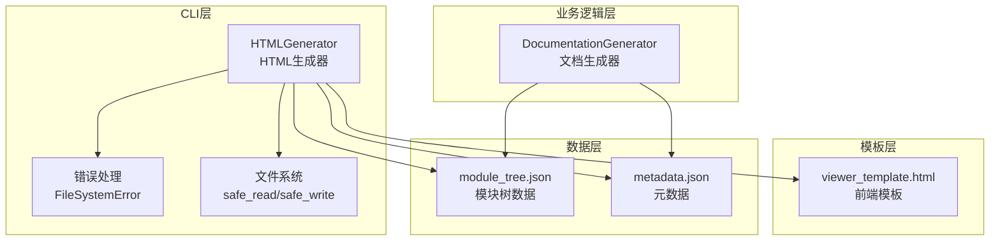

**图表来源**
- [html_generator.py](file://codewiki/cli/html_generator.py#L13-L285)
- [viewer_template.html](file://codewiki/templates/github_pages/viewer_template.html#L1-L644)

**章节来源**
- [html_generator.py](file://codewiki/cli/html_generator.py#L1-L285)

## 核心组件

### HTMLGenerator类

HTMLGenerator是整个数据注入机制的核心，负责：
- 加载和验证模板文件
- 从文件系统加载JSON数据
- 构建替换字典并执行字符串替换
- 处理错误和异常情况

### 占位符系统

模板中定义了多个占位符，其中最重要的三个是：
- `{{CONFIG_JSON}}`: 配置信息的JSON序列化
- `{{MODULE_TREE_JSON}}`: 模块树结构的JSON序列化
- `{{METADATA_JSON}}`: 元数据的JSON序列化

**章节来源**
- [html_generator.py](file://codewiki/cli/html_generator.py#L83-L172)
- [viewer_template.html](file://codewiki/templates/github_pages/viewer_template.html#L399-L404)

## 架构概览

数据注入机制的整体流程如下：

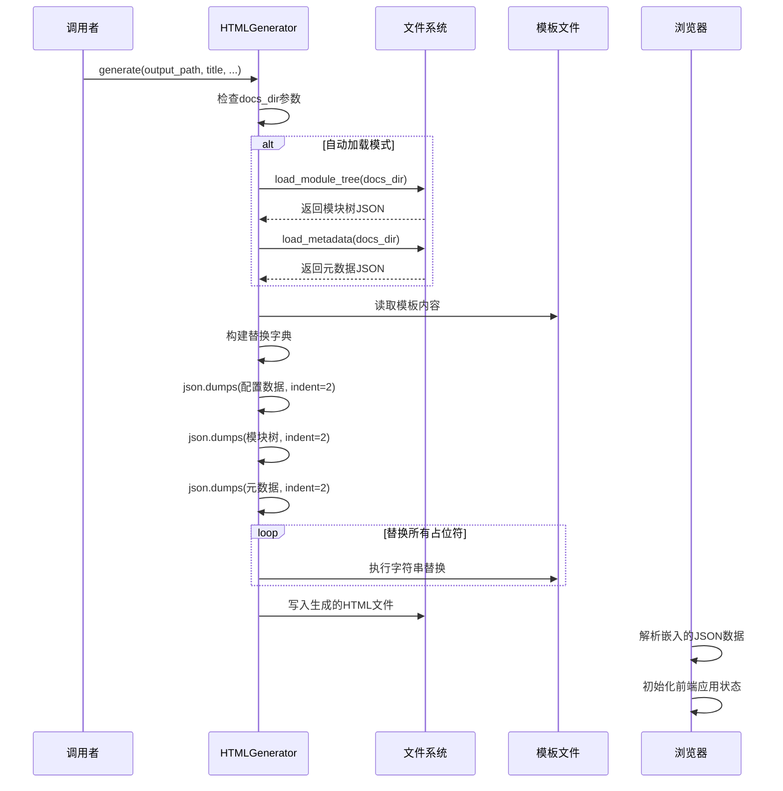

**图表来源**
- [html_generator.py](file://codewiki/cli/html_generator.py#L83-L172)
- [viewer_template.html](file://codewiki/templates/github_pages/viewer_template.html#L399-L404)

## 详细组件分析

### 数据加载机制

#### load_module_tree方法

该方法负责从文档目录加载模块树数据：

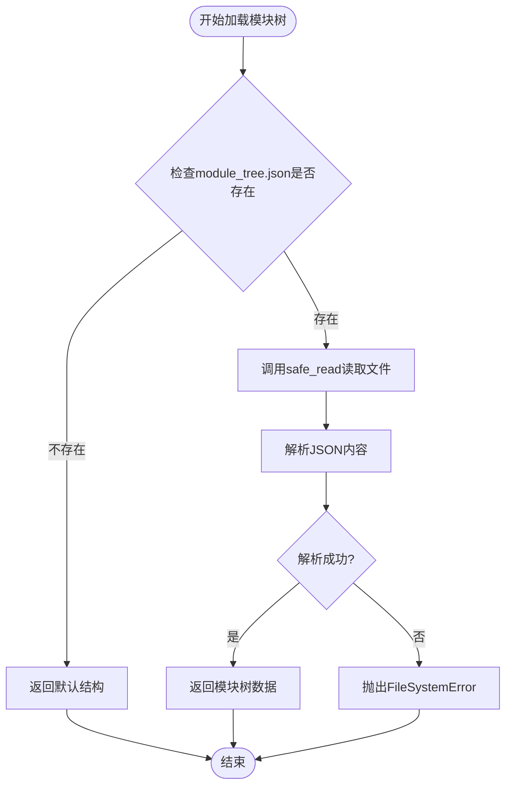

**图表来源**
- [html_generator.py](file://codewiki/cli/html_generator.py#L35-L61)

#### load_metadata方法

元数据加载具有更宽松的错误处理策略：

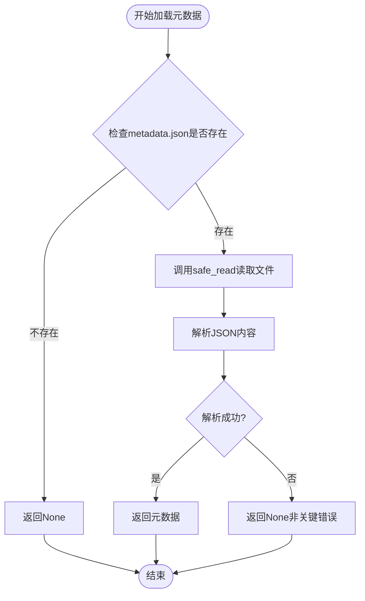

**图表来源**
- [html_generator.py](file://codewiki/cli/html_generator.py#L62-L81)

### JSON序列化与数据注入

#### json.dumps的使用

在数据注入过程中，`json.dumps`函数被广泛使用：

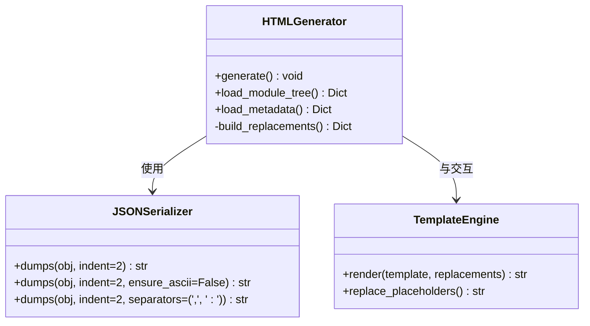

**图表来源**
- [html_generator.py](file://codewiki/cli/html_generator.py#L148-L150)

#### indent=2参数的重要性

`indent=2`参数对输出质量有重要影响：

| 参数 | 影响 |
|------|------|
| indent=2 | 生成格式化的JSON，提高可读性 |
| 缺省值 | 生成紧凑的JSON，节省空间但可读性差 |
| 性能影响 | 格式化会增加字符串长度和处理时间 |
| 前端调试 | 开发环境下便于调试和理解数据结构 |

### 替换字典构建

生成方法中的替换字典构建过程：

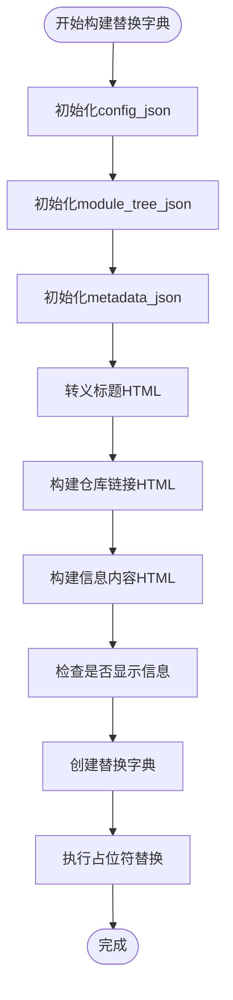

**图表来源**
- [html_generator.py](file://codewiki/cli/html_generator.py#L147-L167)

### 数据结构分析

#### 模块树（ModuleTree）结构

模块树采用嵌套字典结构：

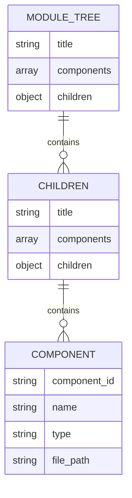

**图表来源**
- [html_generator.py](file://codewiki/cli/html_generator.py#L48-L54)

#### 元数据（Metadata）结构

元数据包含生成信息和统计信息：

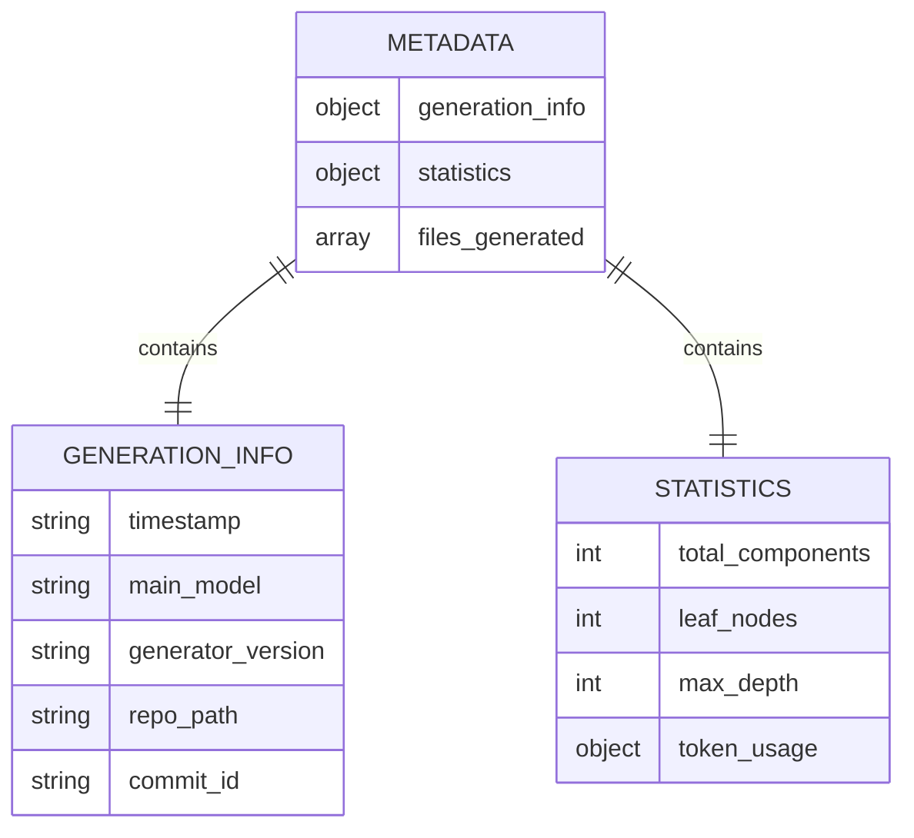

**图表来源**
- [documentation_generator.py](file://codewiki/src/be/documentation_generator.py#L54-L73)

### 错误处理策略

#### FileSystemError异常处理

系统实现了多层次的错误处理：

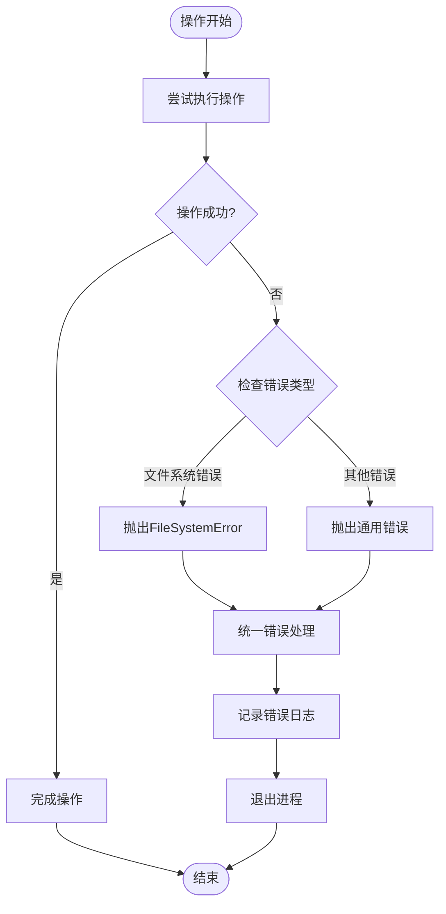

**图表来源**
- [errors.py](file://codewiki/cli/utils/errors.py#L57-L62)

**章节来源**
- [html_generator.py](file://codewiki/cli/html_generator.py#L35-L81)
- [errors.py](file://codewiki/cli/utils/errors.py#L57-L84)

## 依赖关系分析

### 组件间依赖关系

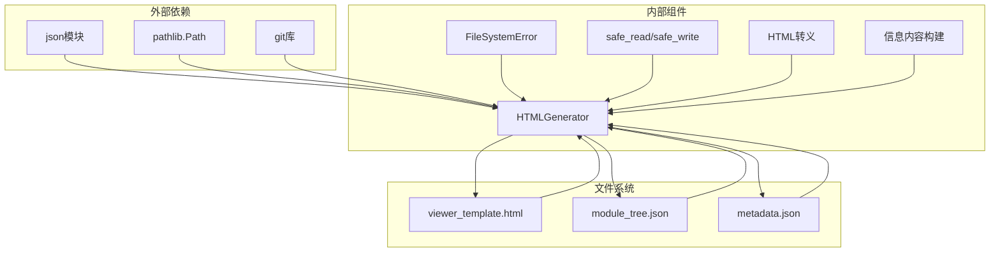

**图表来源**
- [html_generator.py](file://codewiki/cli/html_generator.py#L1-L11)
- [viewer_template.html](file://codewiki/templates/github_pages/viewer_template.html#L1-L644)

### 数据流图

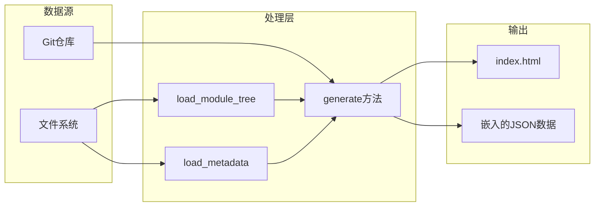

**图表来源**
- [html_generator.py](file://codewiki/cli/html_generator.py#L35-L172)

**章节来源**
- [html_generator.py](file://codewiki/cli/html_generator.py#L1-L285)

## 性能考虑

### JSON序列化优化

1. **延迟序列化**: 只在需要时进行JSON序列化，避免不必要的计算
2. **格式化选择**: 在开发环境使用格式化，在生产环境可以考虑压缩
3. **内存管理**: 大型数据结构的序列化可能占用较多内存

### I/O操作优化

1. **原子写入**: 使用临时文件+重命名的方式确保文件完整性
2. **缓存策略**: 对于重复使用的数据，考虑实现缓存机制
3. **批量操作**: 减少文件系统的频繁访问

## 故障排除指南

### 常见问题及解决方案

#### 模板文件缺失

**问题**: 模板文件不存在导致生成失败
**解决方案**: 
- 检查模板目录路径
- 验证文件权限
- 确认包资源正确安装

#### JSON文件格式错误

**问题**: 模块树或元数据文件格式不正确
**解决方案**:
- 使用在线JSON验证工具检查格式
- 检查编码格式（UTF-8）
- 验证必需字段的存在性

#### 权限问题

**问题**: 文件读写权限不足
**解决方案**:
- 检查目标目录的写权限
- 验证用户对文件的访问权限
- 确保磁盘空间充足

**章节来源**
- [fs.py](file://codewiki/cli/utils/fs.py#L60-L114)
- [errors.py](file://codewiki/cli/utils/errors.py#L57-L84)

## 结论

HTMLGenerator的数据注入机制通过精心设计的文件加载、JSON序列化和模板替换流程，实现了前后端数据的无缝集成。该机制的关键优势包括：

1. **健壮性**: 完善的错误处理和回退策略
2. **一致性**: 统一的数据格式和结构
3. **可维护性**: 清晰的职责分离和模块化设计
4. **可扩展性**: 易于添加新的数据源和占位符

通过合理使用`json.dumps`的`indent=2`参数，系统在保证数据完整性的同时，也兼顾了开发调试的便利性。这种设计确保了生成的HTML文档既能在GitHub Pages上正常运行，也能在本地环境中提供良好的用户体验。