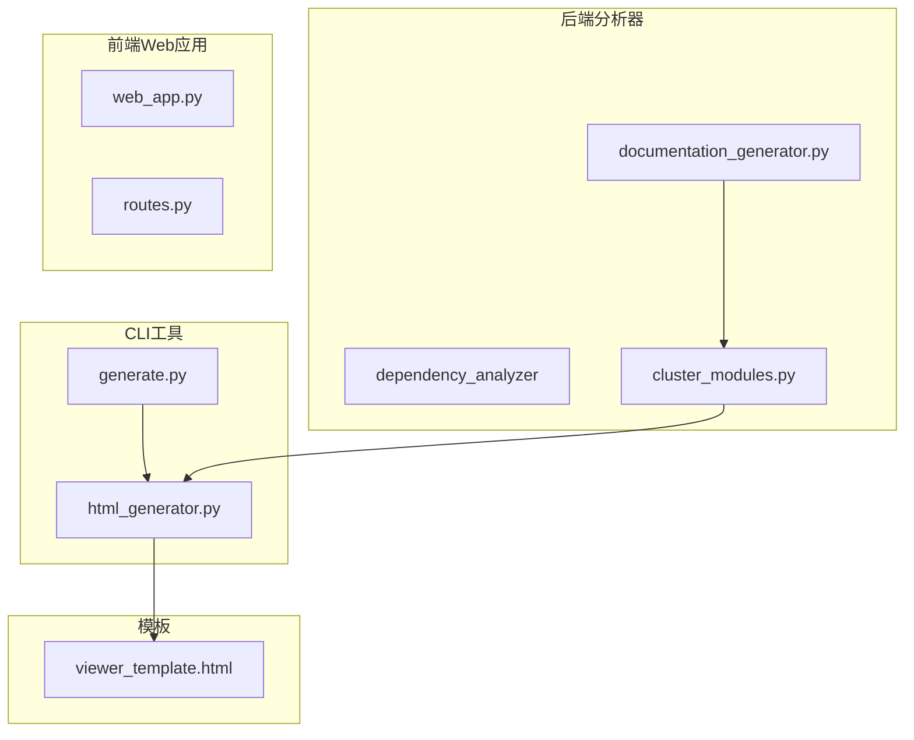
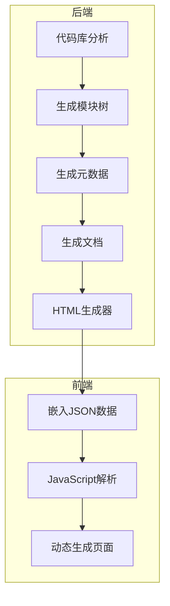
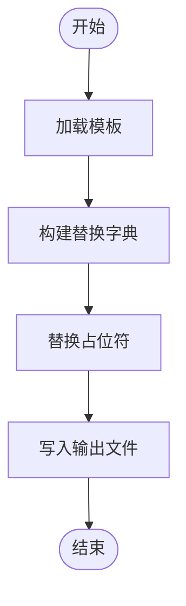
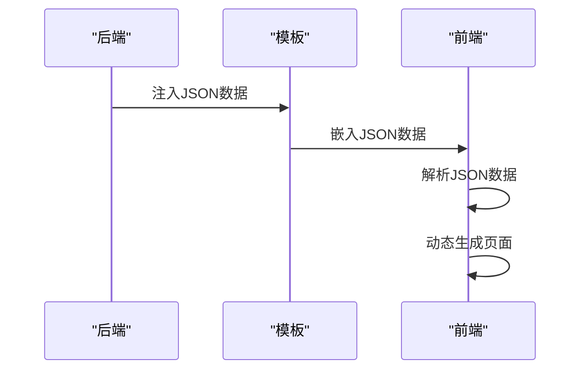
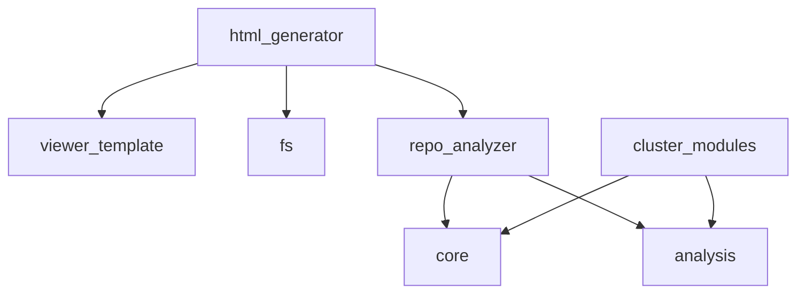

# 模板占位符系统

<cite>
**本文档引用的文件**
- [html_generator.py](file://codewiki/cli/html_generator.py)
- [viewer_template.html](file://codewiki/templates/github_pages/viewer_template.html)
- [core.py](file://codewiki/src/be/dependency_analyzer/models/core.py)
- [analysis.py](file://codewiki/src/be/dependency_analyzer/models/analysis.py)
- [repo_analyzer.py](file://codewiki/src/be/dependency_analyzer/analysis/repo_analyzer.py)
- [cluster_modules.py](file://codewiki/src/be/cluster_modules.py)
- [generate.py](file://codewiki/cli/commands/generate.py)
- [fs.py](file://codewiki/cli/utils/fs.py)
</cite>

## 目录
1. [简介](#简介)
2. [项目结构](#项目结构)
3. [核心组件](#核心组件)
4. [架构概述](#架构概述)
5. [详细组件分析](#详细组件分析)
6. [依赖分析](#依赖分析)
7. [性能考虑](#性能考虑)
8. [故障排除指南](#故障排除指南)
9. [结论](#结论)
10. [附录](#附录)（如有必要）

## 简介
本文档系统性地文档化了HTML查看器的模板占位符替换机制。详细说明了`html_generator.py`中`generate`方法如何构建替换字典（replacements），包括`{{TITLE}}`、`{{REPO_LINK}}`、`{{MODULE_TREE_JSON}}`等占位符的数据来源和格式化过程。解释了`{{SHOW_INFO}}`如何控制信息面板的显示/隐藏，`{{DOCS_BASE_PATH}}`如何支持相对路径解析。结合`viewer_template.html`中的JavaScript代码，说明了这些注入的JSON数据如何被`CONFIG`、`MODULE_TREE`等常量接收并用于驱动前端逻辑。提供了实际的JSON数据示例，展示了模块树（ModuleTree）和元数据（Metadata）的结构如何映射到导航和信息面板。阐述了该设计如何实现前后端解耦，使模板能够独立于生成逻辑进行定制。

## 项目结构
项目结构清晰地分为CLI工具、后端分析器、前端Web应用和模板文件。核心的HTML生成器位于`codewiki/cli/html_generator.py`，它使用`codewiki/templates/github_pages/viewer_template.html`作为模板来生成静态HTML文档查看器。后端分析器位于`codewiki/src/be`目录下，负责代码库的分析和文档生成。前端Web应用位于`codewiki/src/fe`目录下，提供Web界面。模板文件位于`codewiki/templates/github_pages/`目录下，包含HTML模板和静态资源。



**图示来源**
- [html_generator.py](file://codewiki/cli/html_generator.py#L1-L285)
- [viewer_template.html](file://codewiki/templates/github_pages/viewer_template.html#L1-L644)
- [cluster_modules.py](file://codewiki/src/be/cluster_modules.py#L1-L125)

**本节来源**
- [html_generator.py](file://codewiki/cli/html_generator.py#L1-L285)
- [viewer_template.html](file://codewiki/templates/github_pages/viewer_template.html#L1-L644)

## 核心组件
核心组件包括HTML生成器、模块树分析器、元数据生成器和模板引擎。HTML生成器负责将模板与数据结合生成最终的HTML文件。模块树分析器负责分析代码库的结构并生成模块树。元数据生成器负责收集和生成文档的元数据。模板引擎负责处理模板中的占位符替换。

**本节来源**
- [html_generator.py](file://codewiki/cli/html_generator.py#L1-L285)
- [repo_analyzer.py](file://codewiki/src/be/dependency_analyzer/analysis/repo_analyzer.py#L1-L127)
- [cluster_modules.py](file://codewiki/src/be/cluster_modules.py#L1-L125)

## 架构概述
系统架构采用前后端分离的设计，后端负责分析代码库并生成文档数据，前端负责展示文档。HTML生成器作为后端的一部分，负责将生成的文档数据与HTML模板结合，生成最终的静态HTML文件。前端通过JavaScript读取嵌入的JSON数据，动态生成导航和内容。



**图示来源**
- [html_generator.py](file://codewiki/cli/html_generator.py#L1-L285)
- [viewer_template.html](file://codewiki/templates/github_pages/viewer_template.html#L1-L644)

## 详细组件分析
### HTML生成器分析
HTML生成器是整个系统的核心组件，负责将模板与数据结合生成最终的HTML文件。它通过`generate`方法接收各种参数，构建替换字典，并将占位符替换为实际内容。

#### 占位符替换机制


**图示来源**
- [html_generator.py](file://codewiki/cli/html_generator.py#L120-L167)

#### 数据注入与前端交互


**图示来源**
- [html_generator.py](file://codewiki/cli/html_generator.py#L147-L163)
- [viewer_template.html](file://codewiki/templates/github_pages/viewer_template.html#L401-L404)

**本节来源**
- [html_generator.py](file://codewiki/cli/html_generator.py#L1-L285)
- [viewer_template.html](file://codewiki/templates/github_pages/viewer_template.html#L1-L644)

### 模块树与元数据结构
模块树和元数据是前端动态生成页面的基础。模块树描述了代码库的结构，元数据包含了文档的生成信息。

#### 模块树结构示例
```json
{
    "cli_module": {
        "path": "codewiki/cli",
        "components": [
            "CLIDocumentationGenerator",
            "ConfigManager",
            "GitManager",
            "HTMLGenerator"
        ],
        "children": {}
    }
}
```

#### 元数据结构示例
```json
{
    "generation_info": {
        "timestamp": "2026-01-05T15:41:59.373923",
        "main_model": "openai/GLM-4.7",
        "generator_version": "1.0.1",
        "commit_id": null
    },
    "statistics": {
        "total_components": 180,
        "leaf_nodes": 51,
        "max_depth": 2
    }
}
```

**本节来源**
- [module_tree.json](file://output/docs/FSoft-AI4Code--CodeWiki-docs/module_tree.json)
- [metadata.json](file://output/docs/FSoft-AI4Code--CodeWiki-docs/metadata.json)

## 依赖分析
系统各组件之间的依赖关系清晰，HTML生成器依赖于模板文件和数据生成器，数据生成器依赖于代码库分析器。这种设计使得各组件可以独立开发和测试。



**图示来源**
- [html_generator.py](file://codewiki/cli/html_generator.py#L5-L11)
- [repo_analyzer.py](file://codewiki/src/be/dependency_analyzer/analysis/repo_analyzer.py#L3-L13)
- [cluster_modules.py](file://codewiki/src/be/cluster_modules.py#L7-L11)

**本节来源**
- [html_generator.py](file://codewiki/cli/html_generator.py#L1-L285)
- [repo_analyzer.py](file://codewiki/src/be/dependency_analyzer/analysis/repo_analyzer.py#L1-L127)
- [cluster_modules.py](file://codewiki/src/be/cluster_modules.py#L1-L125)

## 性能考虑
在生成大量文档时，性能是一个重要考虑因素。系统通过缓存机制和并行处理来提高性能。HTML生成器在生成文件时使用原子写入，确保文件的完整性。模块树分析器通过过滤不必要的文件和目录来减少分析时间。

## 故障排除指南
### 常见问题
- **模板文件缺失**：确保`viewer_template.html`文件存在且路径正确。
- **JSON数据格式错误**：检查生成的JSON数据是否符合预期格式。
- **文件写入权限问题**：确保输出目录有写入权限。

**本节来源**
- [html_generator.py](file://codewiki/cli/html_generator.py#L123-L124)
- [fs.py](file://codewiki/cli/utils/fs.py#L60-L86)

## 结论
本文档详细分析了HTML查看器的模板占位符替换机制，展示了如何通过前后端解耦的设计实现灵活的文档生成。通过清晰的组件划分和依赖管理，系统具有良好的可维护性和扩展性。未来可以进一步优化性能，增加更多的模板定制选项。

## 附录
### 配置选项
| 选项 | 描述 | 默认值 |
|------|------|--------|
| output | 输出目录 | docs |
| create-branch | 创建Git分支 | false |
| github-pages | 生成GitHub Pages | false |
| no-cache | 禁用缓存 | false |
| verbose | 详细输出 | false |

**本节来源**
- [generate.py](file://codewiki/cli/commands/generate.py#L34-L77)