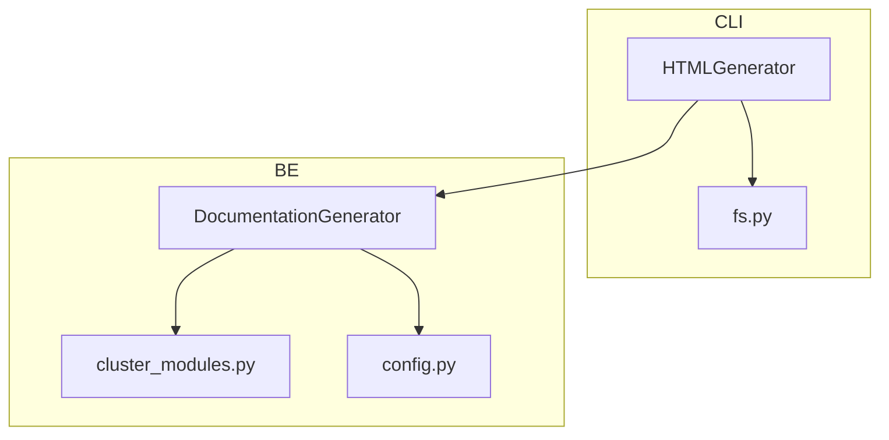
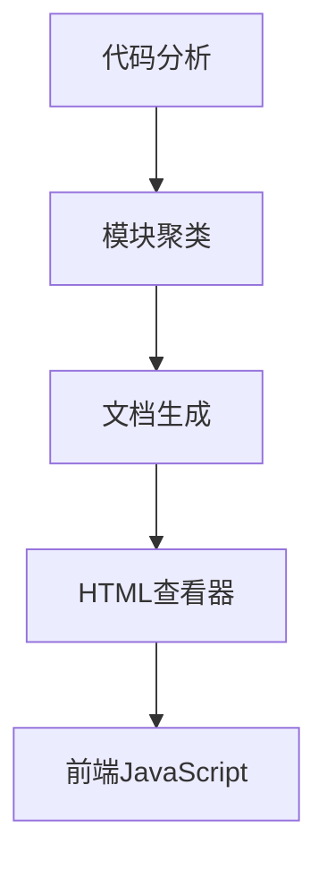
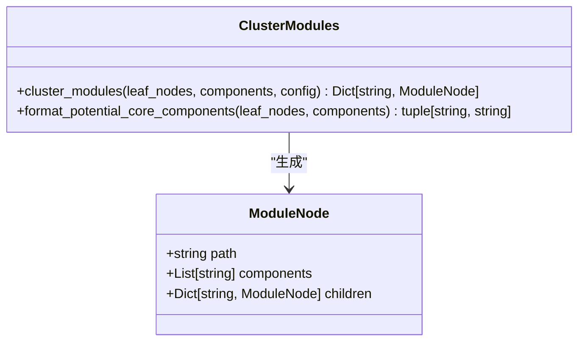
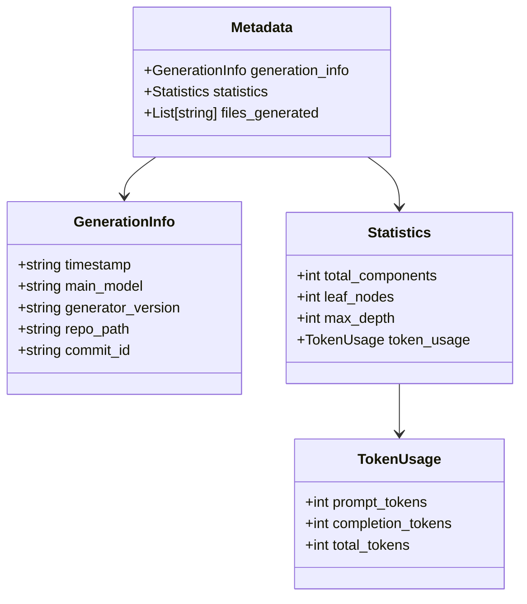
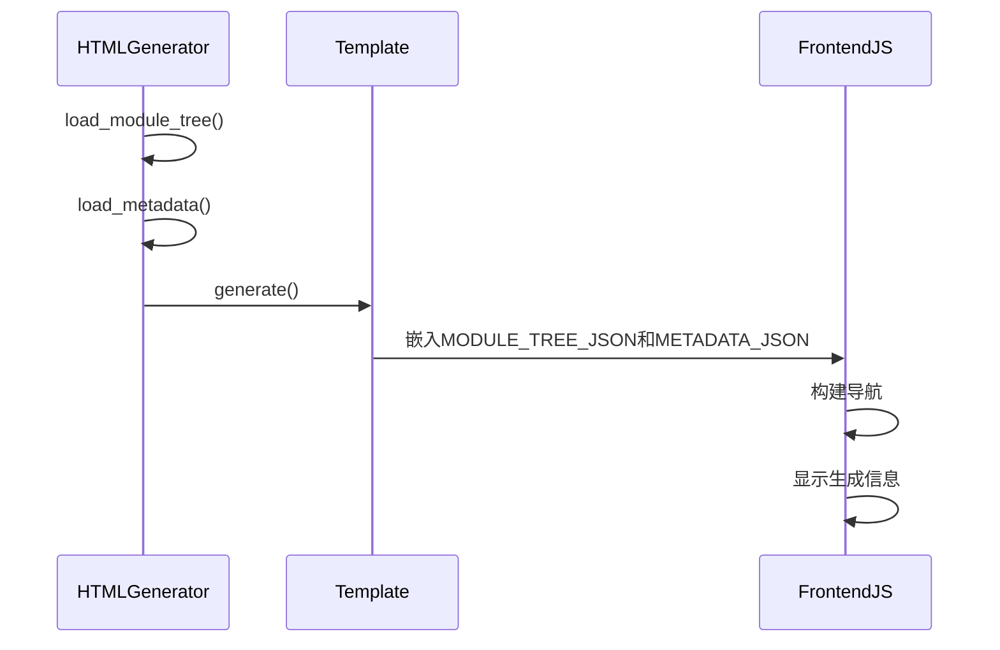
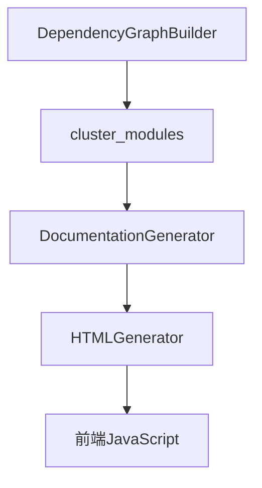

# JSON元数据

<cite>
**本文档中引用的文件**  
- [html_generator.py](file://codewiki/cli/html_generator.py)
- [documentation_generator.py](file://codewiki/src/be/documentation_generator.py)
- [cluster_modules.py](file://codewiki/src/be/cluster_modules.py)
- [config.py](file://codewiki/src/config.py)
- [fs.py](file://codewiki/cli/utils/fs.py)
- [utils.py](file://codewiki/src/utils.py)
- [viewer_template.html](file://codewiki/templates/github_pages/viewer_template.html)
- [module_tree.json](file://output/docs/FSoft-AI4Code--CodeWiki-docs/module_tree.json)
- [metadata.json](file://output/docs/FSoft-AI4Code--CodeWiki-docs/metadata.json)
</cite>

## 目录
1. [简介](#简介)
2. [项目结构](#项目结构)
3. [核心组件](#核心组件)
4. [架构概述](#架构概述)
5. [详细组件分析](#详细组件分析)
6. [依赖分析](#依赖分析)
7. [性能考虑](#性能考虑)
8. [故障排除指南](#故障排除指南)
9. [结论](#结论)

## 简介
本文档全面记录了CodeWiki生成的JSON元数据文件，包括`module_tree.json`和`metadata.json`。详细说明了`module_tree.json`的结构，解释其如何表示代码库的层次化模块树，包含每个节点的名称、描述、子模块和组件列表。同时解释了`metadata.json`的内容，包括生成信息（如LLM模型、时间戳、提交ID）和统计信息（如组件总数、最大深度）。最后描述了这些JSON文件如何被`HTMLGenerator`类加载，并在前端JavaScript中用于构建导航结构和显示生成信息。

## 项目结构
CodeWiki项目具有清晰的分层结构，主要分为CLI（命令行接口）和BE（后端）两大部分。CLI部分负责用户交互和文档生成，而BE部分负责核心的代码分析和文档生成逻辑。`module_tree.json`和`metadata.json`文件在文档生成过程中起着关键作用，它们被`HTMLGenerator`类用于生成静态HTML文档查看器。

**图表来源**  
- [html_generator.py](file://codewiki/cli/html_generator.py#L13-L285)
- [documentation_generator.py](file://codewiki/src/be/documentation_generator.py#L29-L382)
- [cluster_modules.py](file://codewiki/src/be/cluster_modules.py#L1-L125)
- [config.py](file://codewiki/src/config.py#L1-L123)

**章节来源**  
- [html_generator.py](file://codewiki/cli/html_generator.py#L1-L285)
- [documentation_generator.py](file://codewiki/src/be/documentation_generator.py#L1-L382)

## 核心组件
`module_tree.json`和`metadata.json`是CodeWiki生成的核心元数据文件。`module_tree.json`表示代码库的层次化模块树，每个节点包含名称、路径、组件列表和子模块。`metadata.json`包含生成信息和统计信息，用于记录文档生成的上下文和结果。

**章节来源**  
- [documentation_generator.py](file://codewiki/src/be/documentation_generator.py#L50-L85)
- [html_generator.py](file://codewiki/cli/html_generator.py#L148-L151)

## 架构概述
CodeWiki的架构分为三个主要部分：代码分析、模块聚类和文档生成。首先，`DependencyGraphBuilder`分析代码库并提取组件和依赖关系。然后，`cluster_modules`函数使用LLM将组件聚类成模块树。最后，`DocumentationGenerator`生成文档，并将`module_tree.json`和`metadata.json`嵌入到HTML查看器中。

**图表来源**  
- [dependency_graphs_builder.py](file://codewiki/src/be/dependency_analyzer/dependency_graphs_builder.py#L64-L94)
- [cluster_modules.py](file://codewiki/src/be/cluster_modules.py#L44-L125)
- [documentation_generator.py](file://codewiki/src/be/documentation_generator.py#L320-L382)
- [html_generator.py](file://codewiki/cli/html_generator.py#L83-L172)

## 详细组件分析

### module_tree.json 分析
`module_tree.json`文件表示代码库的层次化模块树。每个模块节点包含路径、组件列表和子模块。该文件由`cluster_modules`函数生成，并在`DocumentationGenerator`中用于生成文档。

**图表来源**  
- [cluster_modules.py](file://codewiki/src/be/cluster_modules.py#L44-L125)
- [module_tree.json](file://output/docs/FSoft-AI4Code--CodeWiki-docs/module_tree.json#L1-L83)

### metadata.json 分析
`metadata.json`文件包含文档生成的元数据，包括生成信息和统计信息。生成信息包含时间戳、主模型、生成器版本和提交ID。统计信息包含总组件数、叶节点数和最大深度。

**图表来源**  
- [documentation_generator.py](file://codewiki/src/be/documentation_generator.py#L54-L85)
- [metadata.json](file://output/docs/FSoft-AI4Code--CodeWiki-docs/metadata.json#L1-L24)

### HTML生成器分析
`HTMLGenerator`类负责生成静态HTML文档查看器。它加载`module_tree.json`和`metadata.json`文件，并将它们嵌入到HTML模板中。前端JavaScript使用这些数据构建导航结构和显示生成信息。

**图表来源**  
- [html_generator.py](file://codewiki/cli/html_generator.py#L35-L82)
- [viewer_template.html](file://codewiki/templates/github_pages/viewer_template.html#L401-L403)
- [utils.py](file://codewiki/src/utils.py#L10-L45)

**章节来源**  
- [html_generator.py](file://codewiki/cli/html_generator.py#L13-L285)
- [viewer_template.html](file://codewiki/templates/github_pages/viewer_template.html#L1-L644)

## 依赖分析
`module_tree.json`和`metadata.json`文件的生成和使用涉及多个组件的协作。`DependencyGraphBuilder`生成组件和叶节点，`cluster_modules`使用这些数据生成模块树，`DocumentationGenerator`生成元数据，最后`HTMLGenerator`将这些数据嵌入到HTML查看器中。

**图表来源**  
- [dependency_graphs_builder.py](file://codewiki/src/be/dependency_analyzer/dependency_graphs_builder.py#L64-L94)
- [cluster_modules.py](file://codewiki/src/be/cluster_modules.py#L44-L125)
- [documentation_generator.py](file://codewiki/src/be/documentation_generator.py#L320-L382)
- [html_generator.py](file://codewiki/cli/html_generator.py#L83-L172)

**章节来源**  
- [dependency_graphs_builder.py](file://codewiki/src/be/dependency_analyzer/dependency_graphs_builder.py#L64-L94)
- [cluster_modules.py](file://codewiki/src/be/cluster_modules.py#L44-L125)
- [documentation_generator.py](file://codewiki/src/be/documentation_generator.py#L320-L382)
- [html_generator.py](file://codewiki/cli/html_generator.py#L83-L172)

## 性能考虑
`module_tree.json`和`metadata.json`文件的生成和加载对性能有重要影响。为了优化性能，CodeWiki使用原子写入和安全读取来确保文件操作的可靠性。此外，模块树的生成使用LLM进行聚类，这可能是一个计算密集型过程，但通过缓存和重用现有模块树来优化。

**章节来源**  
- [fs.py](file://codewiki/cli/utils/fs.py#L60-L87)
- [cluster_modules.py](file://codewiki/src/be/cluster_modules.py#L62-L69)

## 故障排除指南
如果`module_tree.json`或`metadata.json`文件生成失败，首先检查日志以确定错误原因。常见的问题包括文件权限不足、LLM调用失败或组件数据不一致。确保所有必要的依赖项都已正确安装，并且LLM API密钥和URL配置正确。

**章节来源**  
- [fs.py](file://codewiki/cli/utils/fs.py#L108-L113)
- [cluster_modules.py](file://codewiki/src/be/cluster_modules.py#L72-L87)
- [documentation_generator.py](file://codewiki/src/be/documentation_generator.py#L377-L381)

## 结论
`module_tree.json`和`metadata.json`是CodeWiki生成的核心元数据文件，它们在文档生成和查看过程中起着关键作用。通过理解这些文件的结构和生成过程，可以更好地利用CodeWiki来生成高质量的代码文档。