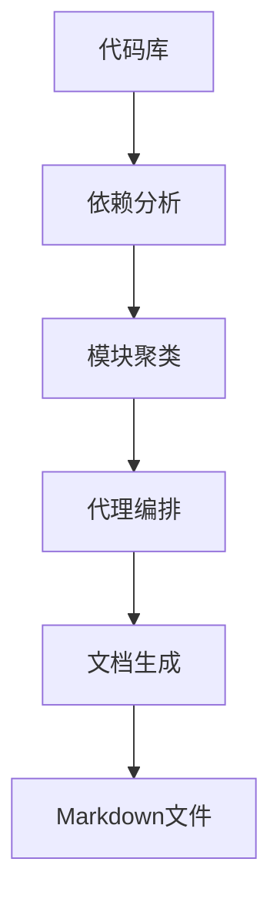
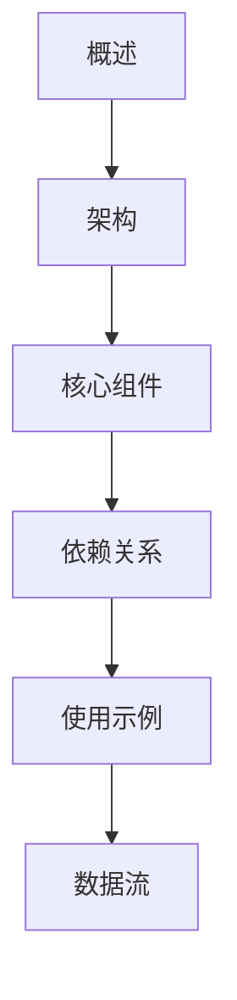
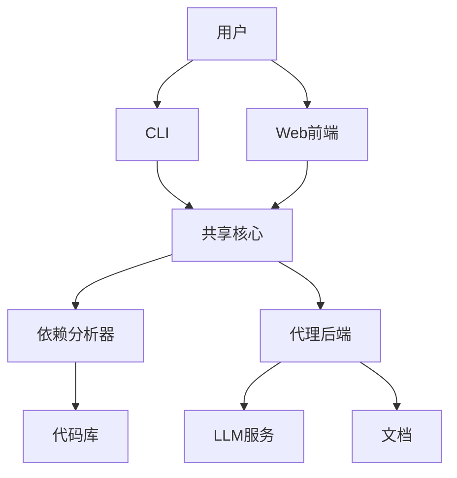
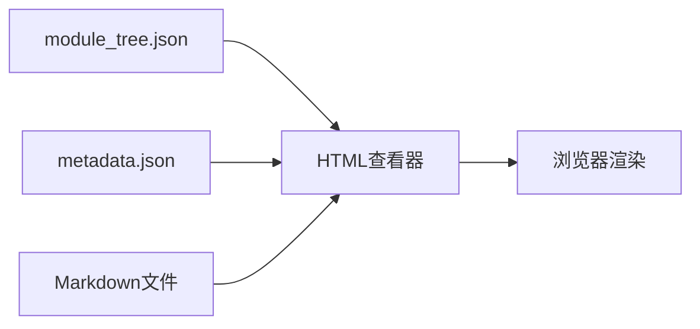

# Markdown文档

<cite>
**本文档引用的文件**   
- [overview.md](file://./docs/overview.md)
- [moduleX.md](file://./docs/moduleX.md)
- [documentation_generator.py](file://codewiki/src/be/documentation_generator.py)
- [prompt_template.py](file://codewiki/src/be/prompt_template.py)
- [html_generator.py](file://codewiki/cli/html_generator.py)
- [viewer_template.html](file://codewiki/templates/github_pages/viewer_template.html)
- [agent_orchestrator.py](file://codewiki/src/be/agent_orchestrator.py)
</cite>

## 目录
1. [文档生成机制](#文档生成机制)
2. [标准文档结构](#标准文档结构)
3. [模块文档内容](#模块文档内容)
4. [概述文档内容](#概述文档内容)
5. [HTML查看器实现](#html查看器实现)
6. [内部链接导航](#内部链接导航)

## 文档生成机制

CodeWiki通过AI分析代码库生成Markdown文档。系统首先使用依赖分析器构建代码库的依赖图，然后通过模块聚类算法将代码组件分组为逻辑模块。文档生成器使用递归代理系统，根据模块复杂度创建不同类型的AI代理。

对于复杂模块，系统创建具有递归能力的代理，可以进一步分解子模块；对于简单模块，则创建基本代理。代理系统使用预定义的提示模板与大型语言模型交互，生成结构化的技术文档。

**图源**
- [documentation_generator.py](file://codewiki/src/be/documentation_generator.py#L320-L382)
- [agent_orchestrator.py](file://codewiki/src/be/agent_orchestrator.py#L62-L198)

## 标准文档结构

CodeWiki生成的文档遵循统一的结构标准，确保一致性和可读性。每个模块文档包含以下标准章节：

### 概述
简要介绍模块的目的和核心功能，提供高层次的上下文。

### 架构
展示模块的架构设计，包括组件关系和数据流，通常包含Mermaid图表。

### 核心组件
详细描述模块中的关键类、函数或组件，包括其职责和相互关系。

### 依赖关系
列出模块的外部依赖和与其他模块的交互关系。

### 使用示例
提供代码示例和API使用方法，帮助开发者快速上手。

### 数据流
描述模块内部的数据处理流程和状态转换。

**图源**
- [prompt_template.py](file://codewiki/src/be/prompt_template.py#L22-L39)

## 模块文档内容

模块文档（如`moduleX.md`）是CodeWiki生成的核心技术文档，详细描述特定功能模块的设计和实现。

### 模块描述
文档以模块名称作为主标题，随后是简明的模块描述，解释其在系统中的角色和价值。

### 组件关系
使用Mermaid类图或ER图展示模块内组件的关系，包括继承、组合和依赖等。

### 依赖信息
详细列出模块的直接和间接依赖，包括外部库和内部模块。

### 代码示例
提供实际的代码片段，展示关键功能的使用方法。示例代码包含适当的上下文和注释。

### 性能考虑
对于性能敏感的模块，文档会包含性能特征、瓶颈分析和优化建议。

**节源**
- [documentation_generator.py](file://codewiki/src/be/documentation_generator.py#L137-L251)
- [prompt_template.py](file://codewiki/src/be/prompt_template.py#L96-L111)

## 概述文档内容

`overview.md`是文档系统的入口点，提供整个代码库的全局视图。

### 仓库概览
文档以仓库名称作为主标题，包含仓库的目的、主要功能和整体架构。

### 架构图
使用Mermaid图表展示系统的端到端架构，包括主要组件、它们之间的关系和数据流。

### 核心模块
列出并简要描述各个核心模块，为读者提供导航指引。

### 技术栈
说明项目使用的主要技术、框架和编程语言。

### 快速开始
提供简明的入门指南，帮助新开发者快速理解项目。

**图源**
- [overview.md](file://./docs/overview.md)
- [documentation_generator.py](file://codewiki/src/be/documentation_generator.py#L253-L319)

## HTML查看器实现

CodeWiki可以生成静态HTML查看器，便于在GitHub Pages等平台上展示文档。

### 模板结构
查看器基于`viewer_template.html`模板，包含嵌入的CSS样式、JavaScript脚本和HTML结构。

### 动态加载
查看器在客户端动态加载Markdown文件，使用marked.js进行渲染，mermaid.js处理图表。

### 导航系统
侧边栏导航根据`module_tree.json`自动生成，支持多级模块结构的导航。

### 响应式设计
查看器采用响应式设计，在桌面和移动设备上都能良好显示。

**图源**
- [html_generator.py](file://codewiki/cli/html_generator.py#L83-L285)
- [viewer_template.html](file://codewiki/templates/github_pages/viewer_template.html#L1-L644)

## 内部链接导航

文档系统通过内部链接实现模块间的无缝导航。

### 链接格式
使用标准Markdown链接语法，目标文件名作为链接文本。

### 自动解析
HTML查看器的JavaScript代码拦截内部链接点击事件，动态加载目标文档。

### 活动状态
当前查看的文档在侧边栏中高亮显示，提供清晰的导航上下文。

### 路径处理
系统正确处理相对路径和锚点链接，确保所有内部引用都能正确解析。

**节源**
- [viewer_template.html](file://codewiki/templates/github_pages/viewer_template.html#L537-L586)
- [html_generator.py](file://codewiki/cli/html_generator.py#L236-L284)