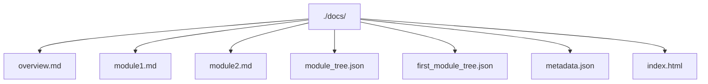
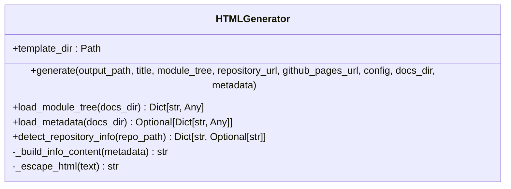
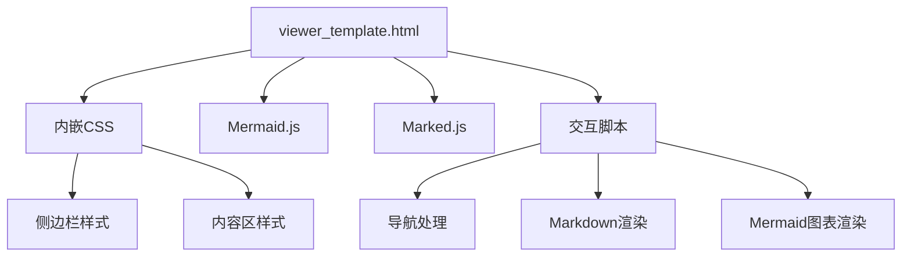
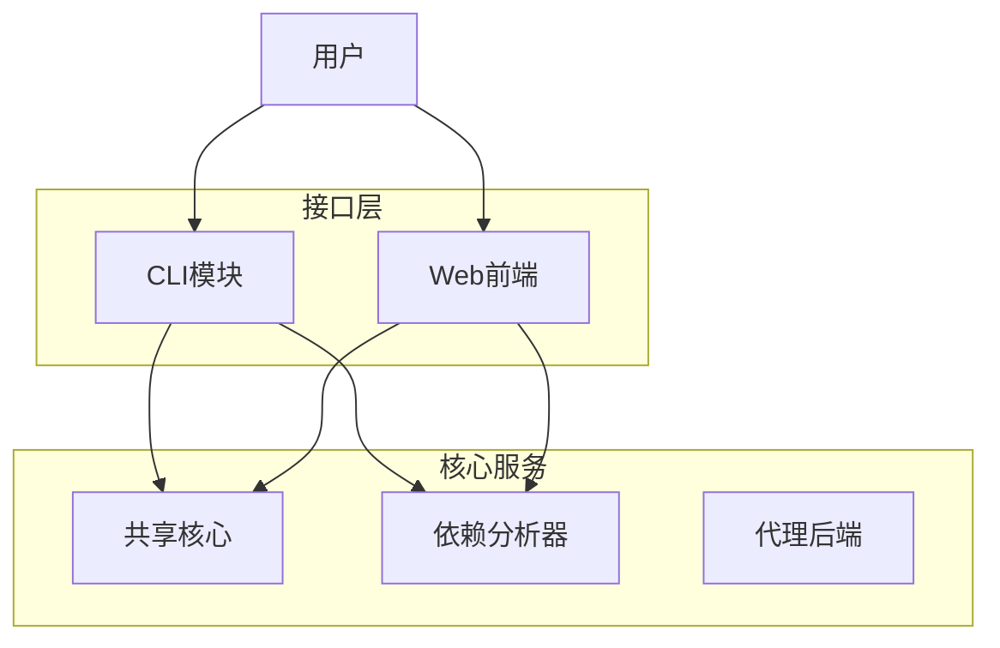
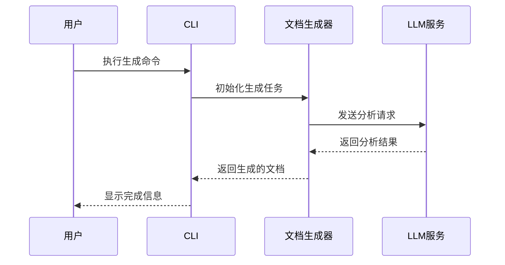

# 输出格式

<cite>
**本文档中引用的文件**  
- [overview.md](file://docs/overview.md)
- [moduleX.md](file://docs/moduleX.md)
- [module_tree.json](file://docs/module_tree.json)
- [first_module_tree.json](file://docs/first_module_tree.json)
- [metadata.json](file://docs/metadata.json)
- [index.html](file://docs/index.html)
- [html_generator.py](file://codewiki/cli/html_generator.py)
- [viewer_template.html](file://codewiki/templates/github_pages/viewer_template.html)
</cite>

## 目录
1. [项目结构](#项目结构)
2. [核心输出文件](#核心输出文件)
3. [HTML查看器功能](#html查看器功能)
4. [视觉工件生成](#视觉工件生成)
5. [HTML模板自定义](#html模板自定义)

## 项目结构

CodeWiki生成的文档输出位于`./docs/`目录下，包含多种文件类型，共同构成完整的文档体系。



**Diagram sources**  
- [README.md](file://README.md#L162-L170)

**Section sources**  
- [README.md](file://README.md#L162-L170)

## 核心输出文件

### overview.md

`overview.md`是文档的入口文件，提供仓库的总体概述和架构指南。

**用途**：  
- 提供项目整体架构视图  
- 包含系统级交互分析  
- 作为文档导航起点  

**内容结构**：  
- 项目目的和核心功能  
- 系统架构图（Mermaid）  
- 架构流程描述  
- 核心模块文档链接  

**Section sources**  
- [overview.md](file://output/docs/FSoft-AI4Code--CodeWiki-docs/overview.md#L1-L108)

### moduleX.md

`moduleX.md`文件为各个功能模块提供详细文档，其中X代表具体模块名称。

**用途**：  
- 详细描述特定模块的功能和实现  
- 提供API参考和使用示例  
- 展示模块内部架构  

**内容结构**：  
- 模块概述  
- 核心组件说明  
- 组件关系图（Mermaid）  
- 数据流图  
- 使用示例  

**Section sources**  
- [shared_core_module.md](file://output/docs/FSoft-AI4Code--CodeWiki-docs/shared_core_module.md#L1-L200)
- [dependency_analyzer_module.md](file://output/docs/FSoft-AI4Code--CodeWiki-docs/dependency_analyzer_module.md#L1-L200)

### module_tree.json

`module_tree.json`定义了文档的层次结构和导航体系。

**用途**：  
- 存储模块的层次化组织结构  
- 为HTML查看器提供导航数据  
- 记录模块路径和组件信息  

**结构示例**：
```json
{
    "cli_module": {
        "path": "codewiki/cli",
        "components": ["CLIDocumentationGenerator", "ConfigManager"],
        "children": {}
    }
}
```

**Section sources**  
- [module_tree.json](file://output/docs/FSoft-AI4Code--CodeWiki-docs/module_tree.json#L1-L83)

### first_module_tree.json

`first_module_tree.json`存储初始的模块聚类结果。

**用途**：  
- 保存首次分析生成的模块结构  
- 作为后续处理的基础  
- 用于调试和分析过程追踪  

**Section sources**  
- [first_module_tree.json](file://output/docs/FSoft-AI4Code--CodeWiki-docs/first_module_tree.json#L1-L83)

### metadata.json

`metadata.json`包含文档生成的元数据信息。

**用途**：  
- 记录生成时间戳和模型信息  
- 存储统计信息  
- 跟踪生成的文件列表  

**结构示例**：
```json
{
    "generation_info": {
        "timestamp": "2026-01-05T15:41:59.373923",
        "main_model": "openai/GLM-4.7"
    },
    "statistics": {
        "total_components": 180,
        "max_depth": 2
    }
}
```

**Section sources**  
- [metadata.json](file://output/docs/FSoft-AI4Code--CodeWiki-docs/metadata.json#L1-L24)

## HTML查看器功能

HTML查看器通过`html_generator.py`和`viewer_template.html`协同工作，创建交互式文档查看体验。

### html_generator.py

`html_generator.py`是HTML文档查看器的生成器类。

**核心功能**：  
- 加载模块树和元数据  
- 读取HTML模板  
- 替换模板占位符  
- 生成最终的`index.html`  

**主要方法**：  
- `generate()`: 主生成方法，协调整个生成过程  
- `load_module_tree()`: 加载模块树结构  
- `load_metadata()`: 加载元数据信息  
- `_build_info_content()`: 构建信息内容HTML  



**Diagram sources**  
- [html_generator.py](file://codewiki/cli/html_generator.py#L13-L285)

**Section sources**  
- [html_generator.py](file://codewiki/cli/html_generator.py#L13-L285)

### viewer_template.html

`viewer_template.html`是HTML查看器的模板文件。

**核心特性**：  
- 内嵌Mermaid.js用于图表渲染  
- 内嵌Marked.js用于Markdown解析  
- 响应式设计支持移动设备  
- 侧边栏导航系统  

**关键组件**：  
- **侧边栏**: 包含导航菜单和仓库信息  
- **内容区**: 动态加载Markdown内容  
- **脚本**: 处理文档加载和交互  



**Diagram sources**  
- [viewer_template.html](file://codewiki/templates/github_pages/viewer_template.html#L1-L644)

**Section sources**  
- [viewer_template.html](file://codewiki/templates/github_pages/viewer_template.html#L1-L644)

## 视觉工件生成

CodeWiki生成多种Mermaid图表来可视化代码结构和流程。

### 架构图

系统架构图展示模块间的高层次关系。



**Section sources**  
- [overview.md](file://output/docs/FSoft-AI4Code--CodeWiki-docs/overview.md#L13-L76)

### 数据流图

数据流图展示信息在系统中的流动过程。


**Section sources**  
- [dependency_analyzer_module.md](file://output/docs/FSoft-AI4Code--CodeWiki-docs/dependency_analyzer_module.md#L114-L157)

### 序列图

序列图展示组件间的交互时序。



**Section sources**  
- 无具体文件来源，为概念性示例

## HTML模板自定义

用户可以通过修改`viewer_template.html`来自定义HTML查看器的外观和功能。

### 自定义选项

**样式定制**：  
- 修改CSS变量调整主题颜色  
- 调整布局和间距  
- 更改字体和排版  

**功能扩展**：  
- 添加新的JavaScript功能  
- 集成其他可视化库  
- 增加搜索功能  

### 示例自定义

```css
:root {
    --primary-color: #2563eb;     /* 主题色 */
    --secondary-color: #f1f5f9;  /* 次要色 */
    --text-color: #334155;       /* 文本色 */
}
```

**Section sources**  
- [viewer_template.html](file://codewiki/templates/github_pages/viewer_template.html#L10-L17)