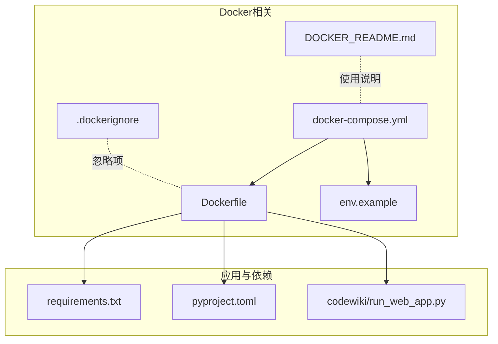
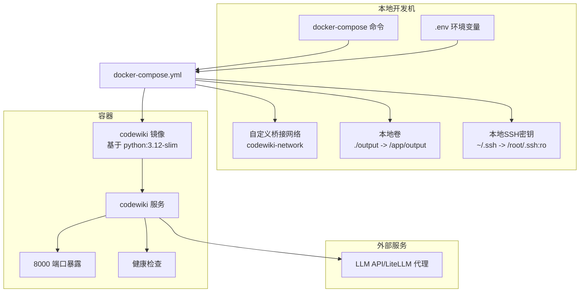
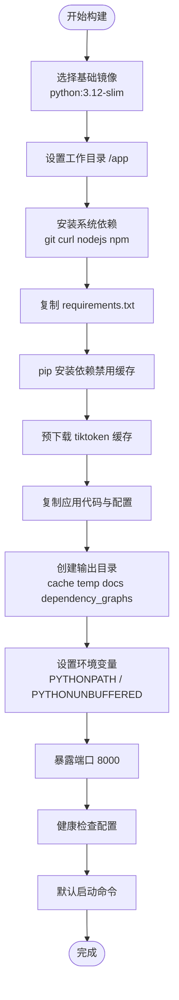
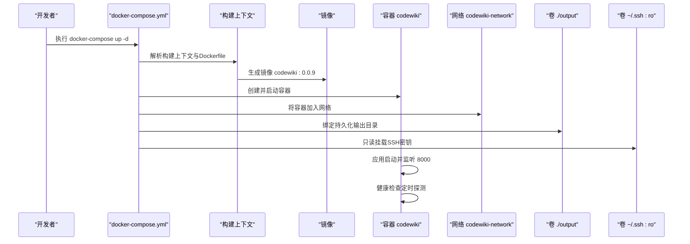
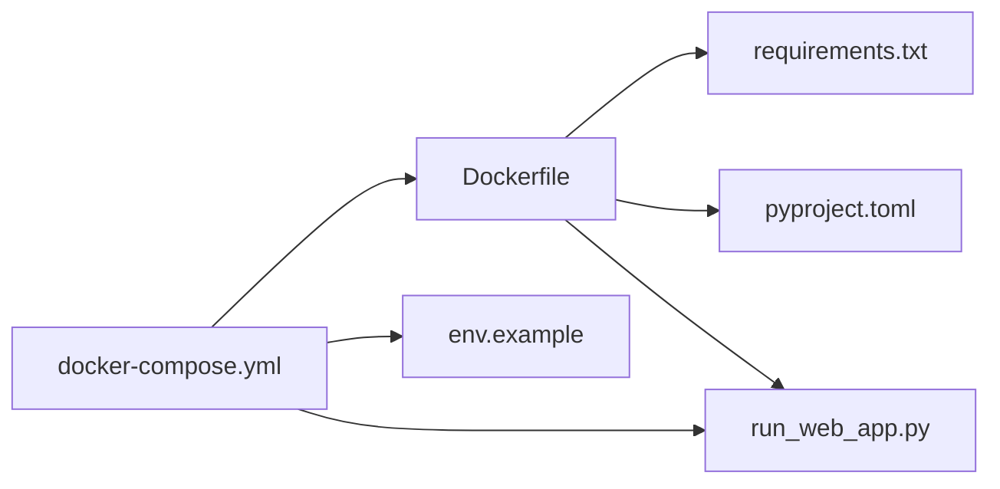

# Docker部署

<cite>
**本文引用的文件**
- [docker/Dockerfile](file://docker/Dockerfile)
- [docker/docker-compose.yml](file://docker/docker-compose.yml)
- [docker/.dockerignore](file://docker/.dockerignore)
- [docker/env.example](file://docker/env.example)
- [docker/DOCKER_README.md](file://docker/DOCKER_README.md)
- [requirements.txt](file://requirements.txt)
- [pyproject.toml](file://pyproject.toml)
- [codewiki/run_web_app.py](file://codewiki/run_web_app.py)
</cite>

## 目录
1. [简介](#简介)
2. [项目结构](#项目结构)
3. [核心组件](#核心组件)
4. [架构总览](#架构总览)
5. [详细组件分析](#详细组件分析)
6. [依赖关系分析](#依赖关系分析)
7. [性能考量](#性能考量)
8. [故障排查指南](#故障排查指南)
9. [结论](#结论)
10. [附录](#附录)

## 简介
本文件面向希望使用Docker与Docker Compose部署CodeWiki的用户，系统性讲解容器构建流程与服务编排要点，重点覆盖：
- 基础镜像选择（python:3.12-slim）的原因与优势
- 系统依赖安装（git、curl、nodejs等）与Python依赖分层安装策略
- tiktoken缓存预下载机制及其对离线环境的支持
- 应用代码复制、输出目录创建、环境变量设置（PYTHONPATH、PYTHONUNBUFFERED）
- 端口暴露（8000）与健康检查配置
- docker-compose.yml中服务定义：构建上下文、端口映射（支持环境变量APP_PORT）、环境变量注入、环境文件加载（.env）、网络配置（bridge模式）、卷挂载（output目录持久化、SSH密钥只读挂载）
- 重启策略（unless-stopped）与健康检查参数（interval、timeout、retries、start_period）的生产级意义
- 完整的docker-compose up命令示例与通过.env管理配置的方法
- 常见部署问题排查：权限问题、网络不通、依赖安装失败等

## 项目结构
与Docker部署直接相关的核心文件位于docker/目录，配合根目录下的requirements.txt、pyproject.toml以及应用入口脚本运行Web应用。

图表来源
- [docker/Dockerfile](file://docker/Dockerfile#L1-L47)
- [docker/docker-compose.yml](file://docker/docker-compose.yml#L1-L37)
- [docker/.dockerignore](file://docker/.dockerignore#L1-L81)
- [docker/env.example](file://docker/env.example#L1-L52)
- [docker/DOCKER_README.md](file://docker/DOCKER_README.md#L1-L447)
- [requirements.txt](file://requirements.txt#L1-L165)
- [pyproject.toml](file://pyproject.toml#L1-L125)
- [codewiki/run_web_app.py](file://codewiki/run_web_app.py#L1-L16)

章节来源
- [docker/Dockerfile](file://docker/Dockerfile#L1-L47)
- [docker/docker-compose.yml](file://docker/docker-compose.yml#L1-L37)
- [docker/.dockerignore](file://docker/.dockerignore#L1-L81)
- [docker/env.example](file://docker/env.example#L1-L52)
- [docker/DOCKER_README.md](file://docker/DOCKER_README.md#L1-L447)

## 核心组件
- Dockerfile：定义容器镜像构建步骤，含基础镜像、系统依赖、Python依赖、应用代码复制、输出目录创建、环境变量、端口暴露与健康检查、默认启动命令。
- docker-compose.yml：定义服务、构建上下文、端口映射、环境变量、环境文件、网络、卷挂载、重启策略与健康检查。
- .dockerignore：控制构建上下文中排除的文件与目录，提升构建效率与安全性。
- env.example：示例环境变量模板，包含LLM配置、应用端口、日志级别、可选监控令牌等。
- DOCKER_README.md：部署操作手册，涵盖快速开始、常见运维、故障排查与生产建议。

章节来源
- [docker/Dockerfile](file://docker/Dockerfile#L1-L47)
- [docker/docker-compose.yml](file://docker/docker-compose.yml#L1-L37)
- [docker/.dockerignore](file://docker/.dockerignore#L1-L81)
- [docker/env.example](file://docker/env.example#L1-L52)
- [docker/DOCKER_README.md](file://docker/DOCKER_README.md#L1-L447)

## 架构总览
下图展示从构建到运行的整体流程，以及compose服务与外部环境的关系。

图表来源
- [docker/docker-compose.yml](file://docker/docker-compose.yml#L1-L37)
- [docker/Dockerfile](file://docker/Dockerfile#L1-L47)
- [docker/env.example](file://docker/env.example#L1-L52)

## 详细组件分析

### Dockerfile 构建流程与优化策略
- 基础镜像与优势
  - 采用 python:3.12-slim 作为基础镜像，具备更小体积、更快拉取速度与更少攻击面的优势，适合生产部署。
- 工作目录与系统依赖
  - 设置工作目录为 /app；安装 git、curl、nodejs、npm 等系统依赖，用于仓库克隆、健康检查与Mermaid图验证。
- 分层安装Python依赖
  - 先复制 requirements.txt 并安装，再复制应用代码，利用Docker层缓存：当依赖未变更时可复用缓存，显著缩短后续构建时间。
- tiktoken缓存预下载
  - 在容器内执行导入并显式调用模型编码器，触发tiktoken缓存文件下载，确保在离线或受限网络环境下仍可正常生成文档。
- 应用代码复制与输出目录
  - 复制 codewiki、img、pyproject.toml、README.md 等必要文件；创建 output/cache、output/temp、output/docs、output/dependency_graphs 等输出目录，便于持久化与调试。
- 环境变量
  - 设置 PYTHONPATH=/app 使Python能直接导入 /app 下的模块；设置 PYTHONUNBUFFERED=1 保证日志实时输出。
- 端口与健康检查
  - 暴露 8000 端口；通过 HEALTHCHECK 使用 curl 访问 / 路径进行存活探测，参数包括间隔、超时、重试次数与启动期。
- 默认启动命令
  - CMD 启动 Web 应用，监听 0.0.0.0:8000。

图表来源
- [docker/Dockerfile](file://docker/Dockerfile#L1-L47)

章节来源
- [docker/Dockerfile](file://docker/Dockerfile#L1-L47)
- [requirements.txt](file://requirements.txt#L1-L165)
- [pyproject.toml](file://pyproject.toml#L1-L125)

### docker-compose.yml 服务配置详解
- 服务定义与镜像
  - 服务名为 codewiki，镜像名 codewiki:0.0.9；平台指定 linux/amd64。
- 构建上下文
  - build.context 为 ..，即以项目根目录为构建上下文，dockerfile 指向 docker/Dockerfile。
- 端口映射
  - ${APP_PORT:-8000} 映射到容器内部 8000 端口；APP_PORT 来自 .env 文件，默认 8000。
- 环境变量与环境文件
  - 注入 PYTHONPATH、PYTHONUNBUFFERED、LANGUAGE 等；env_file 加载 .env 文件，其中包含 LLM配置、APP_PORT、LOG_LEVEL、可选监控令牌等。
- 网络与卷挂载
  - 加入自定义桥接网络 codewiki-network；卷挂载：
    - ./output:/app/output（持久化输出）
    - ~/.ssh:/root/.ssh:ro（SSH密钥只读挂载，用于私有仓库）
- 重启策略与健康检查
  - restart: unless-stopped；健康检查参数：test、interval、timeout、retries、start_period，与Dockerfile一致。
- 平台与容器名称
  - platform: linux/amd64；container_name: codewiki。

图表来源
- [docker/docker-compose.yml](file://docker/docker-compose.yml#L1-L37)
- [docker/env.example](file://docker/env.example#L1-L52)

章节来源
- [docker/docker-compose.yml](file://docker/docker-compose.yml#L1-L37)
- [docker/env.example](file://docker/env.example#L1-L52)

### 环境变量与配置管理
- 关键变量
  - APP_PORT：对外映射端口，默认 8000
  - LOG_LEVEL：日志级别（DEBUG/INFO/WARNING/ERROR/CRITICAL）
  - LANGUAGE：生成文档语言（english/chinese）
  - LLM_BASE_URL、LLM_API_KEY、MAIN_MODEL、FALLBACK_MODEL_1、CLUSTER_MODEL：LLM相关配置
  - LOGFIRE_*：可选监控令牌与项目/服务名
- 注入方式
  - Dockerfile 中显式设置 PYTHONPATH、PYTHONUNBUFFERED
  - docker-compose.yml 中通过 environment 和 env_file 注入其余变量

章节来源
- [docker/env.example](file://docker/env.example#L1-L52)
- [docker/Dockerfile](file://docker/Dockerfile#L34-L36)
- [docker/docker-compose.yml](file://docker/docker-compose.yml#L11-L16)

### 输出目录与持久化
- 容器内创建 output/cache、output/temp、output/docs、output/dependency_graphs
- compose中将 ./output 挂载到 /app/output，确保生成文档与缓存在容器重启后不丢失

章节来源
- [docker/Dockerfile](file://docker/Dockerfile#L31-L32)
- [docker/docker-compose.yml](file://docker/docker-compose.yml#L19-L21)

### tiktoken缓存预下载与离线支持
- 在容器内显式调用模型编码器，触发tiktoken缓存文件下载
- 作用：在离线或受限网络环境中也能正常生成文档，避免首次使用时的网络依赖

章节来源
- [docker/Dockerfile](file://docker/Dockerfile#L21-L23)

### 健康检查与重启策略
- 健康检查参数
  - interval、timeout、retries、start_period 与Dockerfile一致，确保稳定探测与容错
- 重启策略
  - unless-stopped：除非手动停止，否则容器异常退出后自动重启，提升可用性

章节来源
- [docker/Dockerfile](file://docker/Dockerfile#L41-L43)
- [docker/docker-compose.yml](file://docker/docker-compose.yml#L25-L31)

## 依赖关系分析
- Dockerfile 依赖 requirements.txt 与 pyproject.toml 的依赖声明
- 运行时入口 codewiki/run_web_app.py 导入前端Web应用并启动
- compose 依赖 .env 提供运行时配置

图表来源
- [docker/Dockerfile](file://docker/Dockerfile#L1-L47)
- [docker/docker-compose.yml](file://docker/docker-compose.yml#L1-L37)
- [docker/env.example](file://docker/env.example#L1-L52)
- [requirements.txt](file://requirements.txt#L1-L165)
- [pyproject.toml](file://pyproject.toml#L1-L125)
- [codewiki/run_web_app.py](file://codewiki/run_web_app.py#L1-L16)

章节来源
- [docker/Dockerfile](file://docker/Dockerfile#L1-L47)
- [docker/docker-compose.yml](file://docker/docker-compose.yml#L1-L37)
- [docker/env.example](file://docker/env.example#L1-L52)
- [requirements.txt](file://requirements.txt#L1-L165)
- [pyproject.toml](file://pyproject.toml#L1-L125)
- [codewiki/run_web_app.py](file://codewiki/run_web_app.py#L1-L16)

## 性能考量
- 分层构建与缓存复用
  - 先复制 requirements.txt 再复制应用代码，避免依赖变更导致的全量重装
- 禁用pip缓存
  - 安装依赖时使用禁用缓存选项，减少镜像体积与潜在冲突
- 系统依赖最小化
  - 仅安装必要工具（git、curl、nodejs、npm），降低镜像大小与攻击面
- 健康检查参数合理设置
  - 适中的间隔与超时，兼顾探测频率与资源消耗

章节来源
- [docker/Dockerfile](file://docker/Dockerfile#L15-L19)
- [docker/.dockerignore](file://docker/.dockerignore#L1-L81)

## 故障排查指南
- 端口占用
  - 修改 .env 中 APP_PORT 并重启服务
- 容器无法启动
  - 查看容器日志，核对 LLM_API_KEY、网络与端口
- 健康检查失败
  - 使用 curl 测试本地访问，查看容器健康状态与日志
- 卷权限问题（Linux）
  - 调整 output 目录属主，或在 compose 中添加 user 映射
- 私有仓库访问
  - 确保 ~/.ssh 正确挂载且权限正确，必要时扫描并写入 known_hosts

章节来源
- [docker/DOCKER_README.md](file://docker/DOCKER_README.md#L263-L339)
- [docker/docker-compose.yml](file://docker/docker-compose.yml#L19-L24)

## 结论
通过上述Docker与Docker Compose配置，CodeWiki实现了：
- 高效、可复现的镜像构建与运行
- 生产级的健康检查与自动重启策略
- 稳健的离线能力（tiktoken缓存预下载）
- 易于维护的配置管理（.env）
- 可扩展的持久化与网络隔离

## 附录

### 快速开始与常用命令
- 准备 .env：复制示例文件并填写LLM与端口配置
- 创建网络：docker network create codewiki-network
- 启动服务：docker-compose -f docker/docker-compose.yml up -d
- 查看日志：docker-compose logs -f 或 docker logs codewiki -f
- 重建镜像：docker-compose build --no-cache；随后 up -d --build

章节来源
- [docker/DOCKER_README.md](file://docker/DOCKER_README.md#L25-L81)