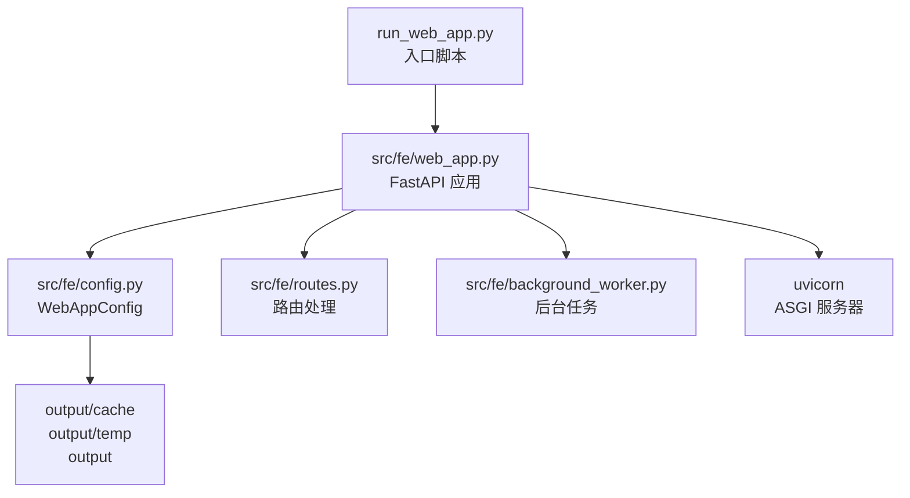
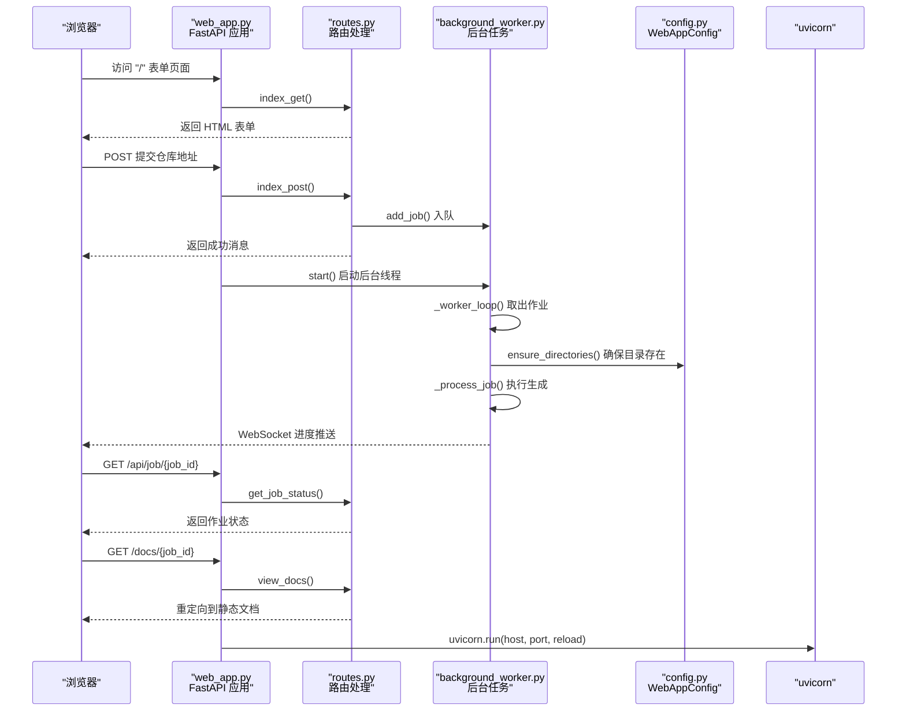
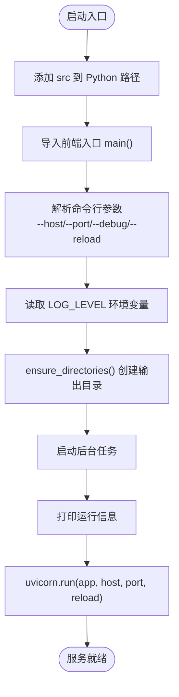
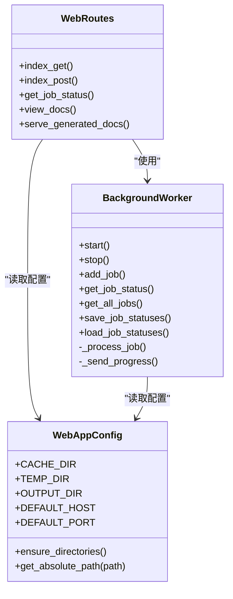
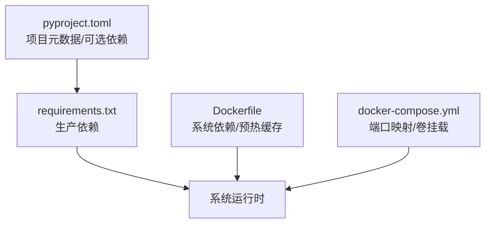

# 本地部署

<cite>
**本文引用的文件**
- [run_web_app.py](file://codewiki/run_web_app.py)
- [web_app.py](file://codewiki/src/fe/web_app.py)
- [config.py](file://codewiki/src/fe/config.py)
- [routes.py](file://codewiki/src/fe/routes.py)
- [background_worker.py](file://codewiki/src/fe/background_worker.py)
- [requirements.txt](file://requirements.txt)
- [pyproject.toml](file://pyproject.toml)
- [README.md](file://README.md)
- [DEVELOPMENT.md](file://DEVELOPMENT.md)
- [Dockerfile](file://docker/Dockerfile)
- [docker-compose.yml](file://docker/docker-compose.yml)
- [env.example](file://docker/env.example)
</cite>

## 目录
1. [简介](#简介)
2. [项目结构](#项目结构)
3. [核心组件](#核心组件)
4. [架构总览](#架构总览)
5. [详细组件分析](#详细组件分析)
6. [依赖关系分析](#依赖关系分析)
7. [性能与资源考虑](#性能与资源考虑)
8. [故障排查指南](#故障排查指南)
9. [结论](#结论)
10. [附录](#附录)

## 简介
本指南面向希望在宿主机上直接运行 CodeWiki Web 服务的用户，提供从创建虚拟环境、安装依赖、启动 Web 应用到配置环境变量、输出目录准备的完整步骤。同时对比本地部署与 Docker 部署的优缺点，并给出 Windows、macOS、Linux 的操作差异与注意事项；最后总结常见问题及解决方案。

## 项目结构
- 入口脚本位于 codewiki/run_web_app.py，负责将 src 目录加入 Python 路径并调用前端应用入口。
- 前端应用主模块为 codewiki/src/fe/web_app.py，基于 FastAPI 提供 Web 接口与后台任务。
- 配置类 WebAppConfig 定义了缓存、临时目录、默认主机与端口等。
- 后台任务由 background_worker.py 管理，负责队列、作业状态持久化与进度广播。
- requirements.txt 列出所有 Python 依赖；pyproject.toml 描述项目元数据与可选依赖。
- Docker 配置用于容器化部署，便于隔离环境与快速上线。

图表来源
- [run_web_app.py](file://codewiki/run_web_app.py#L1-L16)
- [web_app.py](file://codewiki/src/fe/web_app.py#L1-L165)
- [config.py](file://codewiki/src/fe/config.py#L1-L51)
- [routes.py](file://codewiki/src/fe/routes.py#L1-L200)
- [background_worker.py](file://codewiki/src/fe/background_worker.py#L1-L200)

章节来源
- [run_web_app.py](file://codewiki/run_web_app.py#L1-L16)
- [web_app.py](file://codewiki/src/fe/web_app.py#L1-L165)
- [config.py](file://codewiki/src/fe/config.py#L1-L51)
- [routes.py](file://codewiki/src/fe/routes.py#L1-L200)
- [background_worker.py](file://codewiki/src/fe/background_worker.py#L1-L200)
- [requirements.txt](file://requirements.txt#L1-L165)
- [pyproject.toml](file://pyproject.toml#L1-L125)

## 核心组件
- 启动入口与路径注入
  - run_web_app.py 将 src 加入 sys.path 并导入前端入口 main，实现从仓库根目录直接运行 Web 应用。
- Web 应用与 FastAPI
  - web_app.py 创建 FastAPI 实例，注册首页表单、提交、作业状态查询、文档查看、静态文档服务与 WebSocket 进度推送。
  - main() 解析 --host、--port、--debug、--reload 参数，配置日志级别，确保输出目录存在，启动后台任务并以 uvicorn 运行。
- 配置与目录
  - WebAppConfig 定义 CACHE_DIR、TEMP_DIR、OUTPUT_DIR、默认主机与端口，并提供 ensure_directories() 自动创建目录。
- 路由与作业
  - routes.py 处理表单提交、作业状态查询、文档查看与静态文档服务，支持缓存命中与队列控制。
  - background_worker.py 维护作业队列、状态持久化、进度广播与实际生成流程。
- 依赖与构建
  - requirements.txt 提供生产所需依赖；pyproject.toml 定义项目元数据与可选开发依赖；Dockerfile/Docker Compose 用于容器化部署。

章节来源
- [run_web_app.py](file://codewiki/run_web_app.py#L1-L16)
- [web_app.py](file://codewiki/src/fe/web_app.py#L94-L165)
- [config.py](file://codewiki/src/fe/config.py#L10-L51)
- [routes.py](file://codewiki/src/fe/routes.py#L25-L200)
- [background_worker.py](file://codewiki/src/fe/background_worker.py#L26-L200)
- [requirements.txt](file://requirements.txt#L1-L165)
- [pyproject.toml](file://pyproject.toml#L1-L125)

## 架构总览
下图展示本地部署时 Web 应用的启动与请求处理流程，以及后台任务与缓存的关系。

图表来源
- [web_app.py](file://codewiki/src/fe/web_app.py#L45-L92)
- [routes.py](file://codewiki/src/fe/routes.py#L32-L177)
- [background_worker.py](file://codewiki/src/fe/background_worker.py#L43-L165)
- [config.py](file://codewiki/src/fe/config.py#L36-L51)

## 详细组件分析

### 启动入口与 Web 应用
- run_web_app.py
  - 将 src 目录插入 sys.path，再导入前端入口 main，使从仓库根目录直接运行成为可能。
- web_app.py
  - 创建 FastAPI 应用，注册多条路由（首页、提交、作业状态、文档查看、静态文档、WebSocket）。
  - main() 支持 --host、--port、--debug、--reload 参数；解析 LOG_LEVEL 环境变量；调用 WebAppConfig.ensure_directories() 确保输出目录存在；启动后台任务；打印运行信息后以 uvicorn.run 启动服务。

图表来源
- [run_web_app.py](file://codewiki/run_web_app.py#L9-L16)
- [web_app.py](file://codewiki/src/fe/web_app.py#L100-L158)

章节来源
- [run_web_app.py](file://codewiki/run_web_app.py#L1-L16)
- [web_app.py](file://codewiki/src/fe/web_app.py#L94-L165)

### 配置与输出目录
- WebAppConfig
  - 定义 CACHE_DIR、TEMP_DIR、OUTPUT_DIR、默认主机与端口。
  - ensure_directories() 自动创建上述目录，避免首次运行时报错。
- 输出目录
  - 默认输出目录为 ./output，包含 cache、temp 子目录。首次运行前可手动创建，或由程序自动创建。
  - 权限建议：确保当前用户对 output 目录具有读写权限，以便缓存与临时文件正常写入。

章节来源
- [config.py](file://codewiki/src/fe/config.py#L10-L51)

### 路由与作业处理
- routes.py
  - index_get：渲染主页模板，显示最近作业。
  - index_post：校验仓库 URL，检查缓存与队列状态，必要时入队或提示重复/失败冷却。
  - get_job_status：返回作业状态 JSON。
  - view_docs：重定向到静态文档视图。
  - serve_generated_docs：根据作业 ID 或缓存查找文档并返回。
- background_worker.py
  - 维护队列、作业状态字典与 jobs.json 持久化。
  - start()/stop() 控制后台线程生命周期。
  - _process_job() 执行克隆、分析、生成与缓存写入，并通过 WebSocket 广播进度。

图表来源
- [routes.py](file://codewiki/src/fe/routes.py#L25-L200)
- [background_worker.py](file://codewiki/src/fe/background_worker.py#L26-L200)
- [config.py](file://codewiki/src/fe/config.py#L10-L51)

章节来源
- [routes.py](file://codewiki/src/fe/routes.py#L25-L200)
- [background_worker.py](file://codewiki/src/fe/background_worker.py#L26-L200)

## 依赖关系分析
- Python 版本与依赖
  - Python 3.12+；依赖通过 requirements.txt 与 pyproject.toml 管理。
  - 关键依赖包括 FastAPI、uvicorn、GitPython、tree-sitter、openai/litellm 等。
- 开发与运行差异
  - requirements.txt 适合生产/本地运行；pyproject.toml 定义可选开发依赖（pytest、mypy、ruff 等）。
- Docker 对比
  - Dockerfile 在容器内预装系统依赖（git、nodejs、npm），并提前下载 tiktoken 缓存以离线可用。
  - docker-compose.yml 映射 APP_PORT 到容器 8000，挂载 output 目录实现持久化。

图表来源
- [pyproject.toml](file://pyproject.toml#L1-L125)
- [requirements.txt](file://requirements.txt#L1-L165)
- [Dockerfile](file://docker/Dockerfile#L1-L47)
- [docker-compose.yml](file://docker/docker-compose.yml#L1-L37)

章节来源
- [pyproject.toml](file://pyproject.toml#L1-L125)
- [requirements.txt](file://requirements.txt#L1-L165)
- [Dockerfile](file://docker/Dockerfile#L1-L47)
- [docker-compose.yml](file://docker/docker-compose.yml#L1-L37)

## 性能与资源考虑
- 本地部署优点
  - 调试便捷：可直接在宿主机修改代码并热重载（--reload），便于快速迭代。
  - 依赖可控：可按需安装/卸载，减少镜像层与容器启动开销。
- Docker 部署优点
  - 环境隔离：容器内已预装系统依赖，避免宿主机环境污染。
  - 一致性高：镜像版本固定，便于团队协作与 CI/CD。
- 选择建议
  - 开发/调试阶段优先本地部署；生产或需要严格隔离时采用 Docker。

[本节为通用建议，不直接分析具体文件]

## 故障排查指南
- 依赖冲突
  - 使用虚拟环境隔离依赖，避免全局 Python 环境污染。
  - 若出现冲突，尝试先卸载冲突包，再重新安装 requirements.txt 中指定版本。
- 端口占用
  - 默认端口为 8000，若被占用可改用 --port 指定其他端口。
  - 在 Windows/macOS/Linux 上分别检查对应进程并释放端口。
- 权限错误
  - 确保当前用户对 output 目录有读写权限；必要时手动创建并赋予权限。
- LLM API 配置
  - 本地部署可通过系统环境变量或 .env 文件注入 API 密钥与模型设置（参考 Docker env.example 的字段命名与示例）。
  - 注意 LOG_LEVEL 环境变量可控制日志级别，便于定位问题。
- 大型仓库内存压力
  - 调整模块分解阈值与委托深度限制（参考开发指南中的调试建议）。
- 网络与 Git 访问
  - 私有仓库可能需要 SSH 凭据或凭据管理器支持；确保 Git 可正常访问目标仓库。

章节来源
- [DEVELOPMENT.md](file://DEVELOPMENT.md#L218-L232)
- [env.example](file://docker/env.example#L1-L52)

## 结论
通过本指南，您可以在宿主机上完成虚拟环境创建、依赖安装与 Web 应用启动，并正确配置输出目录与环境变量。本地部署适合开发调试，Docker 部署适合生产与环境隔离。遇到常见问题时，可依据本指南的排查建议快速定位并解决。

[本节为总结，不直接分析具体文件]

## 附录

### 本地部署步骤（Windows/macOS/Linux）
- 步骤概览
  - 创建虚拟环境并激活
  - 安装依赖：pip install -r requirements.txt
  - 启动 Web 应用：python codewiki/run_web_app.py --host 0.0.0.0 --port 8000
  - 配置环境变量：通过 .env 文件或系统环境变量注入 API 密钥与模型设置
  - 准备输出目录：确保 output/ 存在且具备读写权限
- 参数说明
  - --host：绑定的主机地址，默认由 WebAppConfig.DEFAULT_HOST 决定，本地可设为 0.0.0.0 以允许外网访问
  - --port：监听端口，默认由 WebAppConfig.DEFAULT_PORT 决定，通常为 8000
  - --debug：启用调试模式
  - --reload：启用自动重载（开发用途）
- 系统差异与注意事项
  - Windows：使用 .venv\Scripts\activate 激活虚拟环境；注意路径分隔符；端口占用排查使用 netstat 或 PowerShell
  - macOS：使用 source .venv/bin/activate；注意 Homebrew 安装的 Node.js 与 tree-sitter 语言包
  - Linux：使用 source .venv/bin/activate；确保系统已安装 git、nodejs、npm；必要时使用 sudo 创建 output 目录（不推荐）

章节来源
- [run_web_app.py](file://codewiki/run_web_app.py#L1-L16)
- [web_app.py](file://codewiki/src/fe/web_app.py#L100-L158)
- [config.py](file://codewiki/src/fe/config.py#L28-L31)
- [requirements.txt](file://requirements.txt#L1-L165)
- [README.md](file://README.md#L31-L70)
- [DEVELOPMENT.md](file://DEVELOPMENT.md#L43-L68)