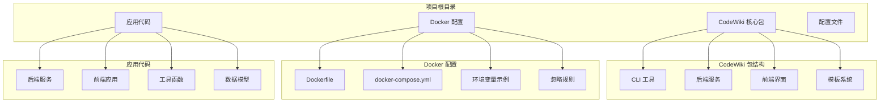
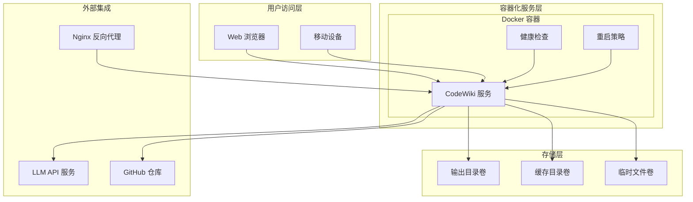
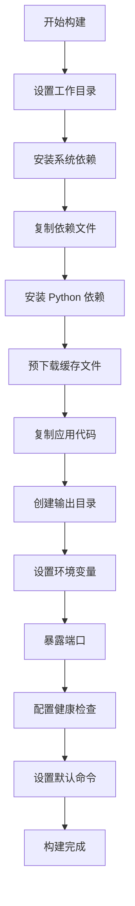
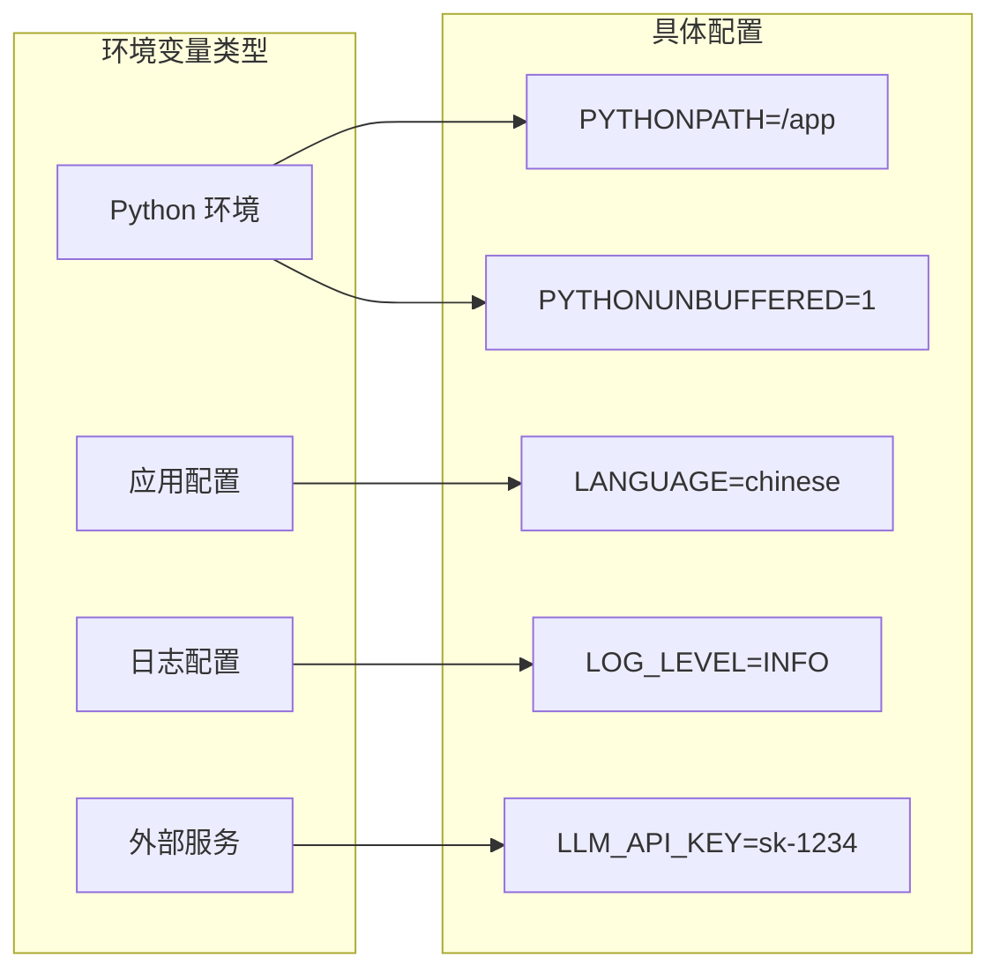
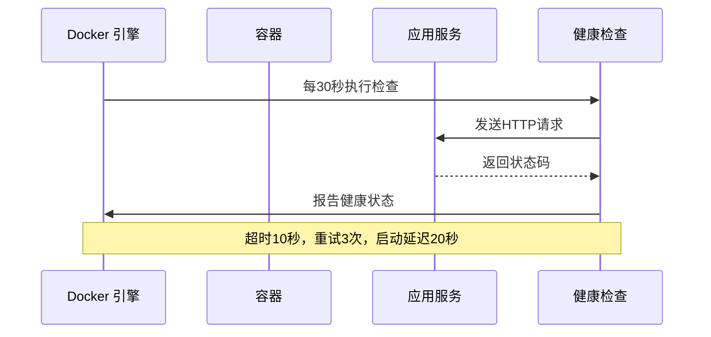
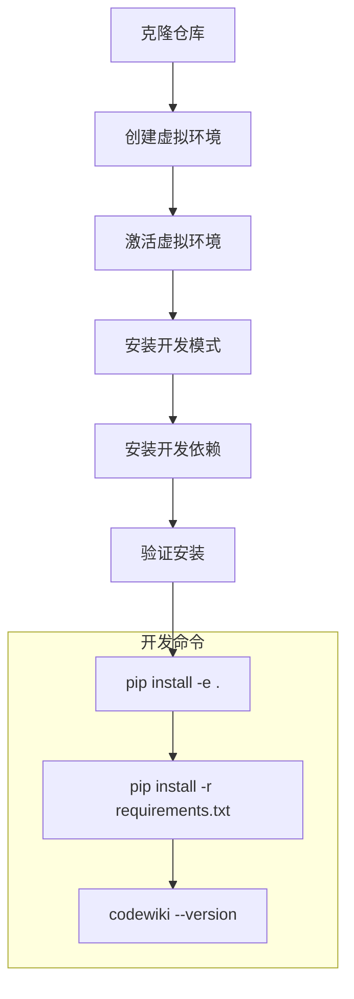
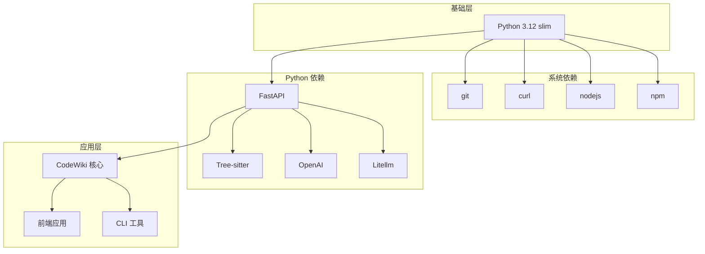
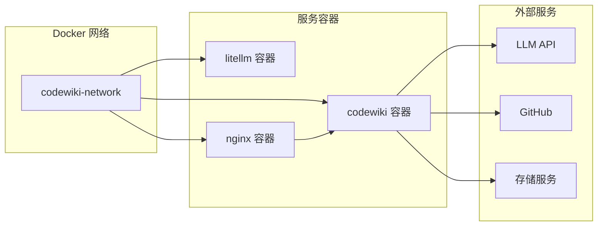
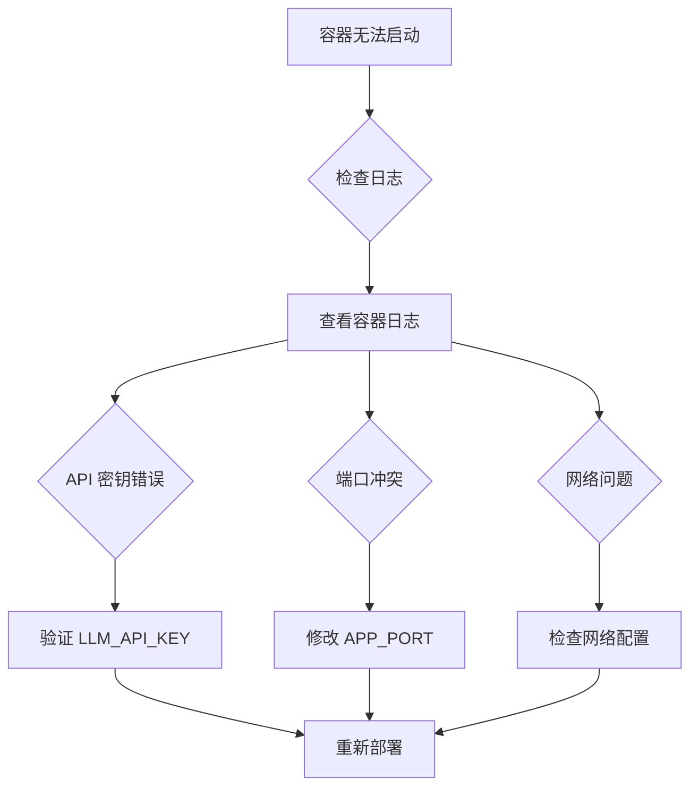
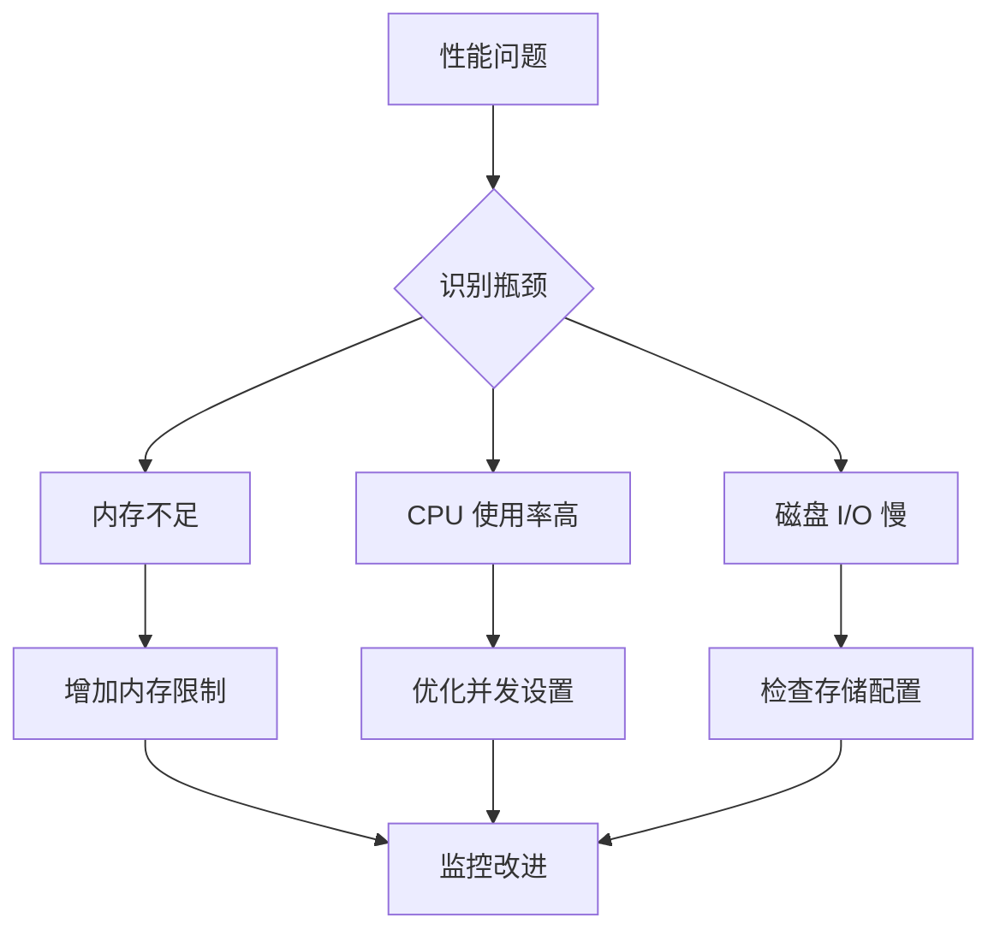

# 部署方案

<cite>
**本文档引用的文件**
- [Dockerfile](file://docker/Dockerfile)
- [docker-compose.yml](file://docker/docker-compose.yml)
- [env.example](file://docker/env.example)
- [run_web_app.py](file://codewiki/run_web_app.py)
- [DOCKER_README.md](file://docker/DOCKER_README.md)
- [.dockerignore](file://docker/.dockerignore)
- [requirements.txt](file://requirements.txt)
- [pyproject.toml](file://pyproject.toml)
- [DEVELOPMENT.md](file://DEVELOPMENT.md)
</cite>

## 目录
1. [简介](#简介)
2. [项目结构](#项目结构)
3. [核心组件](#核心组件)
4. [架构概览](#架构概览)
5. [详细组件分析](#详细组件分析)
6. [依赖关系分析](#依赖关系分析)
7. [性能考虑](#性能考虑)
8. [故障排除指南](#故障排除指南)
9. [结论](#结论)

## 简介

CodeWiki 是一个基于 AI 的代码库文档生成框架，支持多语言代码分析和自动生成综合性的技术文档。本部署文档提供了完整的本地和容器化部署方案，包括 Docker 容器化部署的详细配置说明和最佳实践建议。

## 项目结构

CodeWiki 采用模块化的项目结构，主要包含以下关键目录：

**图表来源**
- [Dockerfile](file://docker/Dockerfile#L1-L47)
- [docker-compose.yml](file://docker/docker-compose.yml#L1-L37)
- [DEVELOPMENT.md](file://DEVELOPMENT.md#L5-L41)

**章节来源**
- [Dockerfile](file://docker/Dockerfile#L1-L47)
- [docker-compose.yml](file://docker/docker-compose.yml#L1-L37)
- [DEVELOPMENT.md](file://DEVELOPMENT.md#L5-L41)

## 核心组件

### Docker 容器化部署

Docker 配置提供了完整的容器化解决方案，包含以下核心组件：

#### 基础镜像配置
- 使用 Python 3.12 slim 基础镜像，确保最小化容器大小
- 安装必要的系统依赖：git、curl、nodejs、npm
- 预下载 tiktoken 缓存文件以支持离线环境

#### 应用构建流程
1. **依赖安装优化**：先复制 requirements.txt 进行缓存优化
2. **Python 依赖安装**：使用 pip 安装所有必需的 Python 包
3. **应用代码复制**：复制整个 codewiki 目录和相关资源文件
4. **输出目录创建**：预创建用于文档生成的目录结构

#### 端口和服务配置
- **默认端口**：8000/tcp
- **网络配置**：使用自定义桥接网络 `codewiki-network`
- **健康检查**：每30秒检查一次，超时10秒，最多重试3次

**章节来源**
- [Dockerfile](file://docker/Dockerfile#L1-L47)
- [docker-compose.yml](file://docker/docker-compose.yml#L1-L37)

### 本地部署方案

本地部署通过直接运行 Python 脚本实现，提供开发和测试环境的快速启动能力。

#### 启动脚本功能
- 自动添加源码目录到 Python 路径
- 导入前端 Web 应用主程序
- 提供标准的命令行入口点

#### 开发环境要求
- Python 3.12 或更高版本
- Node.js（用于 Mermaid 图表验证）
- Git 和相关依赖

**章节来源**
- [run_web_app.py](file://codewiki/run_web_app.py#L1-L16)
- [DEVELOPMENT.md](file://DEVELOPMENT.md#L43-L68)

## 架构概览

CodeWiki 采用分层架构设计，结合了容器化部署的优势：

**图表来源**
- [docker-compose.yml](file://docker/docker-compose.yml#L1-L37)
- [Dockerfile](file://docker/Dockerfile#L1-L47)

## 详细组件分析

### Dockerfile 构建过程详解

Dockerfile 实现了多阶段的构建优化策略：

#### 构建阶段分析

**图表来源**
- [Dockerfile](file://docker/Dockerfile#L1-L47)

#### 关键构建优化

1. **依赖缓存优化**：先复制 requirements.txt 再复制其他文件
2. **离线支持**：预下载 tiktoken 缓存文件
3. **目录结构**：预创建所有必要的输出目录

**章节来源**
- [Dockerfile](file://docker/Dockerfile#L1-L47)

### docker-compose.yml 服务配置

docker-compose.yml 提供了完整的服务编排配置：

#### 服务配置参数

| 参数 | 值 | 描述 |
|------|-----|------|
| **镜像名称** | `codewiki:0.0.9` | 自定义镜像标签 |
| **构建上下文** | `..` | 从项目根目录构建 |
| **容器名称** | `codewiki` | 容器标识符 |
| **平台** | `linux/amd64` | 指定架构 |
| **端口映射** | `${APP_PORT:-8000}:8000` | 动态端口映射 |

#### 环境变量配置

**图表来源**
- [docker-compose.yml](file://docker/docker-compose.yml#L11-L16)
- [env.example](file://docker/env.example#L31-L36)

#### 卷挂载策略

| 卷类型 | 源路径 | 目标路径 | 权限 | 用途 |
|--------|--------|----------|------|------|
| **持久化存储** | `../output` | `/app/output` | 读写 | 文档生成结果 |
| **SSH 密钥** | `~/.ssh` | `/root/.ssh` | 只读 | 私有仓库访问 |
| **Git 配置** | `~/.gitconfig` | `/root/.gitconfig` | 只读 | Git 凭据管理 |

#### 健康检查配置

**图表来源**
- [docker-compose.yml](file://docker/docker-compose.yml#L26-L31)
- [Dockerfile](file://docker/Dockerfile#L41-L43)

**章节来源**
- [docker-compose.yml](file://docker/docker-compose.yml#L1-L37)
- [env.example](file://docker/env.example#L1-L52)

### 环境变量配置详解

.env 文件提供了完整的配置选项：

#### LLM API 配置

| 变量名 | 默认值 | 说明 |
|--------|--------|------|
| `MAIN_MODEL` | `claude-sonnet-4` | 主要使用的 LLM 模型 |
| `FALLBACK_MODEL_1` | `glm-4p5` | 备用模型 |
| `CLUSTER_MODEL` | `claude-sonnet-4` | 聚类分析模型 |
| `LLM_BASE_URL` | `http://litellm:4000/` | LLM API 基础 URL |
| `LLM_API_KEY` | `sk-1234` | API 认证密钥 |

#### 应用配置

| 变量名 | 默认值 | 说明 |
|--------|--------|------|
| `APP_PORT` | `8000` | 应用监听端口 |
| `LANGUAGE` | `chinese` | 文档生成语言 |
| `LOG_LEVEL` | `INFO` | 日志级别 |

#### 日志配置

| 变量名 | 默认值 | 说明 |
|--------|--------|------|
| `LOGFIRE_TOKEN` | 空 | Logfire 认证令牌 |
| `LOGFIRE_PROJECT_NAME` | `codewiki` | 项目名称 |
| `LOGFIRE_SERVICE_NAME` | `codewiki` | 服务名称 |

**章节来源**
- [env.example](file://docker/env.example#L1-L52)

### 本地部署流程

本地部署提供了开发和测试的便捷方式：

#### 开发环境搭建

**图表来源**
- [DEVELOPMENT.md](file://DEVELOPMENT.md#L52-L68)

#### 直接运行应用

本地运行通过以下步骤启动：

1. **设置 Python 路径**：将 src 目录添加到 Python 路径
2. **导入 Web 应用**：从前端应用模块导入主函数
3. **启动服务**：调用应用主程序

**章节来源**
- [run_web_app.py](file://codewiki/run_web_app.py#L1-L16)
- [DEVELOPMENT.md](file://DEVELOPMENT.md#L52-L68)

## 依赖关系分析

### Docker 镜像依赖

**图表来源**
- [requirements.txt](file://requirements.txt#L1-L165)
- [pyproject.toml](file://pyproject.toml#L26-L54)

### 网络拓扑结构

**图表来源**
- [docker-compose.yml](file://docker/docker-compose.yml#L33-L36)

**章节来源**
- [requirements.txt](file://requirements.txt#L1-L165)
- [pyproject.toml](file://pyproject.toml#L26-L54)
- [docker-compose.yml](file://docker/docker-compose.yml#L33-L36)

## 性能考虑

### 容器化部署优化

#### 资源管理
- **CPU 限制**：建议设置合理的 CPU 上限避免资源争用
- **内存限制**：根据文档生成复杂度调整内存分配
- **并发处理**：利用多核 CPU 进行并行文档生成

#### 存储优化
- **缓存策略**：合理配置缓存目录大小
- **临时文件清理**：定期清理临时文件释放空间
- **输出目录管理**：监控输出目录增长趋势

#### 网络性能
- **API 调用优化**：合理设置 LLM API 调用频率
- **连接池管理**：复用网络连接减少开销
- **超时配置**：设置合适的请求超时时间

### 生产环境最佳实践

#### 安全配置
- **环境变量管理**：使用 Docker secrets 管理敏感信息
- **网络隔离**：使用独立的 Docker 网络隔离服务
- **权限控制**：最小权限原则配置容器权限

#### 监控和日志
- **健康检查**：启用容器健康检查机制
- **日志聚合**：集中收集和分析应用日志
- **性能监控**：监控容器资源使用情况

#### 扩展性考虑
- **负载均衡**：使用反向代理实现负载均衡
- **水平扩展**：支持多实例部署
- **自动伸缩**：根据负载自动调整实例数量

## 故障排除指南

### 常见问题诊断

#### 容器启动失败

#### 健康检查失败

| 问题类型 | 排查步骤 | 解决方案 |
|----------|----------|----------|
| **HTTP 500 错误** | 检查应用日志 | 验证 LLM API 连接 |
| **端口占用** | 使用 `netstat` 检查 | 修改端口映射 |
| **依赖缺失** | 检查容器内依赖 | 重建 Docker 镜像 |
| **权限问题** | 检查卷权限 | 修正目录权限 |

#### 性能问题

### 生产环境部署建议

#### 安全加固
- **密钥管理**：使用 Docker secrets 或外部密钥管理服务
- **网络隔离**：配置防火墙规则限制访问
- **更新策略**：建立定期更新和补丁管理流程

#### 监控配置
- **应用监控**：设置容器资源使用监控
- **业务监控**：监控文档生成成功率和响应时间
- **告警机制**：配置异常情况自动告警

#### 备份和恢复
- **数据备份**：定期备份输出目录和配置
- **灾难恢复**：制定容器故障恢复流程
- **版本管理**：使用 Docker 标签管理不同版本

**章节来源**
- [DOCKER_README.md](file://docker/DOCKER_README.md#L263-L339)
- [docker-compose.yml](file://docker/docker-compose.yml#L26-L31)

## 结论

CodeWiki 提供了完整的容器化部署解决方案，结合了 Docker 容器化的优势和 Python 应用的灵活性。通过本文档的详细说明，用户可以：

1. **快速部署**：使用 Docker Compose 在几分钟内启动服务
2. **灵活配置**：通过环境变量轻松调整应用行为
3. **生产就绪**：具备健康检查、重启策略等生产环境特性
4. **易于维护**：清晰的依赖关系和故障排除指南

建议在生产环境中：
- 使用 Docker secrets 管理敏感配置
- 配置适当的资源限制和监控
- 建立完善的备份和恢复机制
- 制定定期更新和维护流程

通过遵循这些最佳实践，CodeWiki 将能够稳定可靠地为大型代码库生成高质量的技术文档。