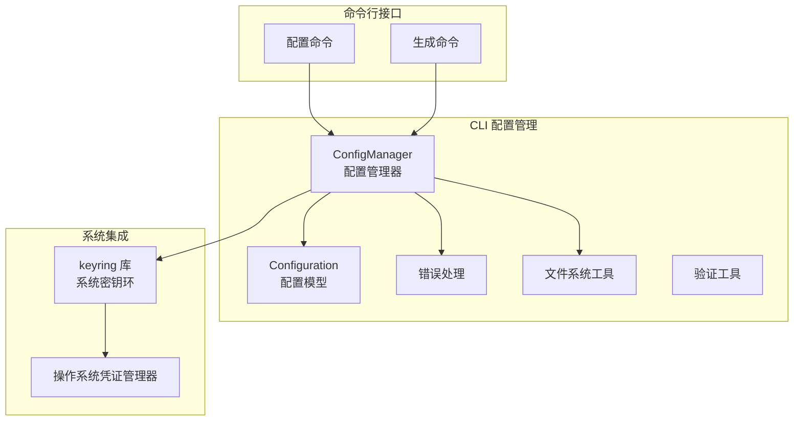
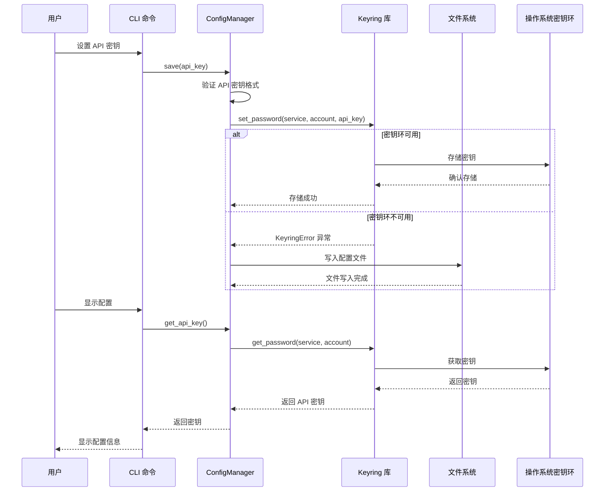
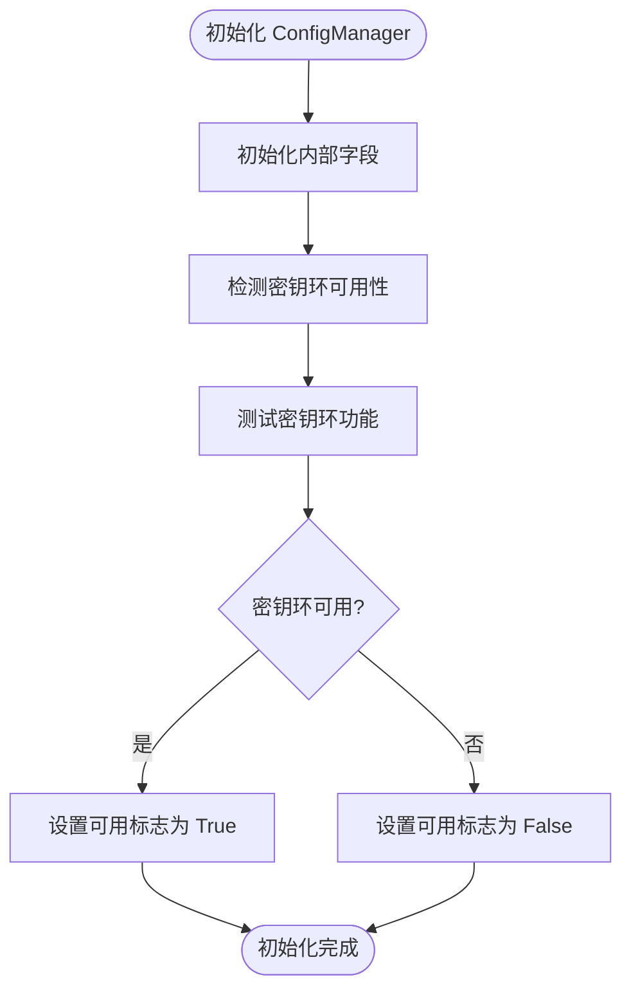
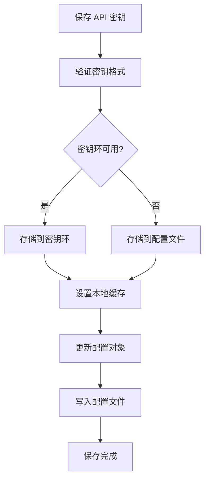
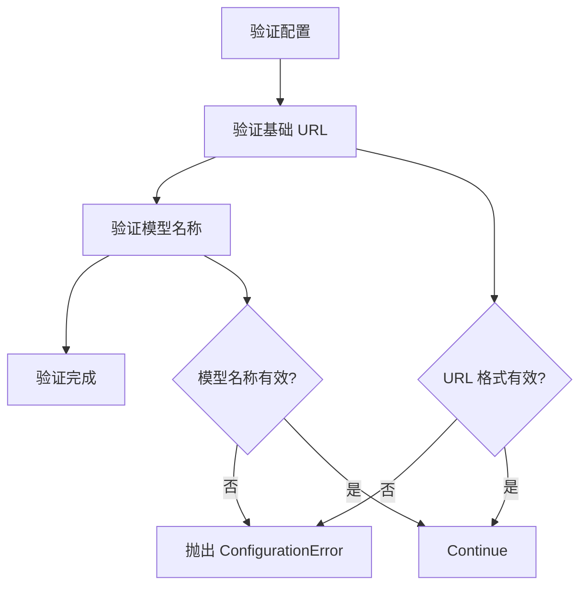
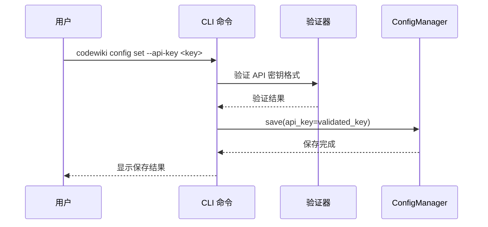
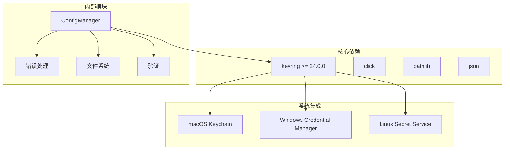
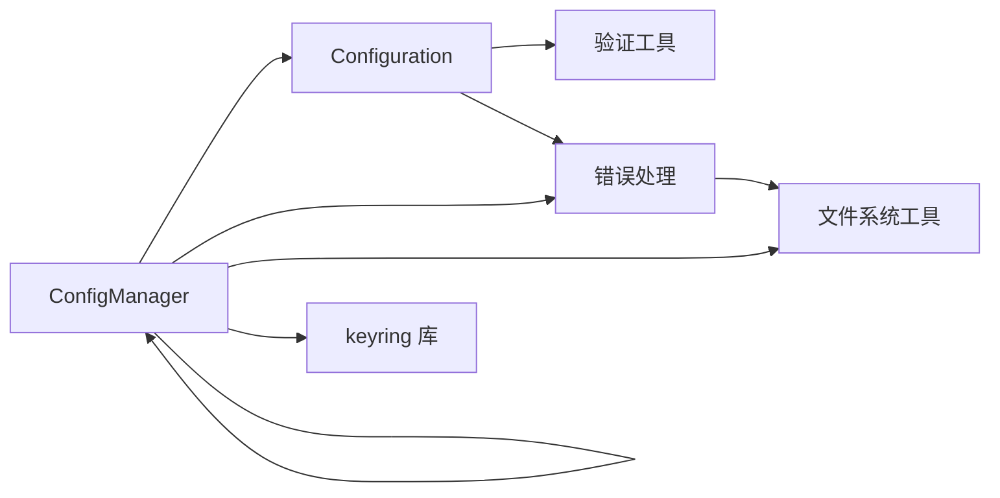

# API密钥安全存储

<cite>
**本文档引用的文件**
- [config_manager.py](file://codewiki/cli/config_manager.py)
- [config.py](file://codewiki/cli/models/config.py)
- [errors.py](file://codewiki/cli/utils/errors.py)
- [fs.py](file://codewiki/cli/utils/fs.py)
- [validation.py](file://codewiki/cli/utils/validation.py)
- [config.py](file://codewiki/cli/commands/config.py)
- [generate.py](file://codewiki/cli/commands/generate.py)
- [requirements.txt](file://requirements.txt)
</cite>

## 目录
1. [简介](#简介)
2. [项目结构概览](#项目结构概览)
3. [核心组件分析](#核心组件分析)
4. [架构概述](#架构概述)
5. [详细组件分析](#详细组件分析)
6. [依赖关系分析](#依赖关系分析)
7. [性能考虑](#性能考虑)
8. [故障排除指南](#故障排除指南)
9. [结论](#结论)

## 简介

CodeWiki 使用 `keyring` 库实现了安全的 API 密钥存储机制，将敏感的 API 密钥存储在系统凭证管理器中，而不是明文保存在配置文件中。这种设计确保了 API 密钥的安全性，支持以下操作系统凭证管理器：
- macOS: Keychain Access
- Windows: Credential Manager  
- Linux: Secret Service (GNOME Keyring, KWallet)

## 项目结构概览

CodeWiki 的 API 密钥安全存储机制主要分布在以下模块中：



**图表来源**
- [config_manager.py](file://codewiki/cli/config_manager.py#L26-L237)
- [config.py](file://codewiki/cli/models/config.py#L20-L113)

**章节来源**
- [config_manager.py](file://codewiki/cli/config_manager.py#L1-L237)
- [config.py](file://codewiki/cli/models/config.py#L1-L113)

## 核心组件分析

### ConfigManager 类

ConfigManager 是 API 密钥安全存储的核心组件，负责协调所有配置管理操作。

#### 关键特性

1. **双重存储策略**：
   - API 密钥：存储在系统密钥环中
   - 其他配置：存储在 `~/.codewiki/config.json` 文件中

2. **密钥环集成**：
   - 服务标识符：`KEYRING_SERVICE = "codewiki"`
   - 账户标识符：`KEYRING_API_KEY_ACCOUNT = "api_key"`

3. **自动检测机制**：
   - `_check_keyring_available()` 方法检测系统密钥环可用性
   - 支持降级到本地文件存储

**章节来源**
- [config_manager.py](file://codewiki/cli/config_manager.py#L16-L40)

## 架构概述

CodeWiki 的 API 密钥安全存储架构采用分层设计，确保安全性与可用性的平衡：



**图表来源**
- [config_manager.py](file://codewiki/cli/config_manager.py#L84-L165)
- [config.py](file://codewiki/cli/commands/config.py#L90-L174)

## 详细组件分析

### ConfigManager 类详解

ConfigManager 类实现了完整的 API 密钥生命周期管理：

#### 初始化过程



**图表来源**
- [config_manager.py](file://codewiki/cli/config_manager.py#L36-L50)

#### 密钥环检测机制

`_check_keyring_available()` 方法通过执行测试操作来验证密钥环功能：

1. 尝试从密钥环获取测试密码
2. 捕获 `KeyringError` 异常
3. 返回可用性状态

#### API 密钥存储流程



**图表来源**
- [config_manager.py](file://codewiki/cli/config_manager.py#L143-L165)

#### 错误处理机制

当密钥环不可用时，系统会优雅降级：

1. **KeyringError 异常捕获**
2. **ConfigurationError 异常抛出**
3. **用户友好的错误消息**
4. **系统配置指导建议**

**章节来源**
- [config_manager.py](file://codewiki/cli/config_manager.py#L42-L165)

### Configuration 数据模型

Configuration 类定义了非敏感配置数据的结构：

#### 配置字段

| 字段名 | 类型 | 默认值 | 描述 |
|--------|------|--------|------|
| base_url | str | "" | LLM API 基础 URL |
| main_model | str | "" | 主要模型名称 |
| cluster_model | str | "" | 聚类模型名称 |
| fallback_model | str | "glm-4p5" | 回退模型名称 |
| default_output | str | "docs" | 默认输出目录 |
| language | str | "english" | 文档语言 |

#### 配置验证

Configuration 类包含完整的字段验证逻辑：



**图表来源**
- [config.py](file://codewiki/cli/models/config.py#L40-L51)

**章节来源**
- [config.py](file://codewiki/cli/models/config.py#L20-L84)

### 命令行接口集成

#### 配置设置命令

配置命令提供了用户友好的 API 密钥设置界面：



**图表来源**
- [config.py](file://codewiki/cli/commands/config.py#L90-L174)

#### 配置显示命令

配置显示命令提供了安全的信息展示：

1. **API 密钥掩码显示**
2. **密钥环状态指示**
3. **完整配置信息**

**章节来源**
- [config.py](file://codewiki/cli/commands/config.py#L176-L263)

## 依赖关系分析

### 外部依赖

CodeWiki 的 API 密钥安全存储依赖于以下关键组件：



**图表来源**
- [requirements.txt](file://requirements.txt#L49)
- [config_manager.py](file://codewiki/cli/config_manager.py#L8)

### 内部模块依赖



**图表来源**
- [config_manager.py](file://codewiki/cli/config_manager.py#L11-L13)

**章节来源**
- [requirements.txt](file://requirements.txt#L49-L49)

## 性能考虑

### 缓存策略

ConfigManager 实现了智能缓存机制：

1. **本地缓存 API 密钥**
   - 避免重复的密钥环访问
   - 减少系统调用开销
   - 支持内存中的快速检索

2. **延迟加载机制**
   - 仅在需要时从密钥环读取
   - 避免不必要的系统交互

### 错误处理优化

1. **异常类型化**
   - 区分不同类型的错误
   - 提供针对性的错误处理

2. **降级策略**
   - 密钥环不可用时的优雅降级
   - 保持功能完整性

## 故障排除指南

### 常见问题及解决方案

#### 密钥环不可用

**症状**：系统显示密钥环不可用警告

**原因**：
- 系统缺少密钥环支持
- 密钥环服务未启动
- 权限配置问题

**解决方案**：
1. 安装系统密钥环支持
2. 启动密钥环服务
3. 检查用户权限

#### API 密钥存储失败

**症状**：保存 API 密钥时出现错误

**原因**：
- 密钥环服务异常
- 权限不足
- 系统资源限制

**解决方案**：
1. 检查密钥环服务状态
2. 验证用户权限
3. 清理系统资源

#### 配置文件损坏

**症状**：配置文件无法读取

**原因**：
- 文件格式错误
- 权限问题
- 文件损坏

**解决方案**：
1. 删除损坏的配置文件
2. 重新配置
3. 检查磁盘空间

**章节来源**
- [errors.py](file://codewiki/cli/utils/errors.py#L36-L62)
- [config_manager.py](file://codewiki/cli/config_manager.py#L148-L153)

### 调试技巧

1. **启用详细日志**
   ```bash
   codewiki config validate --verbose
   ```

2. **检查密钥环状态**
   ```bash
   codewiki config show
   ```

3. **验证配置完整性**
   ```bash
   codewiki config validate
   ```

## 结论

CodeWiki 的 API 密钥安全存储机制通过以下方式确保安全性：

1. **多层保护**：结合系统密钥环和本地文件存储
2. **自动化检测**：自动检测和适应不同的系统环境
3. **优雅降级**：在密钥环不可用时提供替代方案
4. **用户友好**：提供清晰的错误信息和配置指导

这种设计不仅提高了安全性，还保持了系统的可用性和用户体验。通过使用标准的密钥环接口，CodeWiki 能够在不同操作系统上提供一致的安全体验，同时避免了 API 密钥以明文形式存储的风险。