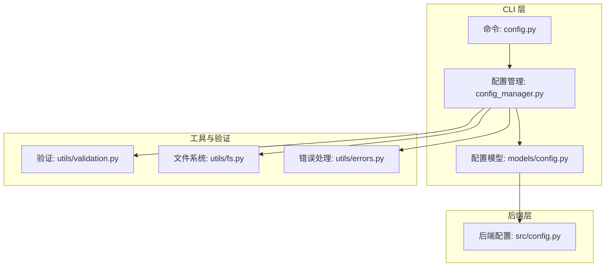
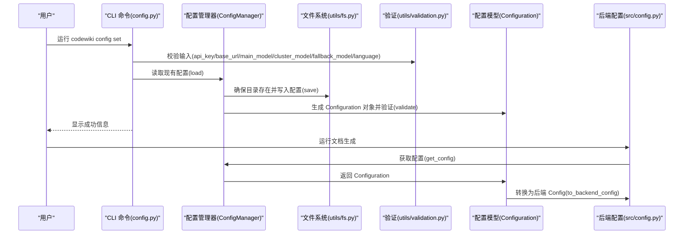
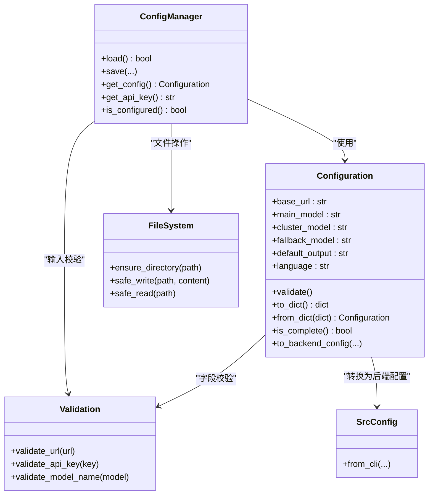

# 配置文件

<cite>
**本文引用的文件**
- [codewiki/cli/config_manager.py](file://codewiki/cli/config_manager.py)
- [codewiki/cli/models/config.py](file://codewiki/cli/models/config.py)
- [codewiki/cli/commands/config.py](file://codewiki/cli/commands/config.py)
- [codewiki/src/config.py](file://codewiki/src/config.py)
- [codewiki/cli/utils/validation.py](file://codewiki/cli/utils/validation.py)
- [codewiki/cli/utils/fs.py](file://codewiki/cli/utils/fs.py)
- [codewiki/cli/utils/errors.py](file://codewiki/cli/utils/errors.py)
- [README.md](file://README.md)
</cite>

## 目录
1. [简介](#简介)
2. [项目结构](#项目结构)
3. [核心组件](#核心组件)
4. [架构总览](#架构总览)
5. [详细组件分析](#详细组件分析)
6. [依赖关系分析](#依赖关系分析)
7. [性能考量](#性能考量)
8. [故障排查指南](#故障排查指南)
9. [结论](#结论)
10. [附录](#附录)

## 简介
本文件面向使用者与开发者，系统性说明 CodeWiki 的配置文件体系，重点围绕以下目标：
- 解释 ~/.codewiki/config.json 的结构与字段含义（version、base_url、main_model、cluster_model、fallback_model、default_output、language）
- 说明配置文件由 ConfigManager 类管理，并通过 Configuration 模型进行数据验证
- 提供完整配置文件示例，展示各配置项的典型取值
- 描述配置文件的创建与更新机制：首次运行 codewiki config set 命令时自动创建配置目录与文件
- 解释默认值设置逻辑：fallback_model 默认为 'glm-4p5'，default_output 默认为 'docs'，language 默认为 'english'
- 说明配置文件与其他配置源（环境变量、命令行参数）的优先级关系

## 项目结构
与配置文件相关的关键模块分布如下：
- CLI 配置命令与管理器：codewiki/cli/commands/config.py、codewiki/cli/config_manager.py
- 配置数据模型：codewiki/cli/models/config.py
- 后端配置与环境变量：codewiki/src/config.py
- 工具与验证：codewiki/cli/utils/validation.py、codewiki/cli/utils/fs.py、codewiki/cli/utils/errors.py
- 使用说明与示例：README.md

图表来源
- [codewiki/cli/commands/config.py](file://codewiki/cli/commands/config.py#L1-L414)
- [codewiki/cli/config_manager.py](file://codewiki/cli/config_manager.py#L1-L237)
- [codewiki/cli/models/config.py](file://codewiki/cli/models/config.py#L1-L113)
- [codewiki/src/config.py](file://codewiki/src/config.py#L1-L123)
- [codewiki/cli/utils/validation.py](file://codewiki/cli/utils/validation.py#L1-L251)
- [codewiki/cli/utils/fs.py](file://codewiki/cli/utils/fs.py#L1-L191)
- [codewiki/cli/utils/errors.py](file://codewiki/cli/utils/errors.py#L1-L114)

章节来源
- [codewiki/cli/commands/config.py](file://codewiki/cli/commands/config.py#L1-L414)
- [codewiki/cli/config_manager.py](file://codewiki/cli/config_manager.py#L1-L237)
- [codewiki/cli/models/config.py](file://codewiki/cli/models/config.py#L1-L113)
- [codewiki/src/config.py](file://codewiki/src/config.py#L1-L123)
- [README.md](file://README.md#L137-L142)

## 核心组件
- 配置文件位置：~/.codewiki/config.json
- 管理器：ConfigManager 负责加载、保存配置，以及 API 密钥的安全存储（系统钥匙串）
- 数据模型：Configuration 使用 dataclass 定义配置字段，并提供校验与序列化方法
- 命令接口：codewiki config set/show/validate 提供交互式配置管理
- 后端桥接：Configuration.to_backend_config 将 CLI 配置转换为后端 Config 实例

章节来源
- [codewiki/cli/config_manager.py](file://codewiki/cli/config_manager.py#L21-L23)
- [codewiki/cli/models/config.py](file://codewiki/cli/models/config.py#L20-L40)
- [codewiki/cli/commands/config.py](file://codewiki/cli/commands/config.py#L26-L174)
- [codewiki/src/config.py](file://codewiki/src/config.py#L81-L123)

## 架构总览
下图展示了配置从 CLI 到后端的流转路径，以及默认值与验证规则的生效点。

图表来源
- [codewiki/cli/commands/config.py](file://codewiki/cli/commands/config.py#L63-L174)
- [codewiki/cli/config_manager.py](file://codewiki/cli/config_manager.py#L51-L165)
- [codewiki/cli/utils/validation.py](file://codewiki/cli/utils/validation.py#L13-L98)
- [codewiki/cli/models/config.py](file://codewiki/cli/models/config.py#L40-L111)
- [codewiki/src/config.py](file://codewiki/src/config.py#L81-L123)

## 详细组件分析

### 配置文件结构与字段说明
- 文件路径：~/.codewiki/config.json
- 字段定义与默认值：
  - version：字符串，用于版本标识
  - base_url：字符串，LLM API 基础地址
  - main_model：字符串，主模型名称
  - cluster_model：字符串，聚类模型名称
  - fallback_model：字符串，默认 'glm-4p5'
  - default_output：字符串，默认 'docs'
  - language：字符串，默认 'english'

字段来源与默认值逻辑：
- 在 Configuration.from_dict 中，未提供的字段使用默认值填充
- 在 ConfigManager.save 中，若首次创建配置且未提供具体值，则使用默认值初始化

章节来源
- [codewiki/cli/models/config.py](file://codewiki/cli/models/config.py#L56-L74)
- [codewiki/cli/config_manager.py](file://codewiki/cli/config_manager.py#L117-L124)

### ConfigManager：配置管理器
职责与行为：
- 加载配置：读取 ~/.codewiki/config.json 并反序列化为 Configuration
- 保存配置：确保目录存在，合并更新字段，执行验证，写回 JSON
- API 密钥安全存储：通过系统钥匙串（keyring）存储，不可直接明文写入文件
- 配置完整性检查：验证 API 密钥与关键字段是否齐全

默认值设置逻辑：
- 若首次创建配置且未显式提供字段值，则使用以下默认值：
  - fallback_model: "glm-4p5"
  - default_output: "docs"
  - language: "english"

章节来源
- [codewiki/cli/config_manager.py](file://codewiki/cli/config_manager.py#L51-L165)

### Configuration：配置数据模型
职责与行为：
- 字段定义：base_url、main_model、cluster_model、fallback_model、default_output、language
- 校验：validate() 统一调用 URL、模型名等验证规则
- 序列化/反序列化：to_dict()/from_dict() 支持持久化与加载
- 完整性检查：is_complete() 检查关键字段是否已设置
- 后端桥接：to_backend_config() 将 CLI 配置转换为后端 Config

章节来源
- [codewiki/cli/models/config.py](file://codewiki/cli/models/config.py#L20-L113)

### CLI 命令：config set/show/validate
- config set：
  - 接受 --api-key、--base-url、--main-model、--cluster-model、--fallback-model、--language
  - 先在 CLI 层做输入校验，再调用 ConfigManager.save 写入配置
  - 若未提供某些选项，则保持现有值不变
- config show：
  - 输出当前配置；JSON 模式包含默认值与配置文件路径
- config validate：
  - 检查配置文件存在与格式、API 密钥、URL 与模型格式、可选的 API 连通性测试

章节来源
- [codewiki/cli/commands/config.py](file://codewiki/cli/commands/config.py#L32-L174)
- [codewiki/cli/commands/config.py](file://codewiki/cli/commands/config.py#L176-L262)
- [codewiki/cli/commands/config.py](file://codewiki/cli/commands/config.py#L265-L413)

### 后端配置与环境变量优先级
- 后端配置（src/config.py）在 CLI 上下文中通过 Config.from_cli 注入 CLI 配置
- 在非 CLI 场景（如 Web 应用），后端配置会从环境变量读取：
  - MAIN_MODEL、FALLBACK_MODEL_1、CLUSTER_MODEL、LLM_BASE_URL、LLM_API_KEY、LANGUAGE
- CLI 与后端的关系：
  - CLI 配置（~/.codewiki/config.json + keyring）仅在 CLI 模式下生效
  - Web 应用模式下，后端配置优先读取环境变量，CLI 配置不参与

章节来源
- [codewiki/src/config.py](file://codewiki/src/config.py#L34-L42)
- [codewiki/src/config.py](file://codewiki/src/config.py#L81-L123)

### 配置文件创建与更新机制
- 创建流程：
  - 首次运行 codewiki config set 时，ConfigManager.ensure_directory 确保 ~/.codewiki 目录存在
  - 若配置文件不存在，ConfigManager.save 初始化默认值并写入 JSON
- 更新流程：
  - 通过 CLI 命令传入新值，ConfigManager.save 合并更新字段并重新验证
  - 非敏感配置写入 JSON，敏感配置（API key）写入系统钥匙串

章节来源
- [codewiki/cli/config_manager.py](file://codewiki/cli/config_manager.py#L106-L165)
- [codewiki/cli/utils/fs.py](file://codewiki/cli/utils/fs.py#L13-L38)

### 验证与错误处理
- 输入验证：
  - URL 格式与 HTTPS 要求（本地回环允许 HTTP）
  - API key 长度与非空校验
  - 模型名非空校验
- 错误处理：
  - 统一的 ConfigurationError/FileSystemError/APIError 等异常类型
  - CLI 命令中捕获并输出友好的错误提示与退出码

章节来源
- [codewiki/cli/utils/validation.py](file://codewiki/cli/utils/validation.py#L13-L98)
- [codewiki/cli/utils/errors.py](file://codewiki/cli/utils/errors.py#L36-L62)
- [codewiki/cli/commands/config.py](file://codewiki/cli/commands/config.py#L96-L173)

## 依赖关系分析
- ConfigManager 依赖：
  - Configuration：用于数据结构与验证
  - utils/validation：URL、API key、模型名校验
  - utils/fs：目录创建与原子写入
  - utils/errors：统一错误类型
- Configuration 依赖：
  - utils/validation：字段校验
  - src/config：to_backend_config 转换到后端配置
- CLI 命令依赖：
  - ConfigManager：读写配置
  - utils/validation：输入校验
  - utils/errors：错误处理

图表来源
- [codewiki/cli/config_manager.py](file://codewiki/cli/config_manager.py#L26-L237)
- [codewiki/cli/models/config.py](file://codewiki/cli/models/config.py#L20-L113)
- [codewiki/cli/utils/validation.py](file://codewiki/cli/utils/validation.py#L13-L98)
- [codewiki/cli/utils/fs.py](file://codewiki/cli/utils/fs.py#L60-L87)
- [codewiki/src/config.py](file://codewiki/src/config.py#L81-L123)

章节来源
- [codewiki/cli/config_manager.py](file://codewiki/cli/config_manager.py#L1-L237)
- [codewiki/cli/models/config.py](file://codewiki/cli/models/config.py#L1-L113)
- [codewiki/cli/utils/validation.py](file://codewiki/cli/utils/validation.py#L1-L251)
- [codewiki/cli/utils/fs.py](file://codewiki/cli/utils/fs.py#L1-L191)
- [codewiki/src/config.py](file://codewiki/src/config.py#L1-L123)

## 性能考量
- 配置文件读写采用原子写入策略（临时文件 + 原子替换），避免部分写入导致的损坏
- 验证在 CLI 层完成，减少无效请求与后端开销
- API key 存储于系统钥匙串，避免频繁磁盘读写

章节来源
- [codewiki/cli/utils/fs.py](file://codewiki/cli/utils/fs.py#L60-L87)
- [codewiki/cli/config_manager.py](file://codewiki/cli/config_manager.py#L144-L153)

## 故障排查指南
常见问题与解决建议：
- 配置文件不存在或格式错误
  - 使用 codewiki config show 查看是否存在与格式是否正确
  - 使用 codewiki config validate 执行完整校验
- API key 缺失或系统钥匙串不可用
  - 确认系统钥匙串服务可用；若不可用，CLI 会提示降级存储
- URL 或模型名格式不合法
  - 检查 base_url 是否为有效 URL（HTTPS 优先，本地回环允许 HTTP）
  - 检查模型名是否为空或包含非法字符
- 配置完整性不足
  - 确保已设置 base_url、main_model、cluster_model、fallback_model

章节来源
- [codewiki/cli/commands/config.py](file://codewiki/cli/commands/config.py#L176-L262)
- [codewiki/cli/commands/config.py](file://codewiki/cli/commands/config.py#L265-L413)
- [codewiki/cli/utils/validation.py](file://codewiki/cli/utils/validation.py#L13-L98)
- [codewiki/cli/utils/errors.py](file://codewiki/cli/utils/errors.py#L36-L62)

## 结论
- ~/.codewiki/config.json 是 CodeWiki 的持久化配置中心，由 ConfigManager 统一管理
- Configuration 提供强类型的字段定义与严格的校验逻辑，确保配置质量
- CLI 命令提供便捷的配置入口，支持默认值与增量更新
- 在 CLI 模式下，配置文件优先于环境变量；在非 CLI 模式下，后端配置优先读取环境变量
- 通过系统钥匙串安全存储 API key，配合原子写入与严格校验，保障配置的可靠性与安全性

## 附录

### 配置文件示例（结构示意）
以下为 ~/.codewiki/config.json 的结构示意，字段含义见“字段说明”：
- version：字符串，版本号
- base_url：字符串，LLM API 基础地址
- main_model：字符串，主模型名称
- cluster_model：字符串，聚类模型名称
- fallback_model：字符串，默认 'glm-4p5'
- default_output：字符串，默认 'docs'
- language：字符串，默认 'english'

章节来源
- [codewiki/cli/models/config.py](file://codewiki/cli/models/config.py#L56-L74)
- [codewiki/cli/config_manager.py](file://codewiki/cli/config_manager.py#L117-L124)

### 配置优先级关系
- CLI 模式下：
  - 配置文件（~/.codewiki/config.json）优先于环境变量
  - API key 优先从系统钥匙串读取，其次考虑降级存储
- 非 CLI 模式（如 Web 应用）：
  - 后端配置优先读取环境变量（MAIN_MODEL、FALLBACK_MODEL_1、CLUSTER_MODEL、LLM_BASE_URL、LLM_API_KEY、LANGUAGE）

章节来源
- [codewiki/src/config.py](file://codewiki/src/config.py#L34-L42)
- [codewiki/src/config.py](file://codewiki/src/config.py#L81-L123)
- [codewiki/cli/config_manager.py](file://codewiki/cli/config_manager.py#L73-L78)