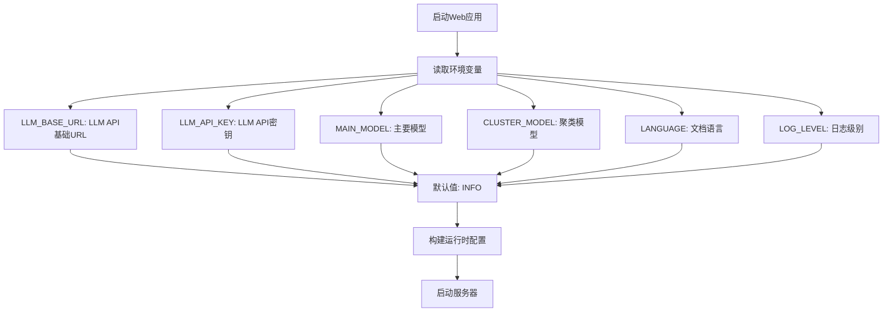
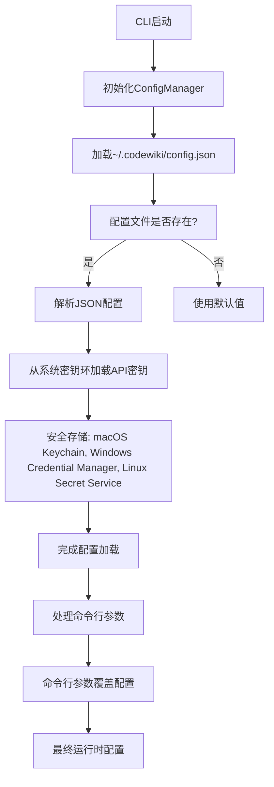
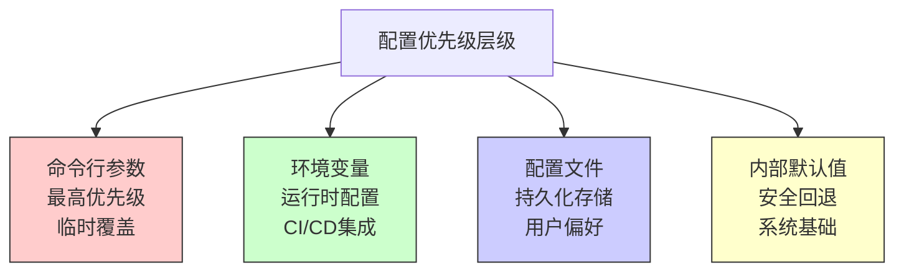
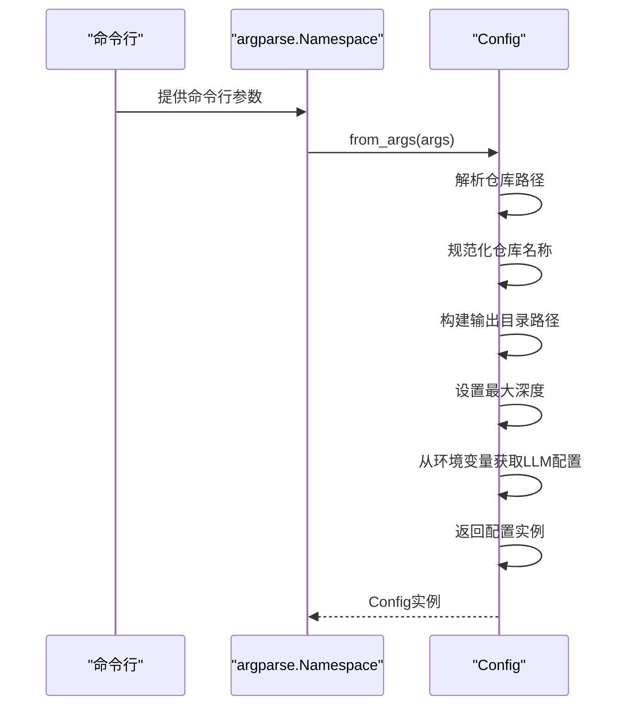
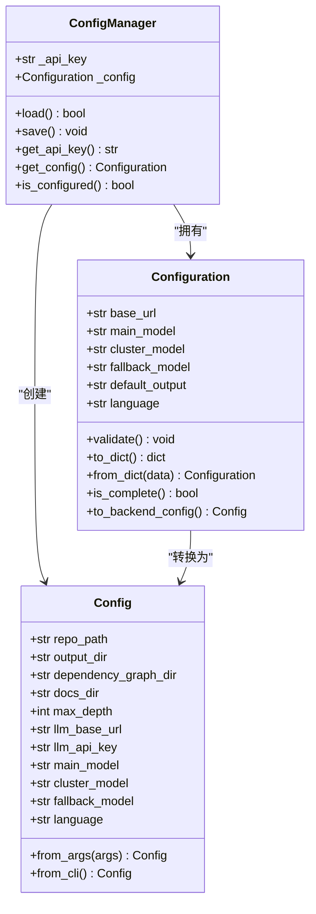
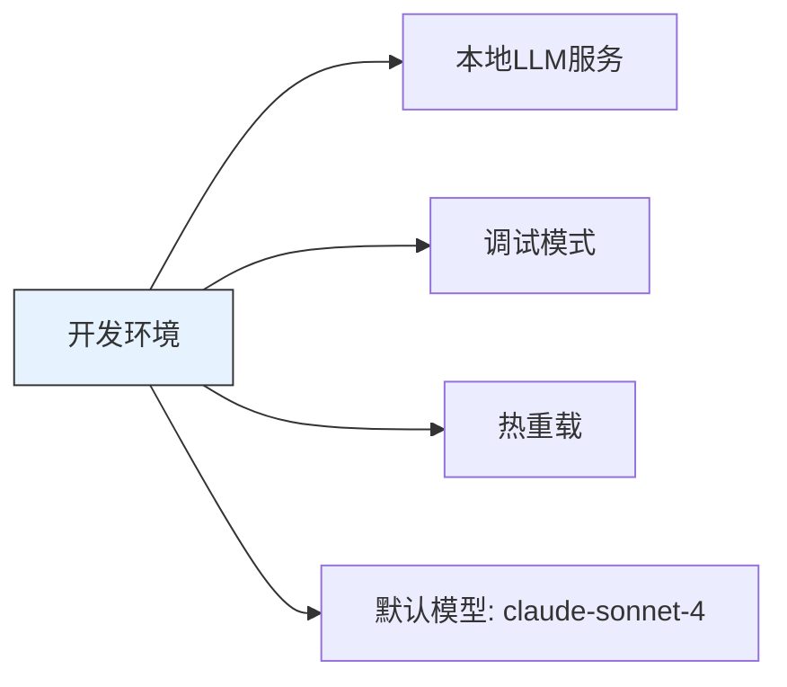
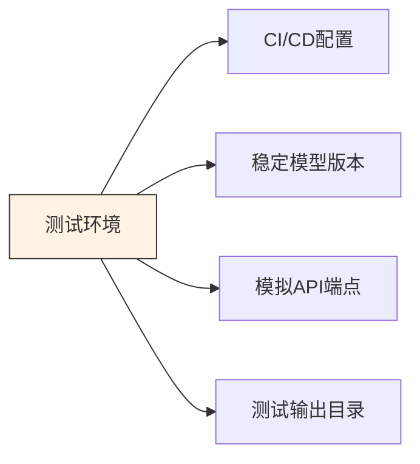
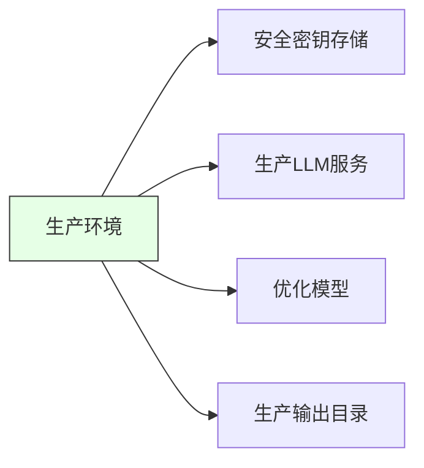

# 配置来源与优先级

<cite>
**本文档引用的文件**   
- [config.py](file://codewiki/src/config.py)
- [config.py](file://codewiki/cli/models/config.py)
- [config_manager.py](file://codewiki/cli/config_manager.py)
- [config.py](file://codewiki/cli/commands/config.py)
- [generate.py](file://codewiki/cli/commands/generate.py)
- [web_app.py](file://codewiki/src/fe/web_app.py)
- [run_web_app.py](file://codewiki/run_web_app.py)
</cite>

## 目录
1. [简介](#简介)
2. [三层配置体系](#三层配置体系)
3. [配置来源详解](#配置来源详解)
4. [配置优先级机制](#配置优先级机制)
5. [配置方法分析](#配置方法分析)
6. [多环境部署支持](#多环境部署支持)
7. [配置策略优势](#配置策略优势)

## 简介
CodeWiki采用灵活的三层配置体系，支持配置文件、环境变量和命令行参数三种配置来源。这种设计使得系统能够在不同运行模式下（Web应用模式和CLI模式）灵活适应各种部署环境和使用场景。配置系统遵循明确的优先级规则，确保配置的可靠性和可预测性，为开发、测试和生产环境提供一致的配置管理体验。

## 三层配置体系
CodeWiki的配置系统由三个层次构成，每个层次服务于不同的使用场景和安全需求：

1. **配置文件层**：存储在用户主目录下的`~/.codewiki/config.json`文件中，用于持久化存储CLI模式下的用户配置
2. **环境变量层**：通过操作系统环境变量传递配置，在Web应用模式下作为主要配置来源
3. **命令行参数层**：在CLI模式下通过命令行直接指定，提供最高优先级的临时配置覆盖

这种分层设计既保证了配置的持久性和安全性，又提供了足够的灵活性来适应不同的使用场景。

## 配置来源详解

### Web应用模式下的配置来源
在Web应用模式下，系统主要通过`os.getenv()`从环境变量读取关键配置。`run_web_app.py`启动脚本将`src`目录添加到Python路径后，由`src/fe/web_app.py`中的`main()`函数处理配置。



**图示来源**
- [src/config.py](file://codewiki/src/config.py#L33-L42)
- [src/fe/web_app.py](file://codewiki/src/fe/web_app.py#L128-L136)
- [run_web_app.py](file://codewiki/run_web_app.py#L1-L16)

### CLI模式下的配置来源
在CLI模式下，配置优先级从高到低为：命令行参数 > 配置文件和密钥环 > 内部默认值。`codewiki/cli/main.py`作为CLI入口点，通过Click框架处理命令行参数。



**图示来源**
- [cli/config_manager.py](file://codewiki/cli/config_manager.py#L26-L237)
- [cli/models/config.py](file://codewiki/cli/models/config.py#L20-L113)
- [cli/main.py](file://codewiki/cli/main.py#L1-L57)

## 配置优先级机制
CodeWiki遵循明确的配置优先级顺序：**命令行参数 > 环境变量 > 配置文件 > 内部默认值**。这一优先级确保了配置的灵活性和可预测性。



**图示来源**
- [src/config.py](file://codewiki/src/config.py#L33-L42)
- [cli/commands/generate.py](file://codewiki/cli/commands/generate.py#L68-L77)
- [cli/commands/config.py](file://codewiki/cli/commands/config.py#L63-L70)

### 优先级应用示例
1. **CI/CD环境覆盖**：在持续集成环境中，通过设置环境变量覆盖开发环境的默认配置
   ```bash
   export LLM_BASE_URL=https://api.anthropic.com
   export MAIN_MODEL=claude-sonnet-4
   export LANGUAGE=chinese
   python run_web_app.py
   ```

2. **单次命令执行**：在CLI模式下，通过命令行参数临时修改模型
   ```bash
   codewiki generate --language chinese --output ./docs-cn
   ```

3. **开发调试**：在开发环境中，通过环境变量启用调试模式
   ```bash
   export LOG_LEVEL=DEBUG
   export LLM_BASE_URL=http://localhost:4000
   python run_web_app.py --debug
   ```

## 配置方法分析

### Config.from_args() 方法
`Config.from_args()`方法用于从解析后的命令行参数创建配置实例。该方法主要在CLI模式下使用，将命令行参数转换为内部配置对象。



**图示来源**
- [src/config.py](file://codewiki/src/config.py#L61-L79)

### Config.from_cli() 方法
`Config.from_cli()`方法专门用于CLI上下文的配置创建，接受明确的参数并构建配置实例。该方法桥接了用户配置和运行时配置。



**图示来源**
- [src/config.py](file://codewiki/src/config.py#L82-L123)
- [cli/models/config.py](file://codewiki/cli/models/config.py#L85-L111)
- [cli/config_manager.py](file://codewiki/cli/config_manager.py#L84-L165)

## 多环境部署支持
CodeWiki的配置策略为多环境部署提供了强大的支持能力，能够无缝适应开发、测试和生产环境的不同需求。

### 开发环境
在开发环境中，开发者可以通过环境变量快速切换配置，便于调试和测试：



### 测试环境
在测试环境中，通过CI/CD管道的环境变量实现自动化配置：



### 生产环境
在生产环境中，配置通过环境变量和安全的密钥管理机制进行管理：



**图示来源**
- [src/config.py](file://codewiki/src/config.py#L33-L42)
- [src/fe/web_app.py](file://codewiki/src/fe/web_app.py#L128-L136)
- [cli/config_manager.py](file://codewiki/cli/config_manager.py#L17-L25)

## 配置策略优势
CodeWiki的配置策略具有以下显著优势：

### 灵活性
通过三层配置体系，用户可以在不同场景下选择最适合的配置方式。在Web应用模式下，环境变量提供了与容器化部署和云平台的良好集成；在CLI模式下，配置文件和命令行参数提供了便捷的本地使用体验。

### 安全性
敏感信息如API密钥在CLI模式下通过系统密钥环（macOS Keychain、Windows Credential Manager、Linux Secret Service）安全存储，避免了明文存储的风险。

### 可维护性
配置优先级机制确保了配置的可预测性，开发者可以清楚地知道在特定场景下哪些配置会生效，降低了配置管理的复杂性。

### 可扩展性
模块化的配置设计使得添加新的配置项和配置来源变得简单，为未来的功能扩展提供了良好的基础。

**配置来源**
- [src/config.py](file://codewiki/src/config.py#L1-L123)
- [cli/config_manager.py](file://codewiki/cli/config_manager.py#L1-L237)
- [cli/commands/config.py](file://codewiki/cli/commands/config.py#L1-L414)