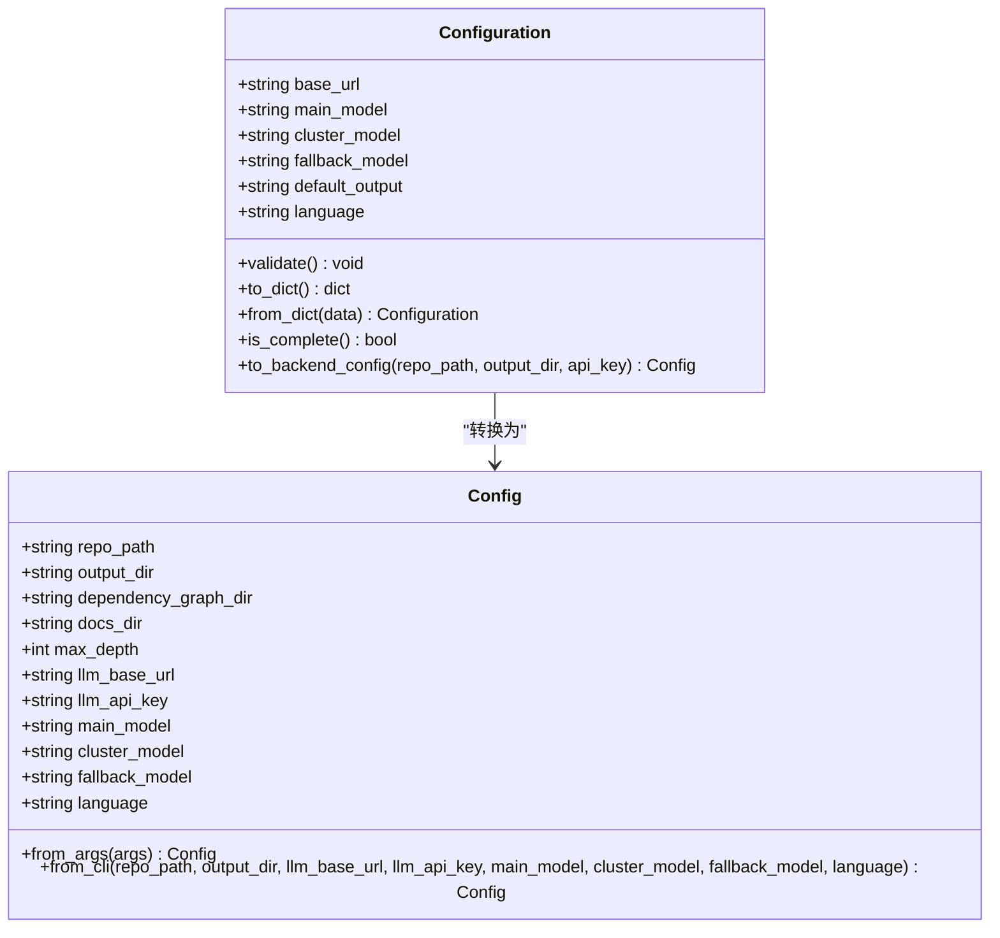
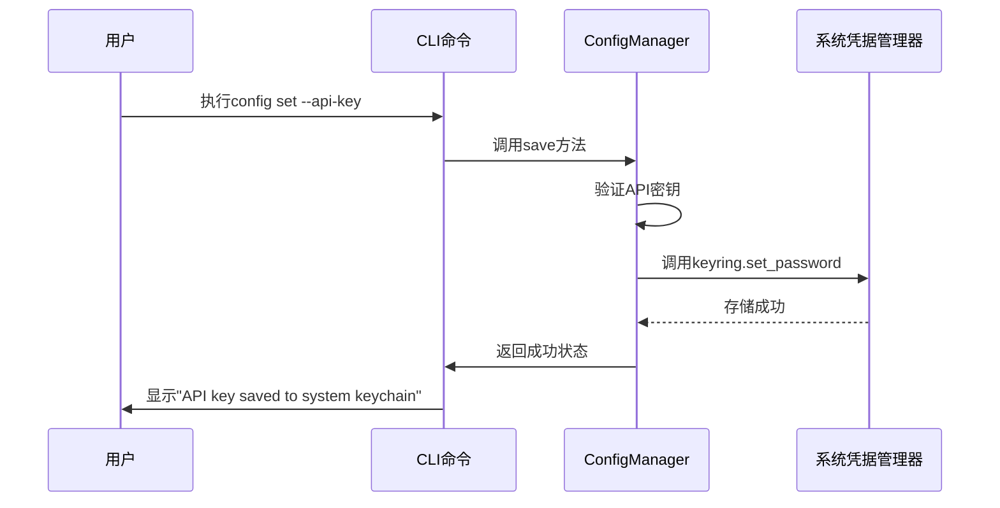

# 配置管理

<cite>
**本文档中引用的文件**  
- [config_manager.py](file://codewiki/cli/config_manager.py)
- [config.py](file://codewiki/cli/models/config.py)
- [config.py](file://codewiki/src/config.py)
- [config.py](file://codewiki/cli/commands/config.py)
- [validation.py](file://codewiki/cli/utils/validation.py)
</cite>

## 目录
1. [简介](#简介)
2. [配置数据模型](#配置数据模型)
3. [配置来源](#配置来源)
4. [API密钥安全存储](#api密钥安全存储)
5. [配置选项说明](#配置选项说明)
6. [配置文件示例](#配置文件示例)
7. [配置优先级](#配置优先级)
8. [配置对文档生成的影响](#配置对文档生成的影响)

## 简介
CodeWiki的配置管理系统为用户提供了一套完整的配置管理解决方案，支持通过命令行参数、配置文件和环境变量等多种方式管理配置。系统采用分层设计，将敏感信息（如API密钥）与普通配置分离存储，确保安全性。配置数据模型设计合理，涵盖了文档生成所需的所有关键参数，包括主模型、聚类模型和回退模型等。通过`config_manager.py`模块，系统实现了安全的API密钥存储机制，利用系统凭据管理器（keyring）保护敏感信息。

## 配置数据模型
CodeWiki的配置系统采用分层数据模型设计，主要包含两个核心类：`Config`和`LLMConfig`（在代码中体现为`Configuration`类）。`Configuration`类定义了持久化用户设置，存储在`~/.codewiki/config.json`文件中，包含LLM API基础URL、主模型、聚类模型、回退模型、默认输出目录和文档生成语言等属性。该类提供了验证方法确保配置的完整性，并通过`to_backend_config`方法将CLI配置转换为后端运行时配置。

`Config`类则代表运行时的作业配置，包含代码库路径、输出目录、依赖关系图目录等运行时参数。两个配置类通过`from_cli`方法桥接，实现了持久化设置与运行时配置的转换。这种设计模式分离了用户偏好设置和临时运行参数，提高了系统的灵活性和可维护性。



**图示来源**
- [config.py](file://codewiki/cli/models/config.py#L20-L112)
- [config.py](file://codewiki/src/config.py#L44-L122)

**本节来源**
- [config.py](file://codewiki/cli/models/config.py#L20-L112)
- [config.py](file://codewiki/src/config.py#L44-L122)

## 配置来源
CodeWiki支持多种配置来源，包括命令行参数、配置文件和环境变量。这些来源按照特定的优先级顺序进行处理，确保配置的灵活性和可覆盖性。命令行参数具有最高优先级，允许用户在运行时覆盖其他配置。配置文件`~/.codewiki/config.json`存储用户的持久化设置，包含API基础URL、模型选择等常规配置。环境变量主要用于Web应用模式，通过`os.getenv`方法读取，如`MAIN_MODEL`、`FALLBACK_MODEL_1`等。

当系统运行时，首先检查命令行参数，然后读取配置文件，最后使用环境变量作为默认值。这种分层配置机制允许用户在不同场景下灵活调整配置。例如，在CI/CD环境中可以通过环境变量设置配置，而在本地开发时可以通过命令行参数快速调整模型选择。`ConfigManager`类负责协调这些配置来源，确保最终配置的一致性和完整性。

**本节来源**
- [config.py](file://codewiki/src/config.py#L34-L38)
- [config_manager.py](file://codewiki/cli/config_manager.py#L26-L236)

## API密钥安全存储
CodeWiki采用安全的API密钥存储机制，通过`keyring`库将API密钥存储在系统凭据管理器中，而不是明文存储在配置文件中。`ConfigManager`类负责管理这一过程，将API密钥存储在系统级的安全存储中，如macOS的Keychain Access、Windows的凭据管理器或Linux的Secret Service。这种设计确保了敏感信息的安全性，即使配置文件被泄露，API密钥也不会暴露。

`ConfigManager`类通过`KEYRING_SERVICE`和`KEYRING_API_KEY_ACCOUNT`常量定义了keyring服务和账户名称，使用`keyring.get_password`和`keyring.set_password`方法进行密钥的读取和存储。系统在初始化时检查keyring的可用性，如果不可用则会发出警告。API密钥的验证通过`validate_api_key`函数完成，确保密钥格式正确且长度足够。这种安全机制符合最佳实践，保护了用户的API凭证。



**图示来源**
- [config_manager.py](file://codewiki/cli/config_manager.py#L26-L236)
- [validation.py](file://codewiki/cli/utils/validation.py#L55-L79)

**本节来源**
- [config_manager.py](file://codewiki/cli/config_manager.py#L26-L236)
- [validation.py](file://codewiki/cli/utils/validation.py#L55-L79)

## 配置选项说明
CodeWiki的配置系统提供了多个关键选项，影响文档生成的质量和成本。主模型（main_model）用于主要的文档生成任务，通常选择性能和成本平衡的模型。聚类模型（cluster_model）用于模块聚类分析，建议使用顶级模型以确保分析质量。回退模型（fallback_model）在主模型失败时使用，提供故障恢复能力。默认配置中回退模型设置为"glm-4p5"，这是一个成本较低的选项。

配置选项还包括API基础URL（base_url），指向LLM服务的端点；文档生成语言（language），支持英语和中文；以及默认输出目录（default_output）。`is_top_tier_model`函数用于检查模型是否为顶级模型，如果用户配置了非顶级模型进行聚类，系统会发出警告。这些配置选项共同决定了文档生成的行为和性能，用户应根据具体需求和预算进行合理配置。

**本节来源**
- [config.py](file://codewiki/cli/models/config.py#L20-L38)
- [config.py](file://codewiki/src/config.py#L34-L38)
- [validation.py](file://codewiki/cli/utils/validation.py#L209-L229)

## 配置文件示例
以下是一个典型的CodeWiki配置文件示例，展示了`~/.codewiki/config.json`文件的结构和内容：

```json
{
  "version": "1.0",
  "base_url": "https://api.anthropic.com",
  "main_model": "claude-sonnet-4",
  "cluster_model": "claude-sonnet-4",
  "fallback_model": "glm-4p5",
  "default_output": "docs",
  "language": "english"
}
```

该配置文件包含了所有必要的配置项，版本号为"1.0"，API基础URL指向Anthropic服务，主模型和聚类模型都设置为"claude-sonnet-4"，回退模型为"glm-4p5"，默认输出目录为"docs"，文档语言为英语。用户可以通过`codewiki config set`命令修改这些配置，或直接编辑此文件。配置文件采用JSON格式，易于阅读和编辑。

**本节来源**
- [config_manager.py](file://codewiki/cli/config_manager.py#L156-L162)
- [config.py](file://codewiki/cli/models/config.py#L56-L74)

## 配置优先级
CodeWiki的配置系统遵循明确的优先级顺序，确保配置的可预测性和一致性。优先级从高到低依次为：命令行参数、配置文件、环境变量。命令行参数具有最高优先级，允许用户在运行时覆盖其他配置。例如，即使配置文件中设置了主模型为"claude-sonnet-4"，用户仍可以通过`--main-model gpt-4`参数临时使用GPT-4模型。

配置文件`~/.codewiki/config.json`存储用户的持久化设置，具有中等优先级。环境变量主要用于Web应用模式，作为最低优先级的默认值。这种分层优先级设计允许用户在不同场景下灵活调整配置，同时保持合理的默认行为。`ConfigManager`类在加载配置时会按照此优先级顺序合并配置，确保最终配置的正确性。

**本节来源**
- [config.py](file://codewiki/src/config.py#L31-L38)
- [config_manager.py](file://codewiki/cli/config_manager.py#L84-L164)

## 配置对文档生成的影响
配置选项对文档生成的质量和成本有显著影响。主模型的选择直接决定了文档生成的质量和处理速度，更强大的模型通常能生成更准确和详细的文档，但成本也更高。聚类模型用于模块聚类分析，使用顶级模型（如claude-opus、gpt-4）可以获得更好的聚类效果，从而提高整体文档质量。系统会警告用户如果配置了非顶级模型进行聚类。

回退模型提供了故障恢复能力，当主模型调用失败时自动切换，确保文档生成过程不会中断。API基础URL的选择影响服务的可用性和延迟，用户应选择稳定可靠的LLM服务提供商。文档生成语言配置允许用户选择输出语言，支持英语和中文，满足不同用户的需求。合理的配置可以优化成本效益，例如在非关键任务中使用成本较低的模型。

**本节来源**
- [config.py](file://codewiki/cli/models/config.py#L20-L38)
- [config.py](file://codewiki/src/config.py#L34-L38)
- [validation.py](file://codewiki/cli/utils/validation.py#L209-L229)