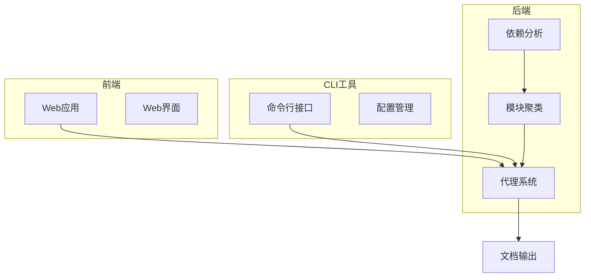
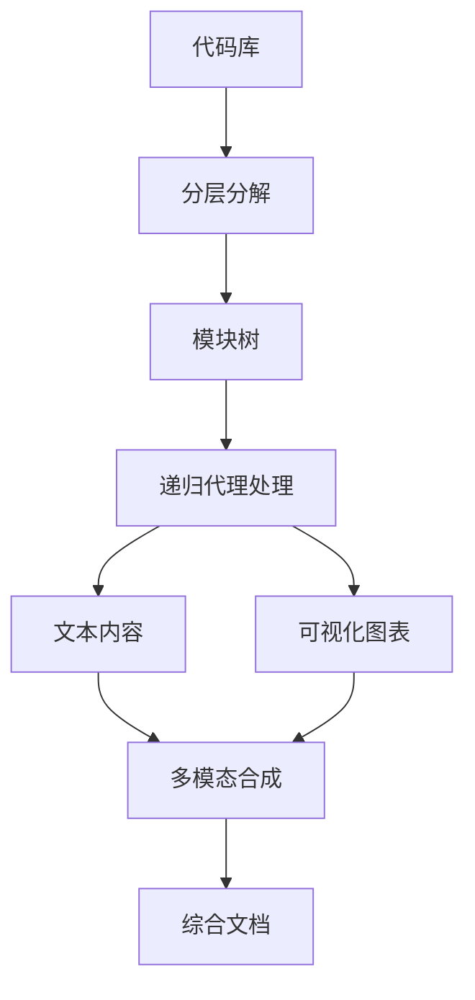

# 项目概述

<cite>
**本文档中引用的文件**  
- [README.md](file://README.md)
- [codewiki/cli/main.py](file://codewiki/cli/main.py)
- [codewiki/src/be/main.py](file://codewiki/src/be/main.py)
- [codewiki/src/be/documentation_generator.py](file://codewiki/src/be/documentation_generator.py)
- [codewiki/src/be/agent_orchestrator.py](file://codewiki/src/be/agent_orchestrator.py)
- [codewiki/src/be/dependency_analyzer/dependency_graphs_builder.py](file://codewiki/src/be/dependency_analyzer/dependency_graphs_builder.py)
- [codewiki/src/be/cluster_modules.py](file://codewiki/src/be/cluster_modules.py)
- [codewiki/src/fe/web_app.py](file://codewiki/src/fe/web_app.py)
- [codewiki/cli/commands/generate.py](file://codewiki/cli/commands/generate.py)
- [codewiki/src/config.py](file://codewiki/src/config.py)
- [pyproject.toml](file://pyproject.toml)
</cite>

## 目录
1. [简介](#简介)
2. [核心功能与创新](#核心功能与创新)
3. [目标用户](#目标用户)
4. [架构与工作流程](#架构与工作流程)
5. [技术深度解析](#技术深度解析)
6. [使用入门](#使用入门)
7. [部署与配置](#部署与配置)
8. [性能与评估](#性能与评估)
9. [结论](#结论)

## 简介

CodeWiki 是一个开源的AI驱动代码库文档生成框架，旨在为大规模代码库生成全面、结构化的文档。该项目通过自动化分析代码库的架构、模块间交互和系统级依赖，解决了传统文档工具在处理大型项目时的局限性。CodeWiki 支持七种主流编程语言（Python、Java、JavaScript、TypeScript、C、C++、C#），能够生成包含文本描述和可视化图表的综合性文档。

该项目的核心价值在于其能够理解代码库的整体架构，而不仅仅是单个函数或类。通过AI分析，CodeWiki 能够生成跨文件、跨模块的交互分析，为开发者提供对代码库的全面理解。无论是新加入项目的开发者需要快速上手，还是技术主管需要评估代码库的健康状况，CodeWiki 都能提供有价值的洞察。

**Section sources**
- [README.md](file://README.md#L77-L88)
- [pyproject.toml](file://pyproject.toml#L1-L125)

## 核心功能与创新

### 多语言支持

CodeWiki 支持七种编程语言，包括高级语言（Python、JavaScript、TypeScript）、托管语言（C#、Java）和系统级语言（C、C++）。这种广泛的语言支持使其能够应用于各种技术栈的项目。项目使用 Tree-sitter 解析器进行语法分析，确保对不同语言的准确解析。

### 架构感知分析

与传统的文档生成工具不同，CodeWiki 不仅分析单个代码元素，还理解代码库的整体架构。它通过构建依赖图来识别模块间的交互关系，从而生成反映系统架构的文档。这种架构感知能力使得生成的文档不仅仅是API参考，而是包含了系统设计和模块交互的全面指南。

### 可视化输出

CodeWiki 生成的文档不仅包含文本描述，还包含多种可视化图表：
- **系统架构图**：使用Mermaid生成，展示模块间的层次结构和依赖关系
- **数据流图**：可视化数据在系统中的流动路径
- **依赖图**：展示模块和组件间的依赖关系
- **序列图**：描述复杂交互的时序流程

### 核心创新

#### 分层分解

CodeWiki 采用动态规划启发的分层分解策略，将代码库分解为具有架构上下文的连贯模块。这种策略能够处理任意大小的代码库（已测试86K-1.4M行代码），通过多粒度级别保持架构上下文。分层分解确保了即使在处理大型代码库时，也能保持模块间的上下文关系。

#### 递归代理系统

CodeWiki 实现了自适应的多代理处理系统，具有动态任务委派能力。复杂模块可以被进一步分解并委派给子代理处理，这种递归处理机制使得系统能够在保持质量的同时扩展到代码库级别。代理系统能够根据模块复杂度动态调整处理策略，确保复杂模块得到更深入的分析。

#### 多模态合成

CodeWiki 将文本描述与可视化图表相结合，从多个角度提供全面的理解。这种多模态合成方法使得开发者能够通过不同视角理解代码库，既可以通过文本获取详细信息，也可以通过图表快速把握整体架构。

**Section sources**
- [README.md](file://README.md#L83-L88)
- [README.md](file://README.md#L144-L158)
- [DEVELOPMENT.md](file://DEVELOPMENT.md#L74-L85)

## 目标用户

### 开发者

对于开发者而言，CodeWiki 是一个强大的工具，能够帮助他们快速理解新加入的代码库。通过生成的架构图和交互分析，开发者可以快速把握代码库的整体设计，而不需要逐行阅读代码。这对于接手遗留项目或加入大型团队尤其有价值。

### 技术主管

技术主管可以使用 CodeWiki 来评估代码库的健康状况和架构质量。生成的依赖图可以帮助识别潜在的架构问题，如循环依赖或过度耦合。此外，文档的生成过程本身就是一个代码质量评估过程，能够揭示代码库中的设计缺陷。

### 开源贡献者

对于开源项目，CodeWiki 可以自动生成高质量的文档，降低新贡献者的入门门槛。通过 GitHub Pages 集成，项目可以自动为每个版本生成文档网站，确保文档与代码同步更新。这有助于建立活跃的社区，吸引更多贡献者。

**Section sources**
- [README.md](file://README.md#L77-L88)
- [README.md](file://README.md#L65-L66)

## 架构与工作流程

### 整体架构

CodeWiki 采用三层架构设计，包括前端（FE）、后端（BE）和命令行接口（CLI）。这种架构设计使得系统既可以通过Web界面使用，也可以通过命令行集成到CI/CD流程中。



**Diagram sources**
- [README.md](file://README.md#L26)
- [DEVELOPMENT.md](file://DEVELOPMENT.md#L5-L41)

### 工作流程

CodeWiki 的文档生成过程分为三个阶段：

1. **分层分解**：使用动态规划启发的算法将代码库划分为连贯的模块，同时保持多粒度级别的架构上下文。
2. **递归多代理处理**：实现自适应的多代理处理，具有动态任务委派能力，使系统能够处理复杂模块。
3. **多模态合成**：将文本描述与可视化图表（架构图、数据流、序列图）结合，提供全面的理解。



**Diagram sources**
- [README.md](file://README.md#L217-L227)
- [DEVELOPMENT.md](file://DEVELOPMENT.md#L191-L204)

**Section sources**
- [README.md](file://README.md#L206-L213)
- [DEVELOPMENT.md](file://DEVELOPMENT.md#L189-L204)

## 技术深度解析

### 依赖分析器

依赖分析器是 CodeWiki 的核心组件之一，负责构建代码库的依赖图。它使用 Tree-sitter 解析器进行语法分析，支持七种编程语言。分析器通过抽象语法树（AST）提取组件和依赖关系，构建完整的依赖图。

```python
# 依赖分析器核心逻辑（概念性表示）
class DependencyGraphBuilder:
    def build_dependency_graph(self):
        # 使用Tree-sitter解析代码库
        components = parser.parse_repository()
        # 构建依赖图
        graph = build_graph_from_components(components)
        # 识别叶节点
        leaf_nodes = get_leaf_nodes(graph, components)
        return components, leaf_nodes
```

**Section sources**
- [codewiki/src/be/dependency_analyzer/dependency_graphs_builder.py](file://codewiki/src/be/dependency_analyzer/dependency_graphs_builder.py#L1-L94)
- [DEVELOPMENT.md](file://DEVELOPMENT.md#L74-L79)

### 模块聚类

模块聚类组件负责将叶节点聚类为有意义的模块。它使用LLM（大语言模型）来理解代码的语义，将相关的组件分组到同一模块中。聚类过程是递归的，可以处理任意深度的模块层次结构。

```python
def cluster_modules(leaf_nodes, components, config):
    # 格式化潜在的核心组件
    potential_core_components = format_potential_core_components(leaf_nodes, components)
    # 使用LLM进行聚类
    prompt = format_cluster_prompt(potential_core_components)
    response = call_llm(prompt, config)
    # 解析响应并构建模块树
    module_tree = eval(response_content)
    return module_tree
```

**Section sources**
- [codewiki/src/be/cluster_modules.py](file://codewiki/src/be/cluster_modules.py#L1-L125)
- [DEVELOPMENT.md](file://DEVELOPMENT.md#L80-L85)

### 代理协调器

代理协调器实现了递归的多代理系统，是CodeWiki智能文档生成的核心。它根据模块复杂度创建不同类型的代理，复杂模块会触发动态委派机制，将子任务委派给子代理处理。

```python
class AgentOrchestrator:
    def create_agent(self, module_name, components, core_component_ids):
        if is_complex_module(components, core_component_ids):
            return Agent(
                tools=[read_code_components_tool, str_replace_editor_tool, generate_sub_module_documentation_tool],
                system_prompt=SYSTEM_PROMPT.format(module_name=module_name)
            )
        else:
            return Agent(
                tools=[read_code_components_tool, str_replace_editor_tool],
                system_prompt=LEAF_SYSTEM_PROMPT.format(module_name=module_name)
            )
```

**Section sources**
- [codewiki/src/be/agent_orchestrator.py](file://codewiki/src/be/agent_orchestrator.py#L1-L198)
- [DEVELOPMENT.md](file://DEVELOPMENT.md#L86-L91)

## 使用入门

### 安装

```bash
# 从源码安装
pip install git+https://github.com/FSoft-AI4Code/CodeWiki.git

# 验证安装
codewiki --version
```

### 配置

```bash
# 配置LLM环境
codewiki config set \
  --api-key YOUR_API_KEY \
  --base-url https://api.anthropic.com \
  --main-model claude-sonnet-4 \
  --cluster-model claude-sonnet-4 \
  --fallback-model glm-4p5
```

### 生成文档

```bash
# 导航到项目目录
cd /path/to/your/project

# 生成文档
codewiki generate

# 生成带GitHub Pages查看器的文档
codewiki generate --github-pages --create-branch
```

**Section sources**
- [README.md](file://README.md#L31-L67)
- [codewiki/cli/commands/generate.py](file://codewiki/cli/commands/generate.py#L34-L276)

## 部署与配置

### CLI命令

CodeWiki 提供了丰富的CLI命令，包括配置管理和文档生成：

```bash
# 配置管理
codewiki config set --api-key <your-api-key> --base-url <provider-url>
codewiki config show
codewiki config validate

# 文档生成
codewiki generate --output ./documentation
codewiki generate --create-branch
codewiki generate --github-pages
```

### 配置存储

- **API密钥**：安全存储在系统密钥链中（macOS Keychain、Windows凭据管理器、Linux Secret Service）
- **设置**：`~/.codewiki/config.json`

### Web应用

CodeWiki 还提供了Web应用，用户可以通过简单的Web表单提交GitHub仓库进行文档生成。Web应用支持后台处理队列、缓存系统和作业状态跟踪。

```python
# Web应用核心组件
app = FastAPI(title="CodeWiki")
background_worker = BackgroundWorker()
cache_manager = CacheManager()
```

**Section sources**
- [README.md](file://README.md#L95-L141)
- [codewiki/src/fe/web_app.py](file://codewiki/src/fe/web_app.py#L1-L165)
- [codewiki/cli/main.py](file://codewiki/cli/main.py#L1-L57)

## 性能与评估

### 实验结果

CodeWiki 在专门设计的代码库级文档质量评估基准 CodeWikiBench 上进行了评估。结果显示，CodeWiki 在多种语言类别上均优于现有工具：

| 语言类别 | CodeWiki (Sonnet-4) | DeepWiki | 提升 |
|---------|-------------------|----------|------|
| 高级语言 (Python, JS, TS) | **79.14%** | 68.67% | **+10.47%** |
| 托管语言 (C#, Java) | **68.84%** | 64.80% | **+4.04%** |
| 系统语言 (C, C++) | 53.24% | 56.39% | -3.15% |
| **总体平均** | **68.79%** | **64.06%** | **+4.73%** |

### 代表性仓库结果

| 仓库 | 语言 | LOC | CodeWiki-Sonnet-4 | DeepWiki | 提升 |
|------|------|-----|-------------------|----------|------|
| All-Hands-AI--OpenHands | Python | 229K | **82.45%** | 73.04% | **+9.41%** |
| puppeteer--puppeteer | TypeScript | 136K | **83.00%** | 64.46% | **+18.54%** |
| sveltejs--svelte | JavaScript | 125K | **71.96%** | 68.51% | **+3.45%** |

**Section sources**
- [README.md](file://README.md#L175-L197)
- [README.md](file://README.md#L180-L197)

## 结论

CodeWiki 作为一个AI驱动的代码库文档生成工具，通过其创新的分层分解、递归代理系统和多模态合成技术，为解决大型代码库的文档挑战提供了有效的解决方案。它不仅能够生成传统的API文档，还能提供反映系统架构和模块交互的全面分析。

对于开发者而言，CodeWiki 大大降低了理解复杂代码库的门槛；对于技术主管，它提供了评估代码库健康状况的有力工具；对于开源项目，它能够自动生成高质量的文档，促进社区发展。随着AI技术的不断发展，CodeWiki 的能力也将持续进化，为软件开发领域带来更大的价值。