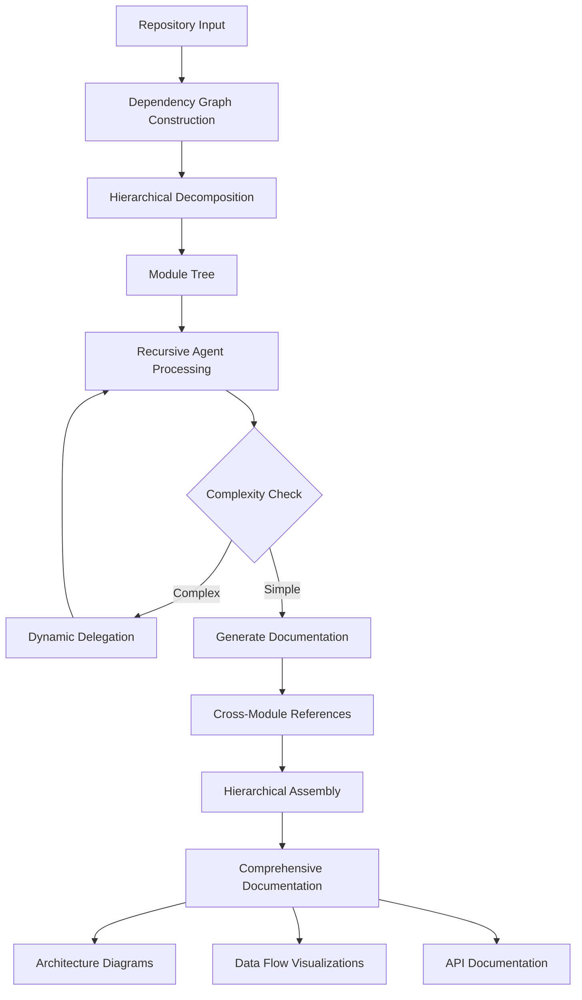

# CodeWiki: Automated Repository-Level Documentation Generation

<div align="center">


<!-- [](LICENSE) -->
[](https://www.python.org/downloads/)
<!-- [](https://arxiv.org/abs/XXXXX) -->

**The first open-source framework for holistic, structured repository-level documentation across multilingual codebases**

[Features](#features) • [Installation](#installation) • [Quick Start](#quick-start) • [Benchmark](#benchmark) • [Documentation](#documentation-structure) • [Demo](https://fsoft-ai4code.github.io/codewiki-demo/) • [Citation](#citation)

</div>

---

## 🎯 Overview

> 🚀 **[View Live Demo](https://fsoft-ai4code.github.io/codewiki-demo/)** - Explore documentation generated for real-world open source projects

Developers spend **58% of their working time** understanding codebases, yet maintaining comprehensive documentation remains a persistent challenge. CodeWiki addresses this by providing automated, scalable repository-level documentation generation that captures:

- 🏗️ **System Architecture** - High-level design patterns and module relationships
- 🔄 **Data Flow Visualizations** - How information moves through your system
- 📊 **Cross-Module Dependencies** - Interactive dependency graphs and sequence diagrams
- 📝 **Comprehensive API Documentation** - From architectural overviews to implementation details

### Key Innovations

| Feature | Description | Impact |
|---------|-------------|--------|
| **Hierarchical Decomposition** | Dynamic programming-inspired strategy that partitions repositories into coherent modules | Handles codebases of arbitrary size (86K-1.4M LOC tested) |
| **Recursive Agentic System** | Adaptive processing with dynamic delegation for complex modules | Maintains quality while scaling |
| **Multi-Format Synthesis** | Generates textual documentation, architecture diagrams, data flows, and sequence diagrams | Comprehensive understanding from multiple perspectives |
| **Multilingual Support** | Supports 7 languages: Python, Java, JavaScript, TypeScript, C, C++, C# | Universal applicability |

---

## Features

### Documentation Generation

- ✅ **Repository-Level Documentation** - First framework to generate complete repo-level docs at scale
- ✅ **Visual Artifacts** - Automatic generation of architecture diagrams and data flow visualizations
- ✅ **Cross-Module References** - Intelligent reference management prevents redundancy
- ✅ **Hierarchical Structure** - Multi-level documentation from high-level overviews to detailed APIs

### Benchmark

- ✅ **[CodeWikiBench](https://github.com/FSoft-AI4Code/CodeWikiBench.git)** - First benchmark specifically designed for repository-level documentation

#### Performance Results

CodeWiki has been evaluated on the **CodeWikiBench** dataset, the first benchmark specifically designed for repository-level documentation quality assessment.

| Language Category | CodeWiki Avg | Improvement over DeepWiki |
|-------------------|--------------|---------------------------|
| High-Level (Python, JS, TS) | **79.14%** | +10.47% |
| Managed (C#, Java) | **68.84%** | +4.04% |
| Systems (C, C++) | 53.24% | -3.15% |
| **Overall Average** | **68.79%** | **+4.73%** |

CodeWiki demonstrates significant improvements in high-level and managed languages, with an overall 4.73% improvement over [DeepWiki](https://deepwiki.com/).

---

## Installation

### Prerequisites

- Python 3.12+
- Node.js (for mermaid validation)
- Docker (optional, for containerized deployment)

### Standard Installation

```bash
# Clone the repository
git clone https://github.com/yourusername/codewiki.git
cd codewiki

# Install Node.js (if not already installed)
# macOS
brew install node
# Linux
sudo apt update && apt install -y nodejs npm

# Create and activate virtual environment
python3.12 -m venv .venv
source .venv/bin/activate  # On Windows: .venv\Scripts\activate

# Install dependencies
pip install -r requirements.txt

#Create a `.env` file from the template and edit with your configuration
cp env.example .env

# Start the web application
python run_web_app.py

#Access the application at `http://localhost:8000` to generate documentation by github url and commit id (optional)
```

### Docker Installation

```bash
# Copy environment configuration
cp env.example .env
# Edit .env with your API keys

# Create network
docker network create codewiki-network

# Start services
docker-compose up -d
```

---

## Workflow



### Processing Pipeline

1. **Repository Analysis** - AST parsing and dependency graph construction
2. **Hierarchical Decomposition** - Feature-based module partitioning
3. **Recursive Documentation** - Agent-based processing with dynamic delegation
4. **Hierarchical Assembly** - Bottom-up synthesis of comprehensive docs

---

## Documentation Structure

Generated documentation includes:

### 📄 Textual Documentation
- **README Overview** - High-level project introduction
- **Architecture Guide** - System design and component relationships
- **API Reference** - Detailed interface specifications
- **Usage Examples** - Practical code samples and patterns

### 📊 Visual Artifacts
- **System Architecture Diagrams** - Component relationships and hierarchies
- **Data Flow Visualizations** - Information flow through the system
- **Sequence Diagrams** - Inter-component communication patterns
- **Dependency Graphs** - Module and function dependencies


---

## Citation

If you use CodeWiki in your research, please cite:

```bibtex
@article{codewiki2025,
  title={CodeWiki: Automated Repository-Level Documentation Generation with Hierarchical Decomposition and Agentic Processing},
  author={Your Name},
  journal={arXiv preprint arXiv:XXXXX},
  year={2025}
}
```

<!-- ---

## 📄 License

This project is licensed under the MIT License - see the [LICENSE](LICENSE) file for details.

--- -->


<!-- ---

## 📧 Contact

- **Issues**: [GitHub Issues](https://github.com/yourusername/codewiki/issues)
- **Discussions**: [GitHub Discussions](https://github.com/yourusername/codewiki/discussions)
- **Email**: your.email@domain.com -->

---

<div align="center">

**Made with ❤️ by the CodeWiki Team**

[⬆ Back to Top](#codewiki-automated-repository-level-documentation-generation)

</div>

/Users/anhnh/Documents/vscode/titan-sight/.venv/lib/python3.13/site-packages/codewiki/templates/github_pages/index.html
/Users/anhnh/Documents/vscode/titan-sight/.venv/lib/python3.13/site-packages/codewiki/cli/templates/github_pages/index.html