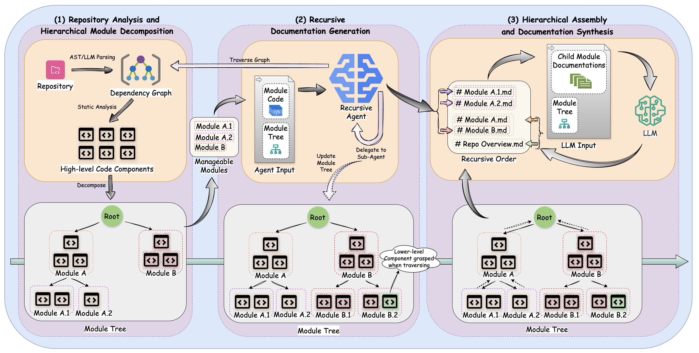
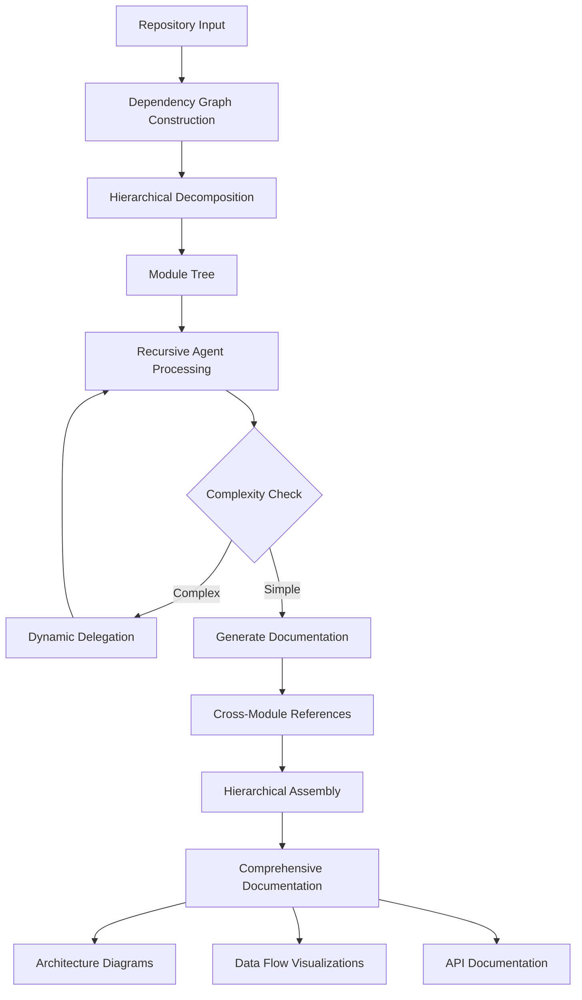

# CodeWiki: Automated Repository-Level Documentation at Scale

<div align="center">



<!-- [](LICENSE) -->
[](https://www.python.org/downloads/)
<!-- [](https://arxiv.org/abs/XXXXX) -->

**The first open-source framework for holistic, structured repository-level documentation across multilingual codebases**

[Features](#features) • [Installation](#installation) • [Quick Start](#quick-start) • [Benchmark](#benchmark) • [Demo](https://fsoft-ai4code.github.io/codewiki-demo/) • [Citation](#citation)

</div>

---

## 🎯 Overview

> 🚀 **[View Live Demo](https://fsoft-ai4code.github.io/codewiki-demo/)** - Explore documentation generated for real-world open source projects

Developers spend **58% of their working time** understanding codebases, yet maintaining comprehensive documentation remains a persistent challenge. CodeWiki addresses this by providing automated, scalable repository-level documentation generation that captures:

- 🏗️ **System Architecture** - High-level design patterns and module relationships
- 🔄 **Data Flow Visualizations** - How information moves through your system
- 📊 **Cross-Module Dependencies** - Interactive dependency graphs and sequence diagrams
- 📝 **Comprehensive API Documentation** - From architectural overviews to implementation details

### Key Innovations

| Feature | Description | Impact |
|---------|-------------|--------|
| **Hierarchical Decomposition** | Dynamic programming-inspired strategy that partitions repositories into coherent modules | Handles codebases of arbitrary size (86K-1.4M LOC tested) |
| **Recursive Agentic System** | Adaptive processing with dynamic delegation for complex modules | Maintains quality while scaling |
| **Multi-Format Synthesis** | Generates textual documentation, architecture diagrams, data flows, and sequence diagrams | Comprehensive understanding from multiple perspectives |
| **Multilingual Support** | Supports 7 languages: Python, Java, JavaScript, TypeScript, C, C++, C# | Universal applicability |

---

## Features

### 🎯 Two Usage Modes

CodeWiki offers both **CLI** and **Web Application** interfaces:

#### CLI Tool
- ✅ **Local Projects** - Generate documentation for codebases on your machine
- ✅ **Git Integration** - Automated branch creation and commit management
- ✅ **Secure Configuration** - API keys stored in system keychain
- ✅ **GitHub Pages** - Generate beautiful, interactive HTML documentation
- ✅ **Progress Tracking** - Real-time progress updates with ETA

#### Web Application
- ✅ **GitHub URL Input** - Generate docs by repository URL and optional commit ID
- ✅ **Remote Processing** - No need to clone repositories locally
- ✅ **Web Interface** - Easy-to-use browser-based UI

### 📚 Documentation Generation

- ✅ **Repository-Level Documentation** - First framework to generate complete repo-level docs at scale
- ✅ **Visual Artifacts** - Automatic generation of architecture diagrams and data flow visualizations
- ✅ **Cross-Module References** - Intelligent reference management prevents redundancy
- ✅ **Hierarchical Structure** - Multi-level documentation from high-level overviews to detailed APIs
- ✅ **Mermaid Diagrams** - Automatic generation of architecture and data flow diagrams

### 🔬 Benchmark

- ✅ **[CodeWikiBench](https://github.com/FSoft-AI4Code/CodeWikiBench.git)** - First benchmark specifically designed for repository-level documentation

#### Performance Results

CodeWiki has been evaluated on the **CodeWikiBench** dataset, the first benchmark specifically designed for repository-level documentation quality assessment.

| Language Category | CodeWiki Avg | Improvement over DeepWiki |
|-------------------|--------------|---------------------------|
| High-Level (Python, JS, TS) | **79.14%** | +10.47% |
| Managed (C#, Java) | **68.84%** | +4.04% |
| Systems (C, C++) | 53.24% | -3.15% |
| **Overall Average** | **68.79%** | **+4.73%** |

CodeWiki demonstrates significant improvements in high-level and managed languages, with an overall 4.73% improvement over [DeepWiki](https://deepwiki.com/).

---

## Installation

### Prerequisites

- Python 3.12+
- Node.js (for mermaid validation)
- Git (optional, for CLI branch management)
- Docker (optional, for containerized deployment)

### CLI Installation

Install CodeWiki CLI from source:

```bash
pip install git+https://github.com/FSoft-AI4Code/CodeWiki.git
```

Verify installation:

```bash
codewiki --version
```

### Web Application Installation

For the web interface:

```bash
# Clone the repository
git clone https://github.com/yourusername/codewiki.git
cd codewiki

# Install Node.js (if not already installed)
# macOS
brew install node
# Linux
sudo apt update && sudo apt install -y nodejs npm

# Create and activate virtual environment
python3.12 -m venv .venv
source .venv/bin/activate  # On Windows: .venv\Scripts\activate

# Install dependencies
pip install -r requirements.txt

# Create a `.env` file from the template
cp docker/env.example .env
# Edit .env with your API keys and configuration

# Start the web application
python codewiki/run_web_app.py

# Access at http://localhost:8000
```

### Docker Installation

For containerized deployment, see [Docker Setup](#docker-deployment) section below.

---

## Quick Start

### CLI Usage

#### 1. Configure CodeWiki

```bash
codewiki config set \
  --api-key YOUR_API_KEY \
  --base-url https://api.anthropic.com \
  --main-model claude-sonnet-4 \
  --cluster-model claude-sonnet-4
```

Verify configuration:

```bash
codewiki config show
codewiki config validate
```

#### 2. Generate Documentation

```bash
cd /path/to/your/project
codewiki generate
```

Documentation will be created in `./docs/`

#### 3. Generate with GitHub Pages

```bash
codewiki generate --github-pages
```

This creates an interactive HTML viewer at `./docs/index.html`

---

## CLI Commands

### Configuration Management

```bash
# Set configuration
codewiki config set --api-key <key> --base-url <url> \
  --main-model <model> --cluster-model <model>

# Show configuration
codewiki config show

# Validate configuration
codewiki config validate
```

### Documentation Generation

```bash
# Basic generation
codewiki generate

# Custom output directory
codewiki generate --output ./documentation

# Create git branch
codewiki generate --create-branch

# Generate GitHub Pages HTML
codewiki generate --github-pages

# Full-featured
codewiki generate --create-branch --github-pages --verbose
```

---

## Configuration

### CLI Configuration

Configuration is stored in:
- API keys: System keychain (macOS Keychain, Windows Credential Manager, Linux Secret Service)
- Settings: `~/.codewiki/config.json`

### Web Application Configuration

Configuration uses environment variables in `.env` file:

```bash
# LLM API Configuration
MAIN_MODEL=claude-sonnet-4
FALLBACK_MODEL_1=glm-4p5
CLUSTER_MODEL=claude-sonnet-4
LLM_BASE_URL=http://litellm:4000/
LLM_API_KEY=sk-1234

# Application Port
APP_PORT=8000

# Optional: Logfire Configuration
LOGFIRE_TOKEN=
LOGFIRE_PROJECT_NAME=codewiki
LOGFIRE_SERVICE_NAME=codewiki
```

---

## Workflow



### Processing Pipeline

1. **Repository Analysis** - AST parsing and dependency graph construction
2. **Hierarchical Decomposition** - Feature-based module partitioning
3. **Recursive Documentation** - Agent-based processing with dynamic delegation
4. **Hierarchical Assembly** - Bottom-up synthesis of comprehensive docs

---

## Documentation Structure

Generated documentation includes:

### 📄 Textual Documentation
- **README Overview** - High-level project introduction
- **Architecture Guide** - System design and component relationships
- **API Reference** - Detailed interface specifications
- **Usage Examples** - Practical code samples and patterns

### 📊 Visual Artifacts
- **System Architecture Diagrams** - Component relationships and hierarchies
- **Data Flow Visualizations** - Information flow through the system
- **Sequence Diagrams** - Inter-component communication patterns
- **Dependency Graphs** - Module and function dependencies

### Output Structure

```
./docs/
├── overview.md              # Start here!
├── module1.md               # Module documentation
├── module2.md
├── ...
├── module_tree.json         # Module hierarchy
├── first_module_tree.json   # Initial clustering
├── metadata.json            # Generation details
└── index.html              # GitHub Pages viewer (if --github-pages)
```

---

## Supported Languages

| Language   | Extensions          | Support |
|------------|---------------------|---------|
| Python     | `.py`               | Full    |
| Java       | `.java`             | Full    |
| JavaScript | `.js`, `.jsx`       | Full    |
| TypeScript | `.ts`, `.tsx`       | Full    |
| C          | `.c`, `.h`          | Full    |
| C++        | `.cpp`, `.hpp`, etc.| Full    |
| C#         | `.cs`               | Full    |

---

## Docker Deployment

### Quick Start with Docker

1. **Set up environment variables**:
   ```bash
   # Copy from docker directory
   cp docker/env.example .env
   # Edit .env with your configuration
   ```

2. **Create Docker network**:
   ```bash
   docker network create codewiki-network
   ```

3. **Start the services**:
   ```bash
   # From project root
   docker-compose -f docker/docker-compose.yml up -d
   
   # Or from docker directory
   cd docker
   docker-compose up -d
   ```

4. **Access the application**:
   - Web app: http://localhost:8000

### Docker Configuration

All Docker-related files are in the `docker/` directory:
- `docker/Dockerfile` - Container image definition
- `docker/docker-compose.yml` - Service orchestration
- `docker/env.example` - Environment variables template

### Stopping Services

```bash
# From project root
docker-compose -f docker/docker-compose.yml down

# Or from docker directory
cd docker
docker-compose down
```

---

## Development

### Project Structure

```
codewiki/
├── codewiki/                 # Main package
│   ├── cli/                  # CLI implementation
│   │   ├── commands/         # CLI commands (config, generate)
│   │   ├── models/           # Data models
│   │   ├── utils/            # Utilities
│   │   └── adapters/         # External integrations
│   ├── src/                  # Web application
│   │   ├── be/               # Backend (dependency analysis, agents)
│   │   └── fe/               # Frontend (web interface)
│   ├── templates/            # HTML templates
│   └── run_web_app.py        # Web app entry point
├── docker/                   # Docker configuration
│   ├── Dockerfile
│   ├── docker-compose.yml
│   └── env.example
├── tests/                    # Test suite
├── output/                   # Generated documentation output
└── README.md                 # This file
```

---

## Requirements

- Python 3.12+
- Git (optional, for branch management)
- LLM API access (Anthropic Claude, OpenAI, etc.)
- Tree-sitter language parsers (automatically installed)
- System keychain support for CLI (macOS Keychain, Windows Credential Manager, Linux Secret Service)
- Node.js (for mermaid diagram validation)

---

## Citation

If you use CodeWiki in your research, please cite:

```bibtex
@article{codewiki2025,
  title={CodeWiki: Automated Repository-Level Documentation at Scale},
  author={Your Name},
  journal={arXiv preprint arXiv:XXXXX},
  year={2025}
}
```

---

## License

MIT License - see LICENSE file for details

---

## Support

- **Live Demo**: [View documentation examples](https://fsoft-ai4code.github.io/codewiki-demo/)
- **Issues**: https://github.com/yourusername/codewiki/issues

---

<div align="center">

**Made with ❤️ by the CodeWiki Team**

[⬆ Back to Top](#codewiki-automated-repository-level-documentation-at-scale)

</div>
